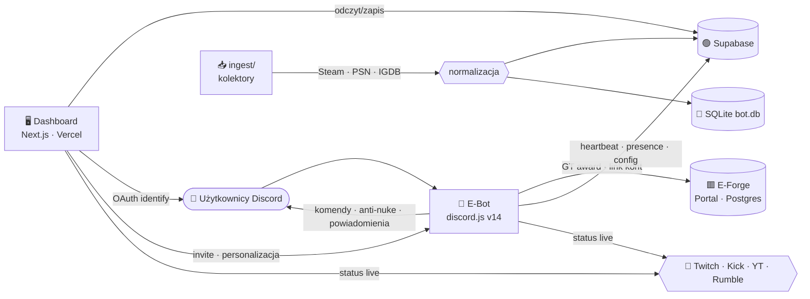
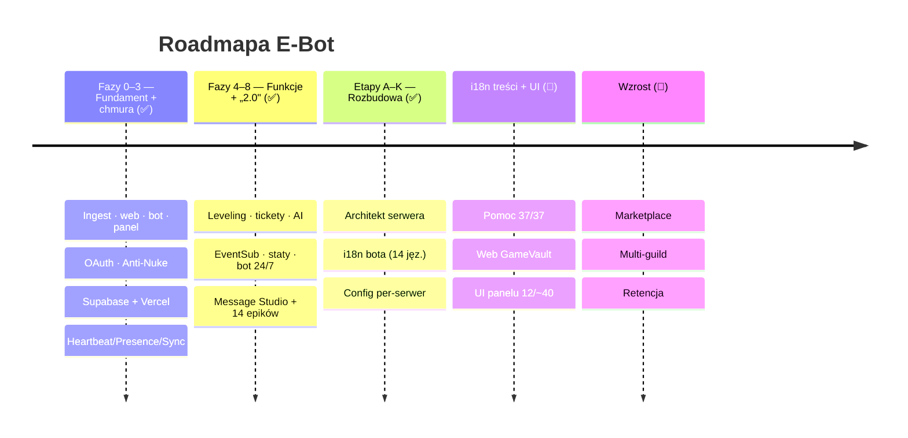
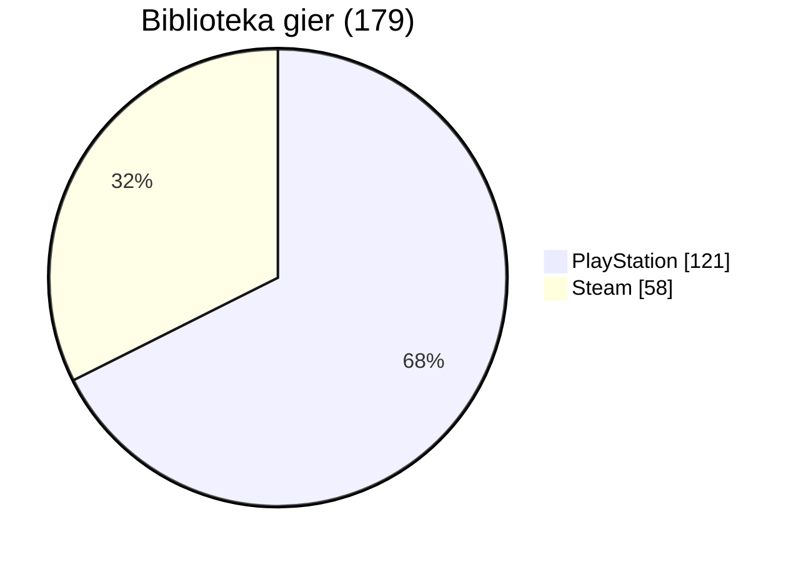

<!-- SYNC: v0.595.0 · #665 · 2026-06-30 — utrzymywane przez `pnpm docs:check` (badge wersji + blurb „Najnowsze") -->
<!-- ╔══════════════════════════════════════════════════════════════════╗ -->
<!-- ║                            E - B O T                              ║ -->
<!-- ╚══════════════════════════════════════════════════════════════════╝ -->

<div align="center">


# 🎬 E‑BOT &nbsp;·&nbsp; E-Forge

### ⟣ Discordowe ramię E-Forge · biblioteka gier „Netflix" · live · bezpieczeństwo ⟣

<br/>


<br/>

**[ 🖥️ Dashboard »](https://e-bot-dc.vercel.app)** &nbsp;·&nbsp;
**[ 📖 Wiki »](../../wiki)** &nbsp;·&nbsp;
**[ 🗺️ Roadmapa »](docs/ROADMAP.md)** &nbsp;·&nbsp;
**[ 📜 Changelog »](CHANGELOG.md)** &nbsp;·&nbsp;
**[ 🧠 Architektura »](docs/ARCHITECTURE.md)** &nbsp;·&nbsp;
**[ 🔐 Bezpieczeństwo »](.github/SECURITY.md)**

<br/>

[](https://top.gg/bot/1512758748761030677)

</div>

<br/>

```
━━━━━━━━━━━━━━━━━━━━━━━━━━━━━━━━━━━━━━━━━━━━━━━━━━━━━━━━━━━━━━━━━━━━━━━━━━
```

## ✨ O projekcie

**E‑Bot** to wielomodułowy ekosystem twórcy: bot Discord (discord.js v14), agregator
biblioteki gier w stylu **Netflix** (Steam · PlayStation · GOG → IGDB) oraz **panel
sterowania** (Next.js, hostowany na Vercel, dane w Supabase). E‑Bot jest **Discordowym
ramieniem E-Forge** — nalicza **Ghost Tokens (GT)** za aktywność i łączy konta z portalem.

> Right‑sized z planu SaaS (`docs/ANALIZA.md`) → wąski, działający produkt zamiast 75 modułów.

<br/>

## 🧩 Moduły

| Moduł | Opis | Status |
|:--|:--|:--:|
| 🎮 **Biblioteka gier** | Steam (58) + PlayStation (121) = **179**, okładki/metadane z IGDB → SQLite/Supabase |  |
| 🖥️ **Dashboard** | Panel E-Forge (Przegląd, Biblioteka, Live, Bezpieczeństwo, Integracje, Komendy, Ekonomia, Profil, Ustawienia) |  |
| 🤖 **Bot Discord** | 92 slash‑komendy (moderacja, ekonomia, leveling, tickety, AI, gry…), ~59 usług w tle, **i18n 14 języków** |  |
| 🛡️ **Anti‑Nuke** | Detekcja audit‑log, progi, kary, whitelist |  |
| 📡 **Powiadomienia live** | Twitch · Kick · YouTube · Rumble (polling) |  |
| 💰 **Ekonomia E-Forge** | GT za czat/voice, `/link`, stawki z portalu |  |

<br/>

## 🗺️ Architektura



<br/>

## 🧱 Stack technologiczny


<br/>


<br/>

## 🚀 Szybki start

```bash
# 1) Biblioteka gier → SQLite (Steam + PSN + GOG)
node ingest/sync.mts
npm run sync:cloud          # ingest + wysyłka do Supabase

# 2) Dashboard (panel E-Forge) — http://localhost:3001
cd dashboard && npm install && npm run dev

# 3) Bot Discord
cd bot && npm install && npm run deploy   # rejestracja slash-komend
cd bot && npm start                       # bot online + powiadomienia
```

> 🔑 Sekrety w `.env` / `dashboard/.env.local` (oba **gitignored**). Szablon: [`.env.example`](.env.example).

<br/>

## 🛰️ Funkcje

<details>
<summary><b>🎮 Biblioteka gier „Netflix"</b></summary>

- Kolektory: **Steam** (Web API), **PlayStation** (psn‑api / NPSSO), **GOG** (lokalna baza Galaxy)
- Normalizacja + okładki/gatunki/rok przez **IGDB** (OAuth Twitcha), dedup po `igdb_id`
- Dashboard: hero, filtry (platforma/gatunek/szukajka), gęste okładki, proxy obrazów `/api/img`
</details>

<details>
<summary><b>🛡️ Anti‑Nuke</b></summary>

- Detekcja przez `GuildAuditLogEntryCreate` + liczniki w pamięci (X akcji / Y s)
- 9 ochron: kanały/role create+delete, bany, kicki, webhooki, dodawanie botów
- Kary: ban · kick · timeout · strip ról · kwarantanna; whitelist (użytkownicy + role)
- Sterowanie: `/antinuke` oraz panel **Bezpieczeństwo**
</details>

<details>
<summary><b>📡 Powiadomienia live + 💰 Ekonomia E-Forge</b></summary>

- Live: Twitch · Kick · Rumble (polling 60 s), YouTube (opcjonalnie); embedy w kolorach platform
- Ekonomia: GT za wiadomości i voice (stawki z `/api/bot/config`), `/link` łączy konto z portalem
- Panel **Ekonomia** pokazuje stawki na żywo; **Live** auto‑odświeża się co 30 s
</details>

<details>
<summary><b>🖥️ Dashboard (E-Forge look)</b></summary>

- Logowanie **Discord OAuth** (tylko właściciel), responsywny (mobilne menu)
- **Personalizacja bota** (nazwa, avatar), **status/aktywność**, **motyw/kolor akcentu**
- **Zaproś bota** jednym kliknięciem, statystyki, wykresy, profil
</details>

<br/>

## 🗓️ Roadmapa



Pełna roadmapa i fazy → [`docs/ROADMAP.md`](docs/ROADMAP.md) · [`docs/PHASES.md`](docs/PHASES.md)

<br/>

## 📊 Biblioteka w liczbach



<br/>

## 📜 Changelog

Najnowsze: **v0.595.0** — 🗂️ pod-zakładki na `/moderation` (Automod & AI · Narzędzia · Rejestr) i `/engagement` (Społeczność · Automatyzacje · Cele) — porządek po 13 nowych modułach (`PanelTabs`, stan formularzy zachowany); **v0.594.0** — 📖 wiki + PDF znów kompletne: uzupełnienie `/wiki` i „pełnego PDF A→Z" o 13 nowych modułów (#651–#663) z opisem i konfiguracją krok po kroku; **v0.593.0** — 🌙 harmonogram blokad kanałów (ciche godziny): bot blokuje/odblokowuje pisanie na kanałach wg zegara (okno może iść przez północ; strefa = offset UTC); **v0.592.0** — 🎙️ rola głosowa: bot przydziela wybraną rolę osobom na kanale głosowym i zdejmuje ją po wyjściu (ping aktywnych / dostęp do kanału-tekstowego głosu); **v0.591.0** — 🚩 zgłaszanie wiadomości: context-menu „Zgłoś wiadomość" → kanał recenzji moderacji z przyciskami „Usuń" / „Oddal" (uprawnienie ManageMessages); **v0.590.0** — 📌 przypinanie reakcją: reakcja 📌 od uprawnionej roli przypina wiadomość (delegacja przypinania bez nadawania „Zarządzania wiadomościami"); **v0.589.0** — 🌐 tłumaczenie flagą: reakcja z flagą kraju na wiadomości → bot tłumaczy jej treść na język tej flagi (przez AI, wspólne limity); **v0.588.0** — ✉️ powitalny DM: przy dołączeniu bot wysyła nowemu członkowi prywatną wiadomość z konfigurowalną treścią (regulamin, pierwsze kroki; placeholdery {user}/{server}); **v0.587.0** — 🔗 podgląd linków do wiadomości: wklejony link do wiadomości z serwera bot rozwija w embed (autor, treść, obrazek) + przycisk „Skocz" (anty-wyciek: ten sam serwer + dostęp wklejającego); **v0.586.0** — 🧹 auto-czyszczenie kanałów: na wybranych kanałach bot kasuje wiadomości starsze niż ustawiony czas (kanały-komendy, spam, tymczasowe; pomija przypięte); **v0.585.0** — 🔤 dehoisting: bot usuwa wiodące znaki interpunkcyjne z pseudonimów, którymi trolle windują się na górę listy członków (na wejściu i przy zmianie nicku); **v0.584.0** — 👍 auto-reakcje: na wybranych kanałach bot sam dodaje skonfigurowane reakcje do każdej wiadomości (prezentacje 👍/❤️, propozycje ⬆️/⬇️, przedstawienia 👋); **v0.583.0** — 🔒 trwałe role (sticky roles): bot zapamiętuje role wychodzącego członka i przywraca je przy powrocie — anty-ucieczka od wyciszenia (leave→rejoin) + zachowanie zdobytych ról; **v0.582.0** — ⏱️ adaptacyjny slowmode: bot mierzy tempo wiadomości na wybranych kanałach i sam podnosi/zdejmuje slowmode (bez kar, bez moderatora — kanał zwalnia w szczycie, wraca do normy po wyciszeniu); **v0.581.0** — ⚖️ system odwołań od bana: publiczny formularz `/p/appeal` (tożsamość przez logowanie Discordem — osobne ciasteczko bez dostępu do panelu) → kolejka → moderator cofa ban / odrzuca przyciskiem (unban + DM); **v0.580.0** — 🤝 fala 2: cele społeczności (zbiorowy target wiadomości/miesiąc → świętowanie) + auto-publikacja ogłoszeń (crosspost na kanałach „Announcement"); **v0.579.0** — 🧰 fala funkcji: `/snipe` (podgląd usuniętej/edytowanej), auto-wątki na kanałach, kamienie milowe serwera (Nty członek) + AI-recap w tygodniowym digescie; **v0.578.0** — 🧰 patch-notes 2.0: anty-spam przy 1. włączeniu, „Testuj feed" (SSRF-safe), własny RSS, wykrywanie martwych feedów, cache AI, Claude jako dostawca AI, „Gaming feed" zawsze widoczny + publiczny `/p/status`; **v0.577.0** — 🎮 tryb PatchBot: patch-notes z katalogu po nazwie (gry Steam + RSS, GPU/sprzęt, newsy) + routing per-wpis (kanał/ping/pin, forum/voice) + digest + AI-streszczenia; **v0.576.0** — 📕 pełny PDF z wszystkimi funkcjami (A→Z: komendy + moduły, generowany z wikiData); **v0.575.0** — 🧨 reset bazy dla developera (cała / per-serwer; tylko właściciel, RPC + potwierdzenie); **v0.574.0** — 🔐 top.gg webhook zgodny z v1 (podpis HMAC `x-topgg-signature` + payload `vote.create`, plus legacy); **v0.573.0** — 🗳️ top.gg: webhook nagród za głos (zapis głosu + GT przez portal, fail-closed auth); **v0.572.0** — ⭐ przygotowanie pod top.gg (auto-raport liczby serwerów + komenda /vote + przewodnik [`docs/TOPGG.md`](docs/TOPGG.md)); **v0.571.0** — 🔓 panel otwarty dla adminów serwerów (self-serve domyślnie, izolacja per-serwer) + komunikaty logowania ×14; **v0.570.0** — 🎨 redesign panelu „Crimson Aurora" (szkło, gradienty, spójne nagłówki/tabele/puste stany) + rebranding „GH0ST EMPIRE" → „E‑Forge"; **v0.569.0** — 🌍 wiki (interfejs) w 14 językach; **v0.568.0** — 🌍 ekran logowania w 14 językach; **v0.567.0** — 🌍 landing w 14 językach (z RTL dla arabskiego); **v0.566.0** — 📄 PDF-y dla streamerów i developerów (ze zrzutami); **v0.565.0** — 📖 zaawansowane Wiki (`/wiki` + eksport Markdown: 95+ komend, moduły krok po kroku, zrzuty); **v0.564.0** — 🔐 nowy ekran logowania „Split" (czerń/czerwień); **v0.563.0** — 🚀 publiczny landing (root dla gości) w stylu mee6 — czerń/czerwień, realne zrzuty; **v0.562.0** — 🔔 czytelny komunikat limitu w panelu (zamiast „Błąd zapisu"); **v0.561.0** — 🔒 limity Free/Premium (egzekwowanie server-side w 7 modułach, konfigurowalne w `PLAN_LIMITS` + env, grandfathering); **v0.560.0** — 📄 treść regulaminu i polityki prywatności + linki na /login; **v0.559.0** — 💳 plan Premium miesięczny i roczny (przełącznik, 19,99 zł/mc · 199 zł/rok); **v0.558.0** — 🦶 stopka panelu + strony /p/about · /p/regulamin · /p/polityka-prywatnosci; **v0.557.0** — 💳 panel: okno porównania planów Free vs Premium (cena z env, Stripe Checkout); **v0.548–0.556** — 🔒 przegląd QA + 11 fixów (`scanScam` phishing przy `HTTP://` · `percentileRank` poprawny percentyl · `buildEmbed` limit 6000 · `duration` ujemne · ReDoS-guard automoda · `levelInfo` pasek na kapie · anti-raid homoglify · automod anty-bypass „rozstrzelony" · redukcja FP findPII/isSuspiciousName); **v0.547.0** — 🔒 atomowa wypłata podium sezonu (`ecoSeason` — domyka atomowość WSZYSTKICH ścieżek salda); **v0.545–0.546** — 🐛 drobiazgi z audytu (pasek XP peta na max-levelu, walidacja przydzielności ról battle-passa); **v0.539–0.544** — 🔒 **pełna atomowość ekonomii** (audyt współbieżności: `pay`/`rob` cross-user + RPC `economy_ensure`, atomowe saldo we wszystkich ścieżkach — level-up · giveaway · market · lottery · cards · skins · stocks · gry/sklep/blackjack `/eco`); **v0.537–0.538** — 🔒 atomowość salda (RPC Postgres + per-user `withLock`) i ♻️ `mergeConfig`; **v0.529–0.534** — 🛡️ **klany kompletne** + 📊 **benchmarking cross-server**; **v0.518–0.528** — ⚔️ **pety PvP** i 🎭 **role battle-passa**. Suite **158 plików / 1199 testów** (0 xfail), bramki zielone (Node 26.4.0).
Pełna, numerowana historia → [`CHANGELOG.md`](CHANGELOG.md).

<br/>

## 📁 Struktura repo

```
E-Bot/
├─ ingest/        📥 kolektory: steam · psn · gog · igdb → data/bot.db (+ Supabase)
├─ bot/           🤖 discord.js v14 — komendy, powiadomienia, anti-nuke, ekonomia
├─ dashboard/     🖥️ Next.js (panel E-Forge) → Vercel + Supabase
├─ web/           🎞️ pierwsza wersja UI „Netflix dla gier" (lokalnie)
├─ docs/          📚 ANALIZA · DESIGN · ARCHITECTURE · ROADMAP · PHASES · SECRETS
├─ .github/       ⚙️ CI · CodeQL · Dependabot · CODEOWNERS · SECURITY
├─ CHANGELOG.md   📜 numerowana historia
└─ README.md      🎬 ten plik
```

<br/>

## 🔐 Bezpieczeństwo

Repo **prywatne**, chronione: branch protection, CodeQL, Dependabot, secret‑scanning,
proprietarna licencja, CODEOWNERS. Sekrety wyłącznie w `.env*` (gitignored).
Szczegóły i zgłaszanie → [`.github/SECURITY.md`](.github/SECURITY.md).

<br/>

## 📚 Dokumentacja

| Dokument | Treść |
|:--|:--|
| [Wiki](../../wiki) | Pełna baza wiedzy projektu |
| [docs/ARCHITECTURE.md](docs/ARCHITECTURE.md) | Diagramy, przepływy, decyzje |
| [docs/ROADMAP.md](docs/ROADMAP.md) | Roadmapa + Gantt |
| [docs/PHASES.md](docs/PHASES.md) | Fazy i status (na bieżąco) |
| [docs/ANALIZA.md](docs/ANALIZA.md) | Analiza i right‑sizing |
| [docs/DESIGN.md](docs/DESIGN.md) | System wizualny (E-Forge/Netflix) |
| [docs/SECRETS.md](docs/SECRETS.md) | Triage kluczy + rotacja |

<br/>

<div align="center">

```
━━━━━━━━━━━━━━━━━━━━━━━━━━━━━━━━━━━━━━━━━━━━━━━━━━━━━━━━━━━━━━━━━━━━━━━━━━
```

**© 2026 E-Forge — wszelkie prawa zastrzeżone.**
Made with 🩸 & ☕ · `E-BOT`

</div>
