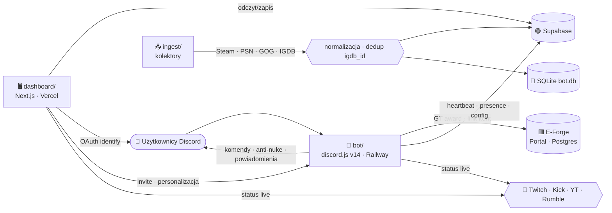
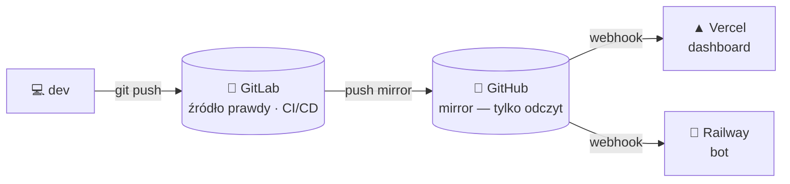

<!-- SYNC: v0.626.0 · #696 · 2026-07-05 — utrzymywane przez `pnpm docs:check` (badge wersji + blurb „Najnowsze") -->
<!-- ╔══════════════════════════════════════════════════════════════════╗ -->
<!-- ║                            E - B O T                              ║ -->
<!-- ╚══════════════════════════════════════════════════════════════════╝ -->

<div align="center">


# 🎬 E‑BOT &nbsp;·&nbsp; E-Forge

### ⟣ Discordowe ramię E-Forge · biblioteka gier „Netflix" · live · bezpieczeństwo ⟣

<br/>


<br/>

**[ 🖥️ Dashboard »](https://e-bot-dc.vercel.app)** &nbsp;·&nbsp;
**[ 📖 Wiki »](../../wiki)** &nbsp;·&nbsp;
**[ 🗺️ Roadmapa »](docs/ROADMAP.md)** &nbsp;·&nbsp;
**[ 📜 Changelog »](CHANGELOG.md)** &nbsp;·&nbsp;
**[ 🧠 Architektura »](docs/ARCHITECTURE.md)** &nbsp;·&nbsp;
**[ 🔐 Bezpieczeństwo »](.github/SECURITY.md)**

<br/>

[](https://top.gg/bot/1512758748761030677)

</div>

<br/>

```
━━━━━━━━━━━━━━━━━━━━━━━━━━━━━━━━━━━━━━━━━━━━━━━━━━━━━━━━━━━━━━━━━━━━━━━━━━
```

## ✨ O projekcie

**E‑Bot** to wielomodułowy ekosystem twórcy: bot Discord (discord.js v14), agregator
biblioteki gier w stylu **Netflix** (Steam · PlayStation · GOG → IGDB) oraz **panel
sterowania** (Next.js na Vercel, dane w Supabase). E‑Bot jest **Discordowym ramieniem
E-Forge** — nalicza **Ghost Tokens (GT)** za aktywność i łączy konta z portalem.

Monorepo **pnpm** złożone z 4 pakietów, **i18n w 14 językach** (PL bazowo, fallback → EN → PL),
z zestawem twardych **bramek jakości** pilnowanych automatycznie (typecheck ×4, Biome,
synchronizacja docs/schematu/env, próg pokrycia).

> Right‑sized z planu SaaS (`docs/ANALIZA.md`) → wąski, działający produkt zamiast 75 modułów.

<br/>

## 🧩 Pakiety monorepo

| Pakiet | Rola | Runtime / Deploy | Status |
|:--|:--|:--|:--:|
| 🤖 **`bot/`** | discord.js v14 — ~**100** slash‑komend, ~**59** usług w tle (moderacja, ekonomia, leveling, tickety, AI, anti‑nuke, live), i18n ×14 | Node (TS strip‑types `.mts`) · Railway |  |
| 🖥️ **`dashboard/`** | Panel E-Forge (Next.js 16 / React 19 / Tailwind 4) — 116 tras API, OAuth Discord, konfiguracja per‑serwer | Vercel + Supabase |  |
| 🎞️ **`web/`** | „GameVault" — pierwsza wersja UI „Netflix dla gier" | Next.js (osobny) · WIP |  |
| 📥 **`ingest/`** | Kolektory Steam · PSN · GOG · IGDB → `data/bot.db` (+ Supabase) | Node CLI |  |

<br/>

## 🗺️ Architektura



Szczegóły, przepływy i decyzje → [`docs/ARCHITECTURE.md`](docs/ARCHITECTURE.md).

<br/>

## 🧱 Stack technologiczny


<br/>


<br/>

## 🚀 Szybki start

> **Wymagania:** Node ≥ 24 · pnpm (repo pinuje `pnpm@11.5.2`). Używaj **wyłącznie pnpm** —
> monorepo ma workspace + `overrides` bezpieczeństwa (postcss/undici), które `npm install` ignoruje.

```bash
# 0) Zależności — RAZ w rootcie
pnpm install

# 1) Biblioteka gier → SQLite (Steam + PSN + GOG)
node ingest/sync.mts
pnpm sync:cloud             # ingest + wysyłka do Supabase

# 2) Dashboard (panel E-Forge) — http://localhost:3001
pnpm --filter dashboard dev

# 3) Bot Discord
pnpm --filter bot deploy    # rejestracja slash-komend
pnpm --filter bot start     # bot online + powiadomienia
```

> 🔑 Sekrety w `.env` / `dashboard/.env.local` (oba **gitignored**). Szablon: [`.env.example`](.env.example).

<br/>

## ✅ Bramki jakości

Zanim zmiana jest „gotowa", muszą przejść (zbiorczo: **`pnpm sync:check`**):

| Bramka | Co pilnuje |
|:--|:--|
| `pnpm check` | Biome — lint + format |
| `pnpm typecheck` | `tsc --noEmit` w 4 pakietach |
| `pnpm docs:check` | marker `<!-- SYNC: vX.Y.Z -->` w README/PHASES/ROADMAP = najnowsza wersja z CHANGELOG |
| `pnpm schema:check` | `_ALL.sql` ↔ pliki SQL per‑feature |
| `pnpm env:check` | `.env.example` ↔ `process.env` |
| `pnpm test` (coverage) | Vitest + próg pokrycia (ratchet) |

Egzekwowane w warstwach: **git pre‑commit** (`scripts/hooks/` — aktywacja: `git config core.hooksPath scripts/hooks`) · **CI pipeline** · **hook Claude Code (Stop)** w `.claude/settings.json`.

<br/>

## 🌍 Internacjonalizacja

14 języków: `pl en de es it fr pt zh ko ru uk ja ar id` (arabski = RTL). **PL** jest bazą i fallbackiem
(`PL → EN → PL`). Wymagana **parzystość kluczy × 14 języków**; marki i tokeny (`/komendy`,
`{placeholdery}`, nazwy usług) pozostają nietłumaczone.

<br/>

## 🛰️ Funkcje (skrót)

<details>
<summary><b>🎮 Biblioteka gier „Netflix"</b></summary>

- Kolektory: **Steam** (Web API), **PlayStation** (psn‑api / NPSSO), **GOG** (lokalna baza Galaxy)
- Normalizacja + okładki/gatunki/rok przez **IGDB** (OAuth Twitcha), dedup po `igdb_id`
- Dashboard: hero, filtry (platforma/gatunek/szukajka), gęste okładki, proxy obrazów `/api/img`
</details>

<details>
<summary><b>🛡️ Anti‑Nuke i moderacja</b></summary>

- Detekcja przez `GuildAuditLogEntryCreate` + liczniki w pamięci (X akcji / Y s)
- Ochrony: kanały/role create+delete, bany, kicki, webhooki, dodawanie botów
- Kary: ban · kick · timeout · strip ról · kwarantanna; whitelist (użytkownicy + role)
- Automod, AI‑moderacja, tickety, logi — sterowane komendami i panelem **Bezpieczeństwo**
</details>

<details>
<summary><b>📡 Powiadomienia live + 💰 Ekonomia E-Forge</b></summary>

- Live: Twitch · Kick · Rumble (polling 60 s), YouTube (opcjonalnie); embedy w kolorach platform
- Ekonomia: GT za wiadomości i voice (stawki z `/api/bot/config`), `/link` łączy konto z portalem
- Panel **Ekonomia** pokazuje stawki na żywo; **Live** auto‑odświeża się co 30 s
</details>

<details>
<summary><b>🖥️ Dashboard (E-Forge look)</b></summary>

- Logowanie **Discord OAuth** (self‑serve dla adminów serwerów, izolacja per‑serwer)
- **Personalizacja bota** (nazwa, avatar), **status/aktywność**, **motyw/kolor akcentu**
- **Zaproś bota** jednym kliknięciem, statystyki, wykresy, Premium (Stripe), profil
</details>

<br/>

## 📁 Struktura repo

```
E-Bot/
├─ bot/           🤖 discord.js v14 — komendy, usługi w tle, anti-nuke, ekonomia, i18n
├─ dashboard/     🖥️ Next.js (panel E-Forge) → Vercel + Supabase
├─ web/           🎞️ „GameVault" — UI „Netflix dla gier" (WIP)
├─ ingest/        📥 kolektory: steam · psn · gog · igdb → data/bot.db (+ Supabase)
├─ docs/          📚 ARCHITECTURE · ROADMAP · PHASES · ANALIZA · DESIGN · audit/ · SECRETS
├─ scripts/       🔧 strażnicy synchronizacji (docs/schema/env) + git hooks
├─ CHANGELOG.md   📜 numerowana historia (źródło prawdy wersji)
└─ README.md      🎬 ten plik
```

<br/>

## 🔀 Model repozytorium i wdrożenia



- **GitLab** = źródło prawdy (rozwój, push, CI/CD). **GitHub** = mirror tylko‑do‑odczytu (aktualizowany automatycznie przez push mirror).
- Wdrożenia wyzwalane z GitHuba: **Vercel** (`dashboard/`), **Railway** (`bot/`).
- Migracja pipeline'u CI do **GitLab CI** oraz automatyzacji (semantic‑release, Renovate, skany bezpieczeństwa) — **w toku**.

<br/>

## 🔐 Bezpieczeństwo

- Repo **prywatne**, licencja **proprietarna**. Sekrety wyłącznie w `.env*` (**gitignored**) — 0 sekretów w historii gita.
- Panel: **CSP per‑request z nonce** (`strict-dynamic`), **centralny, testowany gate autoryzacji** (`dashboard/proxy.ts` → `lib/authz.ts`), **timing‑safe** weryfikacja webhooków (Stripe/top.gg/Ko‑fi/Twitch).
- Zależności: `pnpm audit` — 0 znanych podatności. Triage i rotacja kluczy → [`docs/SECRETS.md`](docs/SECRETS.md).

Zgłaszanie podatności → [`.github/SECURITY.md`](.github/SECURITY.md).

<br/>

## 📜 Najnowsze

**v0.626.0** — 💳 Premium: plany **3‑ i 6‑miesięczne** (drabinka 1/3/6/12 mies. — 49/129/239/429 zł, rabaty 12/18/27 %, przełącznik 4 interwałów) · **v0.625.0** — 🔑 recenzja App Directory: `/lock` i `/unlock` wymagają `ManageRoles` · **v0.624.0** — 🩹 naprawa funkcji wrażliwych na restart (blackjack · tempvoice · invites · giveXp) · **v0.623.0** — 🧪 testy bramek bezpieczeństwa + coverage gate w CI.

Pełna, numerowana historia → [`CHANGELOG.md`](CHANGELOG.md).

<br/>

## 📚 Dokumentacja

| Dokument | Treść |
|:--|:--|
| [Wiki](../../wiki) | Pełna baza wiedzy projektu |
| [docs/ARCHITECTURE.md](docs/ARCHITECTURE.md) | Diagramy, przepływy, decyzje |
| [docs/ROADMAP.md](docs/ROADMAP.md) | Roadmapa + Gantt |
| [docs/PHASES.md](docs/PHASES.md) | Fazy i status (na bieżąco) |
| [docs/audit/](docs/audit/) | Raporty audytu inżynierskiego |
| [docs/ANALIZA.md](docs/ANALIZA.md) | Analiza i right‑sizing |
| [docs/DESIGN.md](docs/DESIGN.md) | System wizualny (E-Forge/Netflix) |
| [docs/SECRETS.md](docs/SECRETS.md) | Triage kluczy + rotacja |

<br/>

<div align="center">

```
━━━━━━━━━━━━━━━━━━━━━━━━━━━━━━━━━━━━━━━━━━━━━━━━━━━━━━━━━━━━━━━━━━━━━━━━━━
```

**© 2026 E-Forge — wszelkie prawa zastrzeżone.**
Made with 🩸 & ☕ · `E-BOT`

</div>
