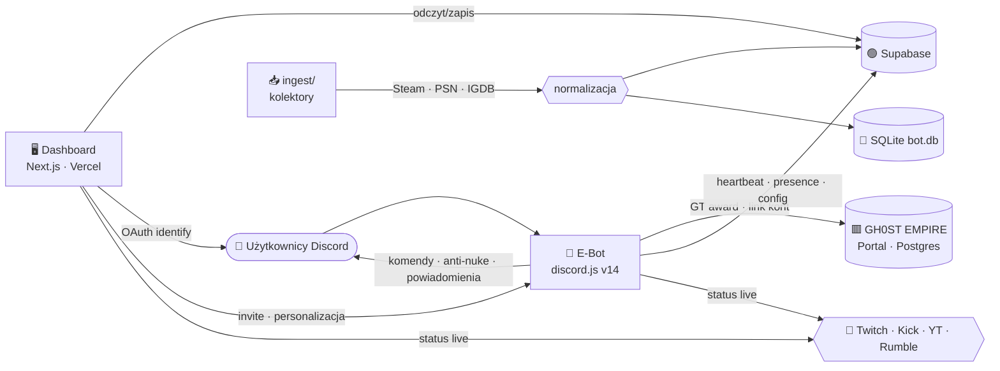
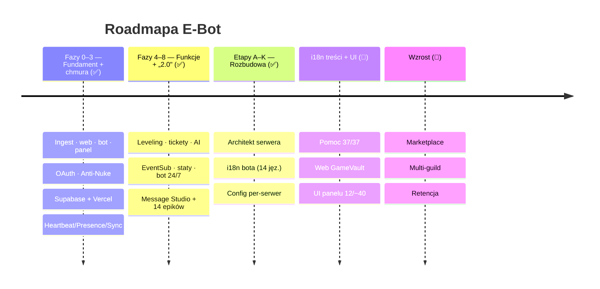
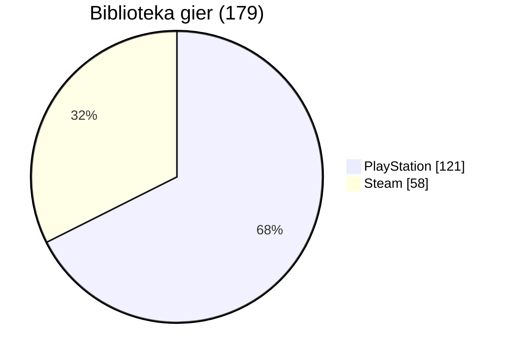

<!-- SYNC: v0.496.0 · #566 · 2026-06-27 — utrzymywane przez `pnpm docs:check` (badge wersji + blurb „Najnowsze") -->
<!-- ╔══════════════════════════════════════════════════════════════════╗ -->
<!-- ║                            E - B O T                              ║ -->
<!-- ╚══════════════════════════════════════════════════════════════════╝ -->

<div align="center">


# 🎬 E‑BOT &nbsp;·&nbsp; GH0ST EMPIRE

### ⟣ Discordowe ramię imperium · biblioteka gier „Netflix" · live · bezpieczeństwo ⟣

<br/>


<br/>

**[ 🖥️ Dashboard »](https://e-bot-dc.vercel.app)** &nbsp;·&nbsp;
**[ 📖 Wiki »](../../wiki)** &nbsp;·&nbsp;
**[ 🗺️ Roadmapa »](docs/ROADMAP.md)** &nbsp;·&nbsp;
**[ 📜 Changelog »](CHANGELOG.md)** &nbsp;·&nbsp;
**[ 🧠 Architektura »](docs/ARCHITECTURE.md)** &nbsp;·&nbsp;
**[ 🔐 Bezpieczeństwo »](.github/SECURITY.md)**

</div>

<br/>

```
━━━━━━━━━━━━━━━━━━━━━━━━━━━━━━━━━━━━━━━━━━━━━━━━━━━━━━━━━━━━━━━━━━━━━━━━━━
```

## ✨ O projekcie

**E‑Bot** to wielomodułowy ekosystem twórcy: bot Discord (discord.js v14), agregator
biblioteki gier w stylu **Netflix** (Steam · PlayStation · GOG → IGDB) oraz **panel
sterowania** (Next.js, hostowany na Vercel, dane w Supabase). E‑Bot jest **Discordowym
ramieniem GH0ST EMPIRE** — nalicza **Ghost Tokens (GT)** za aktywność i łączy konta z portalem.

> Right‑sized z planu SaaS (`docs/ANALIZA.md`) → wąski, działający produkt zamiast 75 modułów.

<br/>

## 🧩 Moduły

| Moduł | Opis | Status |
|:--|:--|:--:|
| 🎮 **Biblioteka gier** | Steam (58) + PlayStation (121) = **179**, okładki/metadane z IGDB → SQLite/Supabase |  |
| 🖥️ **Dashboard** | Panel GH0ST (Przegląd, Biblioteka, Live, Bezpieczeństwo, Integracje, Komendy, Ekonomia, Profil, Ustawienia) |  |
| 🤖 **Bot Discord** | 92 slash‑komendy (moderacja, ekonomia, leveling, tickety, AI, gry…), ~59 usług w tle, **i18n 14 języków** |  |
| 🛡️ **Anti‑Nuke** | Detekcja audit‑log, progi, kary, whitelist |  |
| 📡 **Powiadomienia live** | Twitch · Kick · YouTube · Rumble (polling) |  |
| 💰 **Ekonomia GH0ST** | GT za czat/voice, `/link`, stawki z portalu |  |

<br/>

## 🗺️ Architektura



<br/>

## 🧱 Stack technologiczny


<br/>


<br/>

## 🚀 Szybki start

```bash
# 1) Biblioteka gier → SQLite (Steam + PSN + GOG)
node ingest/sync.mts
npm run sync:cloud          # ingest + wysyłka do Supabase

# 2) Dashboard (panel GH0ST) — http://localhost:3001
cd dashboard && npm install && npm run dev

# 3) Bot Discord
cd bot && npm install && npm run deploy   # rejestracja slash-komend
cd bot && npm start                       # bot online + powiadomienia
```

> 🔑 Sekrety w `.env` / `dashboard/.env.local` (oba **gitignored**). Szablon: [`.env.example`](.env.example).

<br/>

## 🛰️ Funkcje

<details>
<summary><b>🎮 Biblioteka gier „Netflix"</b></summary>

- Kolektory: **Steam** (Web API), **PlayStation** (psn‑api / NPSSO), **GOG** (lokalna baza Galaxy)
- Normalizacja + okładki/gatunki/rok przez **IGDB** (OAuth Twitcha), dedup po `igdb_id`
- Dashboard: hero, filtry (platforma/gatunek/szukajka), gęste okładki, proxy obrazów `/api/img`
</details>

<details>
<summary><b>🛡️ Anti‑Nuke</b></summary>

- Detekcja przez `GuildAuditLogEntryCreate` + liczniki w pamięci (X akcji / Y s)
- 9 ochron: kanały/role create+delete, bany, kicki, webhooki, dodawanie botów
- Kary: ban · kick · timeout · strip ról · kwarantanna; whitelist (użytkownicy + role)
- Sterowanie: `/antinuke` oraz panel **Bezpieczeństwo**
</details>

<details>
<summary><b>📡 Powiadomienia live + 💰 Ekonomia GH0ST</b></summary>

- Live: Twitch · Kick · Rumble (polling 60 s), YouTube (opcjonalnie); embedy w kolorach platform
- Ekonomia: GT za wiadomości i voice (stawki z `/api/bot/config`), `/link` łączy konto z portalem
- Panel **Ekonomia** pokazuje stawki na żywo; **Live** auto‑odświeża się co 30 s
</details>

<details>
<summary><b>🖥️ Dashboard (GH0ST look)</b></summary>

- Logowanie **Discord OAuth** (tylko właściciel), responsywny (mobilne menu)
- **Personalizacja bota** (nazwa, avatar), **status/aktywność**, **motyw/kolor akcentu**
- **Zaproś bota** jednym kliknięciem, statystyki, wykresy, profil
</details>

<br/>

## 🗓️ Roadmapa



Pełna roadmapa i fazy → [`docs/ROADMAP.md`](docs/ROADMAP.md) · [`docs/PHASES.md`](docs/PHASES.md)

<br/>

## 📊 Biblioteka w liczbach



<br/>

## 📜 Changelog

Najnowsze: **v0.464.0** — 🧱 strażniki driftu (`schema:check` + `env:check`) + scalony `_ALL.sql` (11 tabel) i uzupełniony `.env.example` (24 zmienne) + CI (akcje v6, `pnpm audit`); **v0.463.0** — ⬆️ wszystkie zależności na najnowsze (Next 16.2.9 · Biome 2.5.1 · Supabase 2.108.2 · 0 podatności); **v0.462.0** — 🔐 domknięcie izolacji multi-tenant: 5× IDOR cross-tenant naprawione + clamp mintowania pluginów; **v0.461.0** — 🛡️ odporność publicznych stron `/p/*` (fail-fast Supabase) + opcjonalny e2e na buildzie prod. Wcześniej: **v0.460.0** 🎉 — 🧪📦 **rygiel batchowania zapytań IGDB** ([`igdb.chunk.test.ts`](ingest/igdb.chunk.test.ts), 4×): `chunk` (**pierwszy test w pakiecie `ingest`**) — IGDB ma limit ~500 id/zapytanie, więc kolektor dzieli listę na paczki; **RYGIEL bez gubienia/duplikatów** (konkatenacja paczek === wejście, sprawdzone na wielu długościach × rozmiarach), każda paczka `≤ n`, ostatnia mniejsza, kolejność; mutation-proof (`i += n`→`i += 1` dubluje, `slice(i,i+n)`→`(i,i+n-1)` gubi element), 0 zmian produkcyjnych. Suite 127 plików / 905 testów. Wcześniej: **v0.459.0** 🎉 — 🧪🟣 **rygiel parsera transmisji LIVE Twitch** ([`twitch.test.ts`](bot/src/live/twitch.test.ts), 5×): `parseTwitchLive` (domyka czwórkę parserów live) — **RYGIEL placeholderów miniatury** (`{width}`/`{height}` → `1280`×`720`, inaczej URL miniatury = 404) + **nazwa kanału** (`user_name ?? login`) + decyzja LIVE/fail-safe; mutation-proof (usunięcie `.replace('{width}',…)` / `user_name ?? login`→`login` zwala odpowiednie testy), 0 zmian zachowania. **Suite 126 plików / 901 test (przekroczono 900).** Wcześniej: **v0.458.0** — 🧪🎬 **rygiel parsera transmisji LIVE Rumble** ([`rumble.test.ts`](bot/src/live/rumble.test.ts), 5×): `parseRumbleLive` (trójka z YouTube/Kick) — **decyzja LIVE** (`livestreams[0]`; brak/garbage → `live:false`, bez wyjątku) + **fallback widzów** (`watching_now ?? viewers`) + **fallback URL** (bezpośredni `url` lub budowany z względnego `link`) + **polimorfizm miniatury** (string wprost lub obiekt `{url}`); mutation-proof (usunięcie `?? viewers` / spłaszczenie thumbnail zwala odpowiednie testy), 0 zmian zachowania. Suite 125 plików / 896 testów. Wcześniej: **v0.457.0** — 🧪🟢 **rygiel parsera transmisji LIVE Kick** ([`kick.test.ts`](bot/src/live/kick.test.ts), 4×): `parseKickLive` (bliźniak `parseYouTubeLive`, inna decyzja) — **RYGIEL `is_live`** (kanał Kick istnieje zawsze, więc o LIVE decyduje wyłącznie `stream.is_live`; offline → `live:false`, inaczej bot ogłasza „LIVE" dla niegrającego) + **fail-safe** (brak `data`/garbage → `live:false`, bez wyjątku) + puste `game`/`thumbnail` → `undefined`; mutation-proof (osłabienie `!c?.stream?.is_live`→`!c?.stream` zwala is_live, usunięcie `|| undefined` zwala mapowanie), 0 zmian zachowania. Suite 124 pliki / 891 testów. Wcześniej: **v0.456.0** — 🧪📺 **rygiel parsera transmisji LIVE YouTube** ([`youtube.test.ts`](bot/src/live/youtube.test.ts), 4×): `parseYouTubeLive` (wyłoniony behavior-preserving z `getYouTubeLive`) — **RYGIEL decyzji LIVE** (obecność `items[0]` to jedyny wyznacznik: jest → `live:true`, brak/`null` → `false`) + **fail-safe** (niezaufany JSON `null`/`'x'`/`{items:'…'}`/`{items:[null]}` → bez wyjątku, pola `undefined`) + mapowanie `snippet`/`videoId`; mutation-proof (flip `live` w obu gałęziach zwala odpowiednie testy), 0 zmian zachowania. Suite 123 pliki / 887 testów. Wcześniej: **v0.455.0** — 🧪🌐 **rygiel runtime'u i18n panelu** ([`panelI18n.tp.test.ts`](dashboard/lib/panelI18n.tp.test.ts), 4×): `tp` (każda etykieta panelu przez nią przechodzi; lustro bota `t()`) — łańcuch fallbacku **język→pl→klucz**: **RYGIEL fallbacku na PL** (nieznany język → wartość PL, nie `undefined`) + **RYGIEL ostatniej deski** (brakujący klucz → sam klucz, nigdy `undefined` w UI) + honoruje język (klucz różny EN vs PL); mutation-proof (usunięcie rungu `?? UI.pl[key]` / `?? key` zwala odpowiedni fallback), 0 zmian produkcyjnych. Suite 122 pliki / 883 testy. Wcześniej: **v0.454.0** — 🧪🖼️ **rygiel języka etykiet karty rangi** ([`cards.test.ts`](bot/src/lib/cards.test.ts), 3×): `cardLocale` (karty rysowane czcionkami tylko-łacińskimi) — **RYGIEL anty-„tofu"** (języki o piśmie nie-łacińskim `zh`/`ko`/`ru`/`uk`/`ja`/`ar` spadają na `en`, inaczej etykiety jako □□□) + łacińskie bez zmian + `undefined`→`en`; pełny podział 14 języków; mutation-proof (odwrócenie `has(l)`→`!has(l)` zwala oba kierunki), 0 zmian zachowania. Suite 121 plików / 879 testów. Wcześniej: **v0.453.0** — 🧪📡 **rygiel parsera ustawień powiadomień LIVE** ([`data.settings.test.ts`](dashboard/lib/data.settings.test.ts), 3×): `settingsFromMap` (mapa klucz→wartość → typowany `Settings`) — **RYGIEL koercji bool** (tylko `'1'`/`'true'`→true, `'0'`/`'false'`/`''`/`'yes'`/`'TRUE'`→false) + **RYGIEL domyślnych przełączników** (brak klucza → domyślna wartość pola; twitch/kick/rumble ON, youtube OFF — bez przypadkowego włączenia YouTube/wyłączenia Twitcha) + stringi z fallbackiem; mutation-proof (usunięcie gałęzi `|| 'true'` zwala koercję, flip domyślnej YouTube zwala domyślne), 0 zmian produkcyjnych. Suite 120 plików / 876 testów. Wcześniej: **v0.452.0** — 🧪🛡️ **rygiel scalania configu anti-nuke panelu** ([`data.mergeanti.test.ts`](dashboard/lib/data.mergeanti.test.ts), 6×): `mergeAnti` (panel zapisuje config, który bot czyta do obrony przed raidem) — **RYGIEL bez wstrzyknięcia obcego progu** (pętla iteruje tylko 9 znanych `ANTINUKE_PROTECTIONS`, nieznany klucz w zapisie ignorowany) + **płytkie scalanie progu** (brakujące pole zostaje domyślne, np. `windowSec`) + whitelisty domyślnie `[]` + **izolacja klonu** (`structuredClone` chroni DEFAULT); mutation-proof (podmiana zamiast scalania gubi pole, płytki klon przecieka mutację do DEFAULT), 0 zmian produkcyjnych. Suite 119 plików / 873 testy. Wcześniej: **v0.451.0** — 🧪🎟️ **rygiel agregacji statystyk ticketów** ([`faza4.ticketstats.test.ts`](dashboard/lib/faza4.ticketstats.test.ts), 3×): `ticketStats` (liczniki open/claimed/closed na pulpicie panelu) — **RYGIEL dokładnego statusu** (ścisłe `=== 'open'`/`'claimed'`/`'closed'`; status spoza trójki jak `'pending'` nie wpada do żadnego kubełka) + pusta lista → zera; mutation-proof (`===`→`!==` przy 3≠2 kubełkach zwala, `'closed'`→`'closedX'` zeruje), 0 zmian produkcyjnych. Suite 118 plików / 867 testów. Wcześniej: **v0.450.0** 🎉 — 🧪🏗️ **rygiel budowy planu Architekta** ([`setup.buildplan.test.ts`](dashboard/lib/setup.buildplan.test.ts), 6×): `buildPlan` (bloki setupu → plan prowizjonowania, który tworzy byty na serwerze) — **RYGIEL typu kanału** (`announce` → typ `announcement`, nie zwykły tekst) + **RYGIEL liczników** (`counters` → kategoria + 2 kanały głosowe z `lockSend` i wspólnym `categoryKey`) + mapowanie bloków (`welcome`/`tickets` tekst, `levelRoles` 3 role hoist, `muted` zwykła) + brak bloków → pusty plan; mutation-proof (`announcement`→`text` zwala typ, usunięcie `lockSend` zwala liczniki), 0 zmian produkcyjnych. Suite 117 plików / 864 testy. Wcześniej: **v0.449.0** — 🧪🔢 **rygiel nazwy kanału-licznika** ([`counters.test.ts`](bot/src/community/counters.test.ts), 4×): `counterName` (wyłoniony behavior-preserving z `tick`) — **RYGIEL twardego limitu 100 znaków** (limit nazwy kanału Discorda; dłuższa → API odrzuca `setName`, licznik się zawiesza) + format pl-PL (`{count}` z separatorem tysięcy, asercja lustrem `Intl`) + semantyka `String.replace` (tylko pierwsze `{count}`); mutation-proof (`slice(0,100)`→`(0,1000)` zwala limit, `replace`→`replaceAll` zwala „tylko pierwsze"), 0 zmian zachowania. Suite 116 plików / 858 testów. Wcześniej: **v0.448.0** — 🧪🏷️ **rygiel wyboru deala promocji** ([`pricetracker.bestdeal.test.ts`](bot/src/gaming/pricetracker.bestdeal.test.ts), 5×): `bestDeal` (wyłoniony behavior-preserving z `tickForGuild`) — **RYGIEL filtra realnej obniżki** (kandydaci tylko `cut > 0` z ceną — inaczej bot ogłasza pełną cenę jako „promocję") + **najtańszy** (najniższa `price.amount`, nie największy % rabatu — `−90%` za 50 zł przegrywa z `−50%` za 10 zł) + brak promocji → `undefined`; mutation-proof (`cut>0`→`cut>=0` zwala filtr, `<=`→`>=` zwala najtańszego), 0 zmian zachowania. Suite 115 plików / 854 testy. Wcześniej: **v0.447.0** — 🧪🤖 **rygiel weryfikacji captchy** ([`verification.test.ts`](bot/src/security/verification.test.ts), +5×): `checkCaptcha` (wyłoniony behavior-preserving z handlera modala) — drugi tryb bramy anty-bot/raid. **RYGIEL terminu** (wpis po terminie `exp < now` lub brak wpisu → `expired`, mimo poprawnego kodu — jednorazowy i czasowy, granica `exp===now` jeszcze ważna) + **RYGIEL braku wpisu** (`undefined`→`expired`, nie crash) + dopasowanie `trim`+`uppercase`, status zamiast boola (odrębny komunikat: wygasł vs błędny); mutation-proof (`exp<now`→`exp>now` zwala 3 testy, usunięcie `.toUpperCase()` zwala normalizację), 0 zmian zachowania. Suite 114 plików / 849 testów. Wcześniej: **v0.446.0** — 🧪🔐 **rygiel hasła weryfikacji** ([`verification.test.ts`](bot/src/security/verification.test.ts), 5×): `phraseMatches` (wyłoniony behavior-preserving z handlera modala, tryb `phrase`) — brama anty-bot, błąd = obejście weryfikacji. **RYGIEL bezpieczeństwa** (puste/białe hasło w configu NIGDY nie waliduje — inaczej źle skonfigurowana brama wpuszcza każdego) + **trim + nieczułość na wielkość liter po obu stronach** (`SwordFish`↔`swordfish`, `hasło`↔`HASŁO`); mutation-proof (usunięcie strażnika `want!==''` zwala bezpieczeństwo, usunięcie `.toLowerCase()` zwala wielkość liter), 0 zmian zachowania. Suite 114 plików / 844 testy. Wcześniej: **v0.445.0** — 🧪📊 **rygiel paska postępu questów** ([`quests.bar.test.ts`](bot/src/community/quests.bar.test.ts), 6×): `bar` (10-segmentowy pasek w `/quests`) — **RYGIEL klamry przepełnienia** (`Math.min(1, p/t)`; postęp ≥ cel → pełny, nie >10 segmentów ani `repeat(ujemne)`=RangeError→crash widoku) + **strażnik dzielenia** (`t > 0`; cel `0` → pusty, bez `p/0`=Infinity→NaN) + zawsze 10 segmentów; mutation-proof (usunięcie `Math.min` zwala przepełnienie/długość, usunięcie `t>0` zwala cel 0), 0 zmian produkcyjnych. Suite 113 plików / 839 testów. Wcześniej: **v0.444.0** — 🧪🔔 **rygiel dopasowania highlightów** ([`highlights.test.ts`](bot/src/community/highlights.test.ts), 7×): `highlightTargets` (wyłoniony behavior-preserving z handlera `messageCreate`) — **RYGIEL bez auto-pingu** (autor nie dostaje powiadomienia o własnym słowie) + **dedup per-user** (kilka pasujących słów → jeden wpis, nie seria DM-ów) + **case-insensitive** po obu stronach (`DEPLOY`↔`deploy`, zapisane `Crash`↔treść `crash`); mutation-proof (usunięcie self-skip / `seen.has` / `word.toLowerCase()` — każdy strażnik niezależnie), 0 zmian zachowania. Suite 112 plików / 833 testy. Wcześniej: **v0.443.0** — 🧪🎂 **rygiel walidacji daty urodzin** ([`birthday.test.ts`](bot/src/commands/birthday.test.ts), 5×): `isValidBirthday` (wyłoniony behavior-preserving z `execute`) — **RYGIEL liczby dni w miesiącu** (`31 kwietnia/czerwca/września/listopada` odrzucone, `30` w nich OK; `31 stycznia` OK) + **luty bez roku** (`29` przyjęte — urodziny nie patrzą na rok przestępny, `30` odrzucone) + zakresy miesiąc `1–12` / dzień `≥ 1`; regresja = przyjęcie nieistniejącej daty → poller urodzinowy jej nie ogłosi; mutation-proof (`[month-1]`→`[month]` zwala 3 testy, `<=`→`<` zwala dni graniczne), 0 zmian zachowania. Suite 111 plików / 826 testów. Wcześniej: **v0.442.0** — 🧪🧮 **rygiel bezpiecznego kalkulatora /math** ([`math.test.ts`](bot/src/commands/math.test.ts), 6×): `safeEval` (wyłoniony behavior-preserving z `execute`) — komenda używa `new Function`, więc to granica zaufania. **RYGIEL anti-injection** (twardy whitelist `[0-9+\-*/().%\s]` odrzuca `process`/`alert(1)`/`(()=>5)()`/`[5][0]` PRZED ewaluacją = brak RCE) + **skończoność** (`1/0`→Infinity, `0/0`→NaN → `null`, nie „Infinity" w odpowiedzi) + normalizacja `×÷−` + zaokrąglenie (`0.1+0.2`→`0.3`); mutation-proof (usunięcie whitelisty zwala anti-injection, usunięcie `Number.isFinite` zwala skończoność), 0 zmian zachowania. Suite 110 plików / 821 testów. Wcześniej: **v0.441.0** — 🧪📈 **rygiel silnika cen giełdy** ([`stocks-price.test.ts`](bot/src/economy/stocks-price.test.ts), 6×): `priceAt`/`changePct` (cena = suma sinusoid z czasu, `nowMs` wstrzykiwany) — **RYGIEL determinizmu** (ta sama spółka + ta sama chwila → identyczna cena, inaczej kupno ≠ sprzedaż = arbitraż) + **klamra mnożnika `max(0.15)`** (cena nie spada poniżej `base·0.15` — test na `base 1000` odróżnia ją od zewnętrznej) + **dolna klamra `max(1)`** (maleńka spółka nigdy < 1, inaczej dzielenie przez zero w `changePct`) + `changePct(_,0)`=`0%`; mutation-proof (każda klamra zaryglowana niezależnie), 0 zmian produkcyjnych. Suite 109 plików / 815 testów. Wcześniej: **v0.440.0** 🎉 — 🧪🏦 **rygiel matematyki odsetek bankowych** ([`interest.test.ts`](bot/src/economy/interest.test.ts), 5×): `interestGain` (wyłoniony behavior-preserving z `tick`) — pasywny dochód doliczany codziennie każdej osobie z saldem w banku, więc błąd = zła wypłata całemu serwerowi. **RYGIEL floor** (`floor(bank·pct/100)`; `199 @ 1%`=`1`, nie `1.99`/`2` — inaczej dryf na groszach) + **kolejność działań** (mnożenie przed dzieleniem; `150 @ 2%`=`3`, nie `2`) + sub-grosz→`0` (caller pomija); mutation-proof (usunięcie `floor` zwala 2 testy, `floor(bank/100)·pct` zwala kolejność), 0 zmian zachowania. Suite 108 plików / 809 testów. Wcześniej: **v0.439.0** — 🧪📈 **rygiel upsertu snapshotu wzrostu serwera** ([`serverHistory.test.ts`](bot/src/analytics/serverHistory.test.ts), 6×): `pushSnap` (wyłoniony behavior-preserving z `tickGuild`) — **RYGIEL bez duplikatu dnia** (ten sam dzień co ostatni → odświeża, inaczej wykres 90-dniowy dubluje słupki; nowy → dopisuje) + **kap** (trzyma najnowsze `cap` przez `slice(-cap)`, domyślnie 90 — ograniczony rozrost klucza chmury) + czystość (nie mutuje wejścia); mutation-proof (wyłączenie gałęzi same-day zwala duplikat, `slice(-cap)`→`slice(0,cap)` zwala 2 testy kapu), 0 zmian zachowania. Suite 107 plików / 804 testy. Wcześniej: **v0.438.0** — 🧪📊 **rygiel lidera tygodniowego digestu** ([`digest.test.ts`](bot/src/analytics/digest.test.ts), 6×): `topUserByMessages` (wyłoniony behavior-preserving z `maybePost`) — **RYGIEL sumy per-user** (wiersze `user_activity` jeden/dzień grupowane po `user_id` i sumowane `+=`) + **ranking malejąco** (digest chwali realnego lidera, nie najmniej aktywnego) + **rozwiązanie nazwy** (`username` z dowolnego wiersza > fallback `user_id`, inaczej surowe id w ogłoszeniu) + `messages`→`0`/pusta→`undefined`; mutation-proof (`+=`→`=` zwala sumę, `b-a`→`a-b` zwala ranking, usunięcie override nicku zwala nazwę), 0 zmian zachowania. Suite 106 plików / 798 testów. Wcześniej: **v0.437.0** — 🧪🏆 **rygiel rankingu sezonu eko** ([`ecoSeason.test.ts`](bot/src/analytics/ecoSeason.test.ts), 5×): `rankByTotal` (wyłoniony behavior-preserving ze `snapshot`) — **RYGIEL sumy majątku** (`total = wallet+bank`; DB sortuje tylko po `wallet`, więc re-sort po sumie, by gracz z dużym bankiem a małym portfelem nie wypadł z podium) + **kolejność malejąco** (indeks 0–2 = podium z nagrodą → zła kolejność = wypłata do złej osoby) + **kap top N** + `null`→`0`; mutation-proof (`b-a`→`a-b` zwala kolejność, zerowanie banku zwala sumę, `slice topN`→`topN*10` zwala kap), 0 zmian zachowania. Suite 105 plików / 792 testy. Wcześniej: **v0.436.0** — 🧪🎬 **rygiel embeda klipu Twitch** ([`clips.test.ts`](bot/src/creator/clips.test.ts), 4×): `clipEmbed` (klip z Helix API → embed relayu) — mapowanie tytuł/URL/stopka „klip od `<autor>`"/kolor + **RYGIEL warunku `setImage`** (obrazek tylko gdy `thumbnail_url` niepuste — inaczej Discord odrzuca embed z pustym `image.url` i wywala publikację) + fallback tytułu (puste z API → „Klip"); mutation-proof (bezwarunkowy `setImage` zwala obrazek, fallback `'Klip'`→`'KLIP_MUT'` zwala tytuł), 0 zmian produkcyjnych. Suite 104 pliki / 787 testów. Wcześniej: **v0.435.0** — 🧪📰 **rygiel czyszczenia patch-notes** ([`patchnotes.test.ts`](bot/src/gaming/patchnotes.test.ts), 5×): `strip` (Steam News → plain) — usuwa BBCode `[..]` + kolaps białych znaków + **kap 400** (limit pola embeda); mutation-proof (usunięcie strip BBCode / `slice(0,400)`→`(0,4000)`), 0 zmian produkcyjnych. Suite 103 pliki / 783 testy. Wcześniej: **v0.434.0** — 🧪🏷️ **rygiel parsera deali ITAD** ([`freegames.itad.test.ts`](bot/src/gaming/freegames.itad.test.ts), 7×): `parseItad` (niezaufany JSON z IsThereAnyDeal) — **fail-safe** (brak tablicy `list` → `[]`) + **filtr darmowości** (`cut ≥ 100%` lub cena 0, inaczej przecena ≠ rozdanie) + **strażnik klucza dedup** (deal bez id/slug/url/title → pominięty, brak klucza = re-post bez końca); mutation-proof (`≥ 100`→`> 100` / usunięcie strażnika), 0 zmian produkcyjnych. Suite 102 pliki / 778 testów. Wcześniej: **v0.433.0** — 🧪🆓 **rygiel parsera darmówek Epic** ([`freegames.test.ts`](bot/src/gaming/freegames.test.ts), 6×): `parseFree` (niezaufany JSON z API Epic) — **RYGIEL fail-safe** (garbage/null → `[]`, poller nie wybucha) + **filtr darmowości** (`discountPrice === 0` + aktywna promocja, inaczej bot ogłasza płatną grę jako darmową) + fallbacki slug/obrazek/title; mutation-proof (`=== 0`→`!== 0` / usunięcie fallbacku slug), 0 zmian produkcyjnych. Suite 101 plików / 771 testów. Wcześniej: **v0.432.0** 🎉 — 🧪🎛️ **rygiel rejestru modułów panelu** ([`modules.test.ts`](dashboard/lib/modules.test.ts), 6×): `MODULES`/`MODULE_VIEWS` (Centrum sterowania) — **RYGIEL unikalności kluczy** (duplikat = kolizja toggle) + **spójności projekcji** (`MODULE_VIEWS` klucze identyczne i w kolejności jak `MODULES`); mutation-proof (duplikat key / `m.key`→`m.label`), 0 zmian produkcyjnych. **Suite 100 plików / 765 testów (próg 100 plików)**. Wcześniej: **v0.431.0** — 🧪🏗️ **rygiel silnika Architekta** ([`provision.test.ts`](bot/src/setup/provision.test.ts), 7×): `findChannel`/`findId` — **RYGIEL idempotencji** (dopasowanie kanału po nazwie CI ORAZ typie — kategoria ≠ kanał tekstowy) + **RYGIEL referencji po id** (`findId` zwraca id tylko wpisu udanego z id — nieudany→undefined, bez referencji do nieutworzonego bytu); mutation-proof (usunięcie typu / `ok`), 0 zmian produkcyjnych. Suite 99 plików / 759 testów. Wcześniej: **v0.430.0** 🎉 (#500) — 🧪 **rygiel sugestii** ([`suggestions.test.ts`](bot/src/community/suggestions.test.ts), 8×): `suggestionsConfig`/`STATUS`/`suggestionModRow` — config merge + fail-safe + katalog 4 statusów (label/kolor) + **RYGIEL kontraktu** (customId akcji `sug:approve`/`deny`/`consider` mapuje się na istniejący status); mutation-proof (usunięcie `...DEFAULT` / `sug:consider`→`sug:considerX`), 0 zmian produkcyjnych. **Suite 98 plików / 752 testy**. Wcześniej: **v0.429.0** — 🧪⚙️ **rygiel parserów env configu ekonomii** ([`config.test.ts`](bot/src/empire/config.test.ts), 6×): `int`/`bool` — **RYGIEL `int` finite-check** (env `"0"` poprawne, nie spada na default; `parseInt` wiodące cyfry) + **`bool` strict** (tylko `"true"`/`"1"`→true, `"false"`/`"yes"`/`""`→false); mutation-proof (`finite?:`→`n||d` / `===`→`!=null`), 0 zmian produkcyjnych. Suite 97 plików / 744 testy. Wcześniej: **v0.428.0** — 🧪🔢 **rygiel gry w liczenie** ([`counting.test.ts`](bot/src/community/counting.test.ts), 6×): `checkCount` (refactor behavior-preserving z handlera) — **RYGIEL anti-cheat** (ten sam user dwa razy z rzędu → fail, sprawdzany przed liczbą) + **zgodność** (dokładnie `count+1`) + rekord + kolejność reguł; mutation-proof (wyłączenie same-user / `!==`→`===`), 0 zmian zachowania. Suite 96 plików / 738 testów. Wcześniej: **v0.427.0** — 🧪📣 **rygiel parsera configu feedów social** ([`social.test.ts`](bot/src/creator/social.test.ts), 5×): `cfgFor` — **RYGIEL strażnika `feeds` po spreadzie** (`feeds` nie-tablica w configu → `[]`, nie przecieka = brak crasha pollera) + merge (domyślny szablon wiadomości zachowany) + fail-safe; mutation-proof (usunięcie strażnika+DEFAULT zwala 3 testy), 0 zmian produkcyjnych, realny SQLite. Suite 95 plików / 732 testy. Wcześniej: **v0.426.0** — 🧪📅 **rygiel synchronizacji harmonogramu Twitch** ([`scheduleSync.test.ts`](bot/src/creator/scheduleSync.test.ts), 8×): `getSyncConfig`/`setScheduleSync`/`syncedCount` — **RYGIEL `enabled` STRICT `=== true`** (string `"true"`/`1` nie włączą syncu) + **fallback env** (pusty login → `TWITCH_CHANNEL`) + round-trip set→get; mutation-proof (`===true`→`!!` / usunięcie `envLogin()`), 0 zmian produkcyjnych, realny SQLite. Suite 94 pliki / 727 testów. Wcześniej: **v0.425.0** — 🧪📜 **rygiel logów serwera** ([`serverlog.test.ts`](bot/src/security/serverlog.test.ts), 6×): `cfgFor`/`trunc` — **RYGIEL merge** (częściowy config zachowuje domyślne przełączniki zdarzeń — inaczej włączenie logów zeruje wszystkie grupy) + fail-safe + `trunc` (granica `n+1`, limit 500); mutation-proof (usunięcie `...DEFAULT` / `>`→`>=`), 0 zmian produkcyjnych, realny SQLite. Suite 93 pliki / 719 testów. Wcześniej: **v0.424.0** — 🧪✉️ **rygiel relayu modmail** ([`modmail.test.ts`](bot/src/modmail.test.ts), 6×): `relayBody` (DM ↔ kanał staff) — łączenie treść + URL-e załączników + **RYGIEL załącznika bez treści** (sam obrazek z DM nie ginie) + **placeholder pustej** (Discord nie wyśle pustej); mutation-proof (usunięcie placeholdera / dołączania URL-i), 0 zmian produkcyjnych. Suite 92 pliki / 713 testów. Wcześniej: **v0.423.0** — 🧪🎟️ **rygiel escapingu transkryptu ticketów** ([`service.test.ts`](bot/src/tickets/service.test.ts), 5×): `esc` (anty-XSS HTML transkryptu) — **RYGIEL kolejności** (`&` escapowane PIERWSZE, inaczej podwójny escape `&amp;lt;`) + anty-XSS payload (brak surowych `<`/`>`) + wszystkie wystąpienia; mutation-proof (przestawienie kolejności zwala 4 testy), 0 zmian produkcyjnych. Suite 91 plików / 707 testów. Wcześniej: **v0.422.0** 🎉 — 🧪📡 **rygiel powiadomień live** ([`notifier.test.ts`](bot/src/live/notifier.test.ts), 7×): `fillVars`/`sec` — render ogłoszenia „streamer LIVE" (placeholdery, puste pola→`""`, `{platform}`→etykieta, **replaceAll** wszystkich wystąpień) + `sec` (parser interwału: tylko dodatnia liczba, `0`/NaN→domyślna = anty-busy-loop); mutation-proof (`replaceAll`→`replace` / `n>0`→`n>=0`), 0 zmian produkcyjnych. **Suite 90 plików / 702 testy (próg 700 przekroczony)**. Wcześniej: **v0.421.0** — 🧪📋 **rygiel aplikacji do ekipy** ([`applications.test.ts`](bot/src/community/applications.test.ts), 6×): `resolveApps`/`applyEnabled` — **RYGIEL kapu 5 pytań** (limit modala Discorda) + fallback pól na top-level + **bramka `applyEnabled`** (wymaga kanału recenzji — inaczej zgłoszenia donikąd); mutation-proof (`slice 5→50` / usunięcie wymogu kanału), 0 zmian produkcyjnych, realny SQLite. Suite 89 plików / 695 testów. Wcześniej: **v0.420.0** — 🧪🟣 **rygiel ról z obecności** ([`presenceRoles.test.ts`](bot/src/community/presenceRoles.test.ts), 7×): `liveStreaming`/`vanityMatch` (refactor behavior-preserving z `applyLive`/`applyVanity`) — **RYGIEL filtra roli** (live-rola tylko gdy Streaming ORAZ user ma wymaganą rolę — inaczej trafia do każdego streamera) + `vanityMatch` (fraza w statusie, case-insensitive); mutation-proof (usunięcie filtra / `toLowerCase`), 0 zmian zachowania. Suite 88 plików / 689 testów. Wcześniej: **v0.419.0** — 🧪🖼️ **rygiel kanałów tylko-obrazki** ([`imageonly.test.ts`](bot/src/community/imageonly.test.ts), 6×): `hasMedia` + lista kanałów — **bramka mediów** (załącznik/embed `image`/`thumbnail`/`video` → media; sam tekst → kasacja; regresja = obrazki kasowane lub spam przepuszczony) + add idempotentne + `removeImageOnly` (true/false) + persystencja SQLite; mutation-proof (`size>0`→`>1` / `return had`→`true`), 0 zmian produkcyjnych. Suite 87 plików / 682 testy. Wcześniej: **v0.418.0** — 🧪🎭 **rygiel routingu reaction-roles** ([`reaction-roles.test.ts`](bot/src/reaction-roles.test.ts), 8×): `emojiMatches`/`matchRole` (reakcja→rola) — dopasowanie emoji (nazwa/id/mention) + **RYGIEL izolacji wiadomości** (reguła pasuje tylko przy zgodnym `messageId` — reakcja na innej wiadomości nie przypina roli) + fallback panelu + fail-safe JSON; mutation-proof (toString-clause / warunek `messageId`), 0 zmian produkcyjnych, realny SQLite. Suite 86 plików / 676 testów. Wcześniej: **v0.417.0** — 🧪❓ **rygiel huba /help** ([`help.test.ts`](bot/src/commands/help.test.ts), 7×): `CATEGORIES` + `cmdDesc` — **katalog** (każda komenda w dokładnie 1 kategorii, klucze unikalne, ≤25 kategorii = limit select-menu) + **spójność opisów** (każda z ~60 komend ma niepusty opis, fallback `locale→en→pl→''`); mutation-proof (duplikat komendy / usunięcie fallbacku), 0 zmian produkcyjnych. Suite 85 plików / 668 testów. Wcześniej: **v0.416.0** — 🧪🛡️ **rygiel heurystyk automoda** ([`automod.test.ts`](bot/src/automod.test.ts), 11×): `normalizeText`/`capsViolation`/`linkNotAllowed` (na każdej wiadomości) — **anty-bypass** (leet/diakrytyki/zero-width → ta sama forma co czyste słowo) + **próg caps** (`≥`, na granicy = naruszenie) + **whitelist linków** (choć jeden link spoza listy → blok); mutation-proof (leet-replace / `≥`→`>` / odwrócenie whitelisty), 0 zmian produkcyjnych. Suite 84 pliki / 661 testów. Wcześniej: **v0.415.0** — 🧪🖼️ **rygiel escapingu memegen** ([`meme.test.ts`](bot/src/commands/meme.test.ts), 5×): `esc` (kodowanie tekstu do URL memegen) — **RYGIEL kolejności** (`_`/`-` podwajane PRZED spacją→`_`: `"a_b c"`→`"a__b_c"`, inaczej zepsuty mem) + placeholder pustego (`null`/blank→`_`) + znaki specjalne→`~x`; mutation-proof (`__`→`_` zwala podwojenie/kolejność, `'_'`→`''` zwala placeholder), 0 zmian produkcyjnych. **Suite 83 pliki / 650 testów**. Wcześniej: **v0.414.0** — 🧪🎲 **rygiel /fun** ([`fun.test.ts`](bot/src/commands/fun.test.ts), 6×): `pick`/`rollDie` + katalogi — **RYGIEL zakresu kostki** (`rollDie(sides) ∈ [1, sides]` — nigdy 0/`sides+1`) + `pick` zawsze zwraca element (nigdy undefined, coupon-collector) + niepuste katalogi TRUTHS/DARES/WYR/EIGHTBALL; mutation-proof (osobno dolna i górna granica kostki), refactor behavior-preserving, 0 zmian zachowania. Suite 82 pliki / 645 testów. Wcześniej: **v0.413.0** — 🧪🤖 **rygiel parsera configu AI** ([`ai.test.ts`](bot/src/lib/ai.test.ts), 4×): `aiConfig` (bramka `/ai`·`/tldr`·`/translate` + dzienne limity kosztów) — **RYGIEL merge** (`{...DEFAULT,...zapisane}` — częściowy config zachowuje limity, inaczej zapis samego `enabled` zeruje limit do `undefined`) + fail-safe (brak/uszkodzony JSON → DEFAULT) + pełny override; mutation-proof (usunięcie `...DEFAULT` zwala merge, `catch→{}` zwala fail-safe), realny SQLite, 0 zmian produkcyjnych. Suite 81 plików / 639 testów. Wcześniej: **v0.412.0** — 🧪⌨️ **rygiel opcji komend no-code** ([`customCommands.options.test.ts`](dashboard/lib/customCommands.options.test.ts), 6×): `buildCommandOptions` (refactor behavior-preserving z `saveCustomCommands`) — **RYGIEL kolejności** (wymagane przed opcjonalnymi — inaczej Discord odrzuca rejestrację `/custom-command`) + kap 25 + typ STRING/opis-fallback/filtr bezimiennych; mutation-proof (usunięcie sortu zwala kolejność, `slice(0,25)`→`(0,250)` zwala kap), 0 zmian zachowania. Suite 80 plików / 635 testów. Wcześniej: **v0.411.0** — 🧪💾 **rygiel snapshotu serwera** ([`backup.test.ts`](bot/src/lib/backup.test.ts), 6×): `captureGuild` (`Guild → Snapshot`, Architekt/Security) — **RYGIEL bezpieczeństwa restore** (pomija role zarządzane + @everyone — inaczej restore pada/dubluje) + sort wg pozycji + permissions jako string + kapy (≤100 ról / typy kanałów, kategorie pierwsze); mutation-proof (usunięcie `!r.managed` zwala filtr, `slice(0,100)`→`(0,1000)` zwala kap), 0 zmian produkcyjnych. Suite 79 plików / 629 testów. Wcześniej: **v0.410.0** — ♻️🧪 **DRY linku zaproszenia bota** (`botInviteUrl`): builder był w **2 kopiach** ([`invite.ts`](dashboard/lib/invite.ts) — powłoka panelu + [`enroll.ts`](dashboard/lib/enroll.ts) — onboarding M4), rozjazd defaultów `permissions`/`scope` = różne linki; teraz **1 źródło prawdy** (`enroll` re-eksportuje z `invite`), −11 linii, 0 zmian zachowania + rygiel anty-redup (`===` ta sama referencja, mutation-proof). Suite 78 plików / 623 testy. Wcześniej: **v0.409.0** — 🧪🔐 **rygiel podpisanej sesji** ([`session.test.ts`](dashboard/lib/session.test.ts), 10×): `signSession`/`verifySession`/`getAuthSecret` (cookie HMAC-SHA256, bramka autoryzacji panelu) — **RYGIEL anty-forge** (zły sekret / podmieniony body / podmieniony podpis → `null`) + **wygaśnięcie** (`exp` przeszłość → `null`) + **fail-closed sekretu** (produkcja + krótki/brak `AUTH_SECRET` → wyjątek, nie publiczny fallback); mutation-proof (pominięcie `if(!ok) return null` zwala anty-forge, `exp<Date.now()`→`>` zwala wygaśnięcie), 0 zmian produkcyjnych. Suite 77 plików / 622 testy. Wcześniej: **v0.408.0** — 🧪👁️ **rygiel trybów widoku panelu** ([`viewMode.test.ts`](dashboard/lib/viewMode.test.ts), 9×): `tierVisible`/`isViewMode`/`VIEW_MODES` (bramka widoczności nawigacji) — **RYGIEL przecieku dev** (próg `dev`: klucze/audyt widoczne tylko w trybie Developer, nie przeciekają do Prostego/Zaawansowanego) + esencja zawsze widoczna + monotoniczność + type guard + katalog 3 trybów; mutation-proof (`≤`→`<` zwala widoczność, usunięcie gałęzi `simple` zwala guard), 0 zmian produkcyjnych. Suite 76 plików / 612 testów. Wcześniej: **v0.407.0** 🎉 — 🧪🔗 **rygiel linku zaproszenia bota** ([`invite.test.ts`](dashboard/lib/invite.test.ts), 5×): `botInviteUrl` (OAuth „dodaj bota") — fail-safe braku `DISCORD_CLIENT_ID` → pusty string + **RYGIEL scope** (zawsze `bot`+`applications.commands` — inaczej slash-komendy się nie zarejestrują) + **permissions** domyślnie `8` (Administrator), env honorowane/przycięte; mutation-proof (usunięcie guardu zwala pusty link, `||'8'`→`||'0'` zwala domyślne uprawnienia), 0 zmian produkcyjnych. **Suite 75 plików / 603 testy (próg 600 przekroczony)**. Wcześniej: **v0.406.0** — 🧪🕐 **rygiel formatera czasu względnego** ([`insights.relTime.test.ts`](dashboard/lib/insights.relTime.test.ts), 6×): `relTime` („2 dni temu" na pulpicie, deterministyczny — `now` wstrzykiwany) — granice kubełków (sek/min/godz/dni) + **RYGIEL clampu przyszłości** (`ts > now` → „teraz", nie „za X") + granica dni (25 h → dni); asercje przez lustro `Intl` (odporne na ICU); mutation-proof (usunięcie `Math.max(0,…)` zwala clamp, `h<24`→`h<2400` zwala granicę dni), 0 zmian produkcyjnych. Suite 74 pliki / 598 testów. Wcześniej: **v0.405.0** — 🧪📊 **rygiel matematyki retencji kohortowej** ([`retention.test.ts`](dashboard/lib/retention.test.ts), 10×): `survived`/`mondayKey` (rdzeń D1/D7/D30 na `/stats`) — **RYGIEL granicy inkluzywnej** (przetrwał gdy `left===null` lub odszedł `≥ n·DAY`; dokładnie n-ty dzień liczy się) + **RYGIEL kubełka tygodnia** (niedziela należy do bieżącego tygodnia, nie następnego); mutation-proof (`≥`→`>` zwala granicę, `(getUTCDay()+6)%7`→`getUTCDay()` zwala kubełkowanie), 2× `export`. Suite 73 pliki / 592 testy. Wcześniej: **v0.404.0** — 🧪❓ **rygiel /trivia** ([`trivia.test.ts`](bot/src/commands/trivia.test.ts), 10×): bank pytań `BANK` + `pick` + `row` — **RYGIEL integralności** (4 odpowiedzi, poprawny indeks `c ∈ [0,3]` — inaczej pytanie niewygrywalne) + **spójność kategorii** (każda z 5 oferowanych kategorii ma ≥1 pytanie) + `pick` (zawsze trafia w kategorię, fallback do BANK); mutation-proof (`c:4` zwala indeks, `pick` `===`→`!==` zwala kategorię), 0 zmian zachowania (4× `export`). Suite 72 pliki / 582 testy. Wcześniej: **v0.403.0** — 🧪🔊 **rygiel kontroli kanału tymczasowego** ([`tempvoice.test.ts`](bot/src/engagement/tempvoice.test.ts), 6×): `canControlVoice` — refactor behavior-preserving (predykat z `isController`, bez stanu `owners`) + **RYGIEL bezpieczeństwa** (sterować może tylko właściciel LUB staff z `ManageChannels` — inaczej obcy przejmuje cudzy kanał) + guard niezcache'owanego membera (`permissions` string → `false`, nie wyjątek); mutation-proof (owner→`return false` zwala właściciela, usunięcie `ManageChannels` zwala staffa), 0 zmian zachowania. Suite 71 plików / 572 testy. Wcześniej: **v0.402.0** — 🧪🔘 **rygiel paneli ról-za-przyciski** ([`buttonroles.test.ts`](bot/src/engagement/buttonroles.test.ts), 8×): `buildRoleRows` — **twarde limity Discorda** (max 5 przycisków/rząd, max 5 rzędów = kap 25, nadmiar ucięty — inaczej API odrzuca publikację `/buttonpanel`) + kontrakt przycisku (`customId=role:<id>`, label domyślny, emoji opcjonalny); mutation-proof (kap `<5`→`<50` zwala test 25, `slice i+5`→`i+6` zwala ≤5/rząd), 0 zmian produkcyjnych. Suite 70 plików / 566 testów. Wcześniej: **v0.401.0** — 🧪⭐ **rygiel starboardu** ([`starboard.test.ts`](bot/src/engagement/starboard.test.ts), 8×): `parseStarboardConfig`/`emojiMatches` — refactor behavior-preserving (parser wyjęty z `cfg`, bez bazy) + **RYGIEL klamry progu ≥1** (próg 0/ujemny bez klamry = każda wiadomość na starboardzie = spam) + fail-safe OFF (uszkodzony JSON → defaulty) + `emojiMatches` (unicode/`<:name:id>`/id); mutation-proof (usunięcie `Math.max` zwala klamrę, usunięcie gałęzi `toString` zwala emoji własny), 0 zmian zachowania. Suite 69 plików / 558 testów. Wcześniej: **v0.400.0** 🎉 — 🧪↩️ **rygiel rejestru /undo** ([`undo.test.ts`](bot/src/lib/undo.test.ts), 8×): `recordUndo`/`readUndo`/`clearUndo` (siatka bezpieczeństwa cofania prowizjonowania Architekta) — round-trip + „tylko ostatnia operacja" + **RYGIEL fail-safe parsowania** (uszkodzony JSON / `channels`-`roles` nie-tablica → `null`, nigdy połowiczny rekord; brak `label`→`''`); mutation-proof (usunięcie strażnika `Array.isArray` zwala 2 testy), **0 zmian produkcyjnych**, realny SQLite. Suite 68 plików / 550 testów. Wcześniej: **v0.399.0** — 🧪🔐 **rygiel generatora captcha** ([`captcha.test.ts`](bot/src/lib/captcha.test.ts), 7×): `generateCaptchaCode`/`ALPHABET` (brama weryfikacji anty-bot/raid) — **RYGIEL czytelności** (brak znaków dwuznacznych `0/O/1/I/L` — inaczej user oblewa legalną weryfikację) + długość (domyślna 5, `0`→`''`) + każdy znak ∈ ALPHABET + **pełny zasięg indeksu** (cały alfabet osiągalny); mutation-proof (wstrzyknięcie `0` zwala czytelność, `i<len`→`i<=len` zwala długość), zmiana produkcyjna = 1× `export`. Suite 67 plików / 542 testy. Wcześniej: **v0.398.0** — 🧪✂️ **rygiel /rps** ([`rps.test.ts`](bot/src/commands/rps.test.ts), 6×): wynik rundy kamień-papier-nożyce — refactor behavior-preserving (logika zwycięstwa z `execute` → czysta `rpsOutcome`) + **RYGIEL anty-symetrii** (`win(a,b)⟺lose(b,a)` — bot nie oszukuje) + **integralność cyklu `BEATS`** (każdy wybór wygrywa z 1 i przegrywa z 1); mutation-proof (zepsucie cyklu `rock:'paper'` zwala 3 testy), 0 zmian zachowania. Suite 66 plików / 535 testów. Wcześniej: **v0.397.0** — 🧪💘 **rygiel /ship** ([`ship.test.ts`](bot/src/commands/ship.test.ts), 8×): `shipPct` — **deterministyczny + SYMETRYCZNY** % dopasowania (`shipPct(a,b)===shipPct(b,a)` dzięki `.sort()`; bez sortu para dostaje różny % zależnie od kolejności) + zakres `[0,100]` (kontrakt dla progów i `bar`) + `bar` (10 segmentów, `round(pct/10)`, kompozycja nigdy nie rzuca); mutation-proof (usunięcie sortu zwala symetrię, `/10`→`/5` zwala `bar` `RangeError`), zmiana produkcyjna = 2× `export`. Suite 65 plików / 529 testów. Wcześniej: **v0.396.0** — 🧪🗺️ **rygiel integralności katalogu questów** ([`quests.catalog.test.ts`](bot/src/community/quests.catalog.test.ts), 9×): `QUESTS` (battle-pass lite) — `id` unikalne (duplikat = **podwójny claim**) + `period ∈ {daily,weekly}` + `metric ∈` klucze liczników (spoza → postęp nie urośnie) + `target ≥ 1` (0 → darmowa nagroda) + `reward`/`points > 0` + label + ≥1 dzienny/tygodniowy; mutation-proof (dup id + `target:0` zwala 2 testy), 0 zmian produkcyjnych. Suite 64 pliki / 521 testów. Wcześniej: **v0.395.0** — ♻️🧪 **DRY taga tygodnia** (`weekKey`): wzór `YYYY-Wnn` był w **2 kopiach** (digest dedup + reset questów weekly) — teraz **1 źródło prawdy** ([`lib/weekKey.mts`](bot/src/lib/weekKey.mts)), 2 kopie usunięte (0 zmian zachowania) + rygiel `weekKey` (4 testy: W0/W1/W52/UTC, mutation-proof). Suite 63 pliki / 512 testów. Wcześniej: **v0.394.0** — 🧪🔗 **rygiel budowy URL OAuth** ([`auth.authorizeUrl.test.ts`](dashboard/lib/auth.authorizeUrl.test.ts), 5×): `authorizeUrl` — **scope `guilds` tylko przy self-serve** (inaczej minimalnie `identify`) + `redirect_uri`/`response_type`/`prompt`/`state`; mutation-proof, 0 zmian produkcyjnych. Suite 62 pliki / 508 testów. Wcześniej: **v0.393.0** — 🧪🏅 **rygiel odznak panelu** ([`badges.test.ts`](dashboard/lib/badges.test.ts), 7×): `nextBadges` (najbliższe do zdobycia — sort wg %, pomija zdobyte/osiągnięte) + `resolveBadges`/`badgeById` + **spójność lustra id panel↔bot** (13); mutation-proof, 0 zmian produkcyjnych. **Suite 61 plików / 503 testy (próg 500 przekroczony)**. Wcześniej: **v0.392.0** — 🧪🌐 **rygiel detekcji języka panelu** ([`panelI18n.detect.test.ts`](dashboard/lib/panelI18n.detect.test.ts), 6×): `isPanelLocale` + `detectBrowserLocale` (odcina region `pt-BR`→`pt`, case-insensitive, brak `navigator` SSR → `pl`); mutation-proof, 0 zmian produkcyjnych. Suite 60 plików / 496 testów. Wcześniej: **v0.391.0** — 🧪🗂️ **rygiel grupowania komend** ([`commands.group.test.ts`](dashboard/lib/commands.group.test.ts), 5×): `groupCommands` (widok `/commands`) — konserwacja (każda raz, brak dup), nieznana → „Inne" (ostatnia), kolejność wg katalogu, puste grupy pominięte; mutation-proof, 0 zmian produkcyjnych. Suite 59 plików / 490 testów. Wcześniej: **v0.390.0** — 🧪👑 **rygiel whitelisty właściciela instancji** ([`tenant.isOwner.test.ts`](dashboard/lib/tenant.isOwner.test.ts), 5×): `isOwner` (instance-admin: owner = pełny dostęp do serwerów bota) — uid z listy `DASHBOARD_OWNER_IDS` (trim/filter), fail-closed (brak env / null uid → false); mutation-proof, 0 zmian produkcyjnych. Suite 58 plików / 485 testów. Wcześniej: **v0.389.0** — 🧪🌉 **rygiel auth mostu bot→panel** ([`pluginBridge.test.ts`](dashboard/lib/pluginBridge.test.ts), 9×): `bridgeAuthorized` (Bearer w stałym czasie, **pusty sekret nie autoryzuje** — guard `token.length>0`) + `bridgeReady` (sekret ≥16 + community ON); bramka `/api/internal/*`; mutation-proof, 0 zmian produkcyjnych. Suite 57 plików / 480 testów. Wcześniej: **v0.388.0** — 🧪🔑 **rygiel parserów auth** ([`auth.parse.test.ts`](dashboard/lib/auth.parse.test.ts), 10×): `parseCookie` (sesja HMAC z nagłówka — trim, decode, split po pierwszym `=`, guard `i>0`) + `getOrigin` (`redirect_uri` OAuth — XFF>host, localhost→http); mutation-proof, 0 zmian produkcyjnych. Suite 56 plików / 471 test. Wcześniej: **v0.387.0** — 🧪✏️ **rygiel edytora rich-message panelu** ([`richMessage.test.ts`](dashboard/lib/richMessage.test.ts), 8×): `embedTotal` (suma znaków = baza limitu 6000), `v2TextTotal` (limit 4000 — tylko text/section), `v2HasContent`/`normalizeRich`/`fromLegacy`; mutation-proof, 0 zmian produkcyjnych. Suite 55 plików / 461 test. Wcześniej: **v0.386.0** — 🧪🧬 **rygiel kodeka recept Architekta** ([`setup.recipe.test.ts`](dashboard/lib/setup.recipe.test.ts), 7×): `encode`/`decodeRecipe` (base64 udostępnialnego setupu) — round-trip + **whitelist anty-wstrzyknięcie** (decode filtruje przez `BLUEPRINT_MODULES`/`PROV_BLOCKS`, nieznane id odpadają) + degeneraty → `null`; mutation-proof, 0 zmian produkcyjnych. Suite 54 pliki / 453 testy. Wcześniej: **v0.385.0** — 🧪💳 **rygiel bramki monetyzacji** ([`billing.canUsePlugin.test.ts`](dashboard/lib/billing.canUsePlugin.test.ts), 4×): `canUsePlugin` — billing OFF → brak paywalla (wszystko), billing ON → plugin `premium` na serwerze `free` **zablokowany** (paywall nie przecieka); mutation-proof, 0 zmian produkcyjnych. Suite 53 pliki / 446 testów. Wcześniej: **v0.384.0** — 🧪🔒 **rygiel kontraktu akcji pluginów** ([`pluginRunner.schema.test.ts`](dashboard/lib/pluginRunner.schema.test.ts), 9×): granica zaufania z obcym kodem (M6 sandbox) — `pluginActionSchema`/`pluginResponseSchema` odrzucają nieznane typy akcji, **>20 akcji** (anty-abuse) i przerośnięte pola (content 2000 / id 32 / value 4000); mutation-proof, 0 zmian produkcyjnych. Suite 52 pliki / 442 testy. Wcześniej: **v0.383.0** — 🧪🛡️ **rygiel mappera AutoModa** ([`discordAutomod.test.ts`](dashboard/lib/discordAutomod.test.ts), 4×): `mapRule` raw API Discorda (snake_case) → `NativeRule` panelu (camelCase) — pełne mapowanie + defaulty (`?? []`/`?? null`) + **RYGIEL `?? null` vs `|| null`** (limit `0` wzmianek zostaje `0`, nie `null`); mutation-proof, 0 zmian produkcyjnych. Suite 51 plików / 433 testy. Wcześniej: **v0.382.0** — 🧪✉️ **rygiel limitów embeda** ([`richMessage.limits.test.ts`](bot/src/lib/richMessage.limits.test.ts), 6×): twarde limity Discorda w `buildEmbed`/`buildRichMessage` (content 2000, title 256, desc 4096, footer 2048, pole 256/1024, **max 25 pól**) — przekroczenie = API odrzuca całą wiadomość; przycięcie PO podstawieniu zmiennych; mutation-proof, 0 zmian produkcyjnych. Suite 50 plików / 429 testów. Wcześniej: **v0.381.0** — ♻️🧪 **DRY helpera cooldownu**: formuła `minutesSince` (`null→∞` / `/60_000`) była w **3 kopiach** (store/cards/pets) — teraz **1 źródło prawdy** (cards/pets re-eksportują `store.minutesSince`), 2 kopie usunięte (0 zmian zachowania) + rygiel anty-redup (`===` ta sama referencja). Suite 49 plików / 423 testy. Wcześniej: **v0.380.0** — 🧪📈 **rygiel katalogu giełdy** ([`stocks-catalog.test.ts`](bot/src/economy/stocks-catalog.test.ts), 6×): `findStock` (case-insensitive+trim) + **kontrakt uppercase** (symbole `STOCKS` muszą być WIELKĄ literą — inaczej niezznajdowalne) + pasmo cen per-spółka `base × [max(0.15,1−0.38·vol), 1+0.38·vol]`; mutation-proof, 0 zmian produkcyjnych. Suite 48 plików / 421 testów. Wcześniej: **v0.379.0** — 🧪🎨 **rygiel presetów motywu** ([`themes.test.ts`](dashboard/lib/themes.test.ts), 4×): kontrakt CSS `rgb(var(--accent-rgb))` — `rgb`/`hover`/`dark` = triplet `"R G B"` (spacje, 0–255; przecinek/>255 = cicho zepsuty akcent panelu) + unikalne id; mutation-proof, 0 zmian produkcyjnych. Suite 47 plików / 415 testów. Wcześniej: **v0.378.0** — 🧪🌍 **rygiel listy języków bota w panelu** ([`botLocales.test.ts`](dashboard/lib/botLocales.test.ts), 5×): `normalizeBotLocale` (fallback `auto`) + **spójność cross-package** — opcje panelu (mirror) == 14 języków bota + `auto`; rozjazd = panel proponuje język, którego bot nie obsługuje; mutation-proof, 0 zmian produkcyjnych. Suite 46 plików / 411 testów. Wcześniej: **v0.377.0** — 🧪🖼️ **rygiel proxowania okładek** ([`cover.test.ts`](dashboard/lib/cover.test.ts), 8×): `proxied` (data: bez proxy — inline; http(s) → `/api/img` z `encodeURIComponent`) + `coverFallbacks` (łańcuch zapasowy zawsze z placeholderem, dedup); mutation-proof, 0 zmian produkcyjnych. Suite 45 plików / 406 testów. Wcześniej: **v0.376.0** — 🧪🎨 **rygiel spójności stylu kart bot↔panel** ([`cardstyle-consistency.test.ts`](bot/src/lib/cardstyle-consistency.test.ts), 4×): oferta czcionek panelu == możliwości renderu bota (`CARD_FONTS` + domyślny `RANKCARD_DEFAULT`/`CARD_STYLE_DEFAULT`) — rozjazd = panel proponuje font, którego bot nie ma → cichy fallback; mutation-proof, 0 zmian produkcyjnych. Suite 44 pliki / 398 testów. Wcześniej: **v0.375.0** — 🧪🛡️ **rygiel rate-limitu panelu** ([`rateLimit.test.ts`](dashboard/lib/rateLimit.test.ts), 8×): sliding-window anty-flood publicznych sinków `/api/sentry`+`/api/hook` — off-by-one limitu, reset po `windowMs`, ścisła granica okna (`<`), izolacja kluczy + `clientIp` (XFF→x-real-ip→unknown); fałszywy zegar, mutation-proof, 0 zmian produkcyjnych. Suite 43 pliki / 394 testy. Wcześniej: **v0.374.0** — 🧪🎭 **rygiel menu ról** ([`rolemenu.test.ts`](bot/src/engagement/rolemenu.test.ts), 8×): twarde limity Discorda dla select-menu — **kap 25 opcji**, label ≤100 / placeholder ≤150 / description ≤100 (przekroczenie = API odrzuca publikację `/rolemenu`) + filtr opcji bez `roleId` + `buildRoleMenu` null gdy pusto; mutation-proof, 0 zmian produkcyjnych. Suite 42 pliki / 386 testów. Wcześniej: **v0.373.0** — 🧪🛡️ **rygiel diagnozy uprawnień anti-nuke** ([`antinuke-perms.test.ts`](bot/src/security/antinuke-perms.test.ts), 5×): `missingPerms` — `/antinuke status` musi pokazać realne braki (regresja = bot raportuje „OK", a nie może banować = cicha dziura w obronie); zaryglowane mapowanie flaga→etykieta + kolejność, brak `me`→`["nieznane"]`; mutation-proof, 0 zmian produkcyjnych. Suite 41 plików / 378 testów. Wcześniej: **v0.372.0** — 🧪👋 **rygiel renderowania pożegnań/boostu** ([`farewell.test.ts`](bot/src/farewell.test.ts), 11×): `renderVars` (literalne replaceAll — **wszystkie** wystąpienia, odporne na regex) + `memberVars` (`{user}`/`{username}`/`{server}`/`{memberCount}`, fallback) + `farewellEmbed`; mutation-proof, 0 zmian produkcyjnych. Suite 40 plików / 373 testy. Wcześniej: **v0.371.0** — 🧪🐹 **rygiel ekonomii petów** ([`pets-gift.test.ts`](bot/src/economy/pets-gift.test.ts), 9×): `giftValue` (dochód pet = `giftBase × poziom × sytość`; factor 0.2–1.0, fałszywy zegar) + kap `petLevel` 50 + katalog `SPECIES`/`findSpecies`; mutation-proof, 0 zmian produkcyjnych. Suite 39 plików / 362 testy. Wcześniej: **v0.370.0** — 🧪🌐 **rygiel runtime'u i18n** ([`t.test.ts`](bot/src/i18n/t.test.ts), 9×): funkcja `t()` (każdy zlokalizowany string przez nią przechodzi) — interpolacja `{placeholder}` (wszystkie wystąpienia, nieznana zmienna dosłownie, liczby koercjonowane, bez vars surowo) + **łańcuch fallback** `locale→en→pl→sam klucz` (nigdy `undefined`); mutation-proof, 0 zmian produkcyjnych. Suite 38 plików / 353 testy. Wcześniej: **v0.369.0** — 🧪🃏 **rygiel gachy** ([`cards.test.ts`](bot/src/economy/cards.test.ts), 12×): drabina rzadkości (`RARITY` — waga **maleje**, sprzedaż **rośnie**, suma 100) + integralność `CARDS` (każda rzadkość ma kartę) + `findCard`/`rarityRank` (kolejność mythic<…<common) + `drawCard` (zawsze prawidłowa karta, wszystkie 5 rzadkości osiągalnych); mutation-proof, 0 zmian produkcyjnych. Suite 37 plików / 344 testy. Wcześniej: **v0.368.0** — 🧪🌍 **rygiel rejestru języków** ([`locales.test.ts`](bot/src/i18n/locales.test.ts), 11×): **dwukierunkowa spójność map** `LOCALE_TO_DISCORD`↔`DISCORD_TO_LOCALE` (anti-drift — komenda zarejestrowana pod kodem X musi rozwiązać się na właściwy język) + `isRtl` (dokładnie 1 RTL = `ar`) + `fromDiscordLocale` (warianty `en-US`/`pt-BR`/`zh-CN`→baza); mutation-proof, zmiana produkcyjna = 1× `export`. Suite 36 plików / 332 testy. Wcześniej: **v0.367.0** — 🧪💬 **rygiel autorespondera** ([`responder.test.ts`](bot/src/community/responder.test.ts), 6×): wydzielony `matchTrigger` (3 tryby `contains`/`exact`/`starts`, case-insensitive) — **`exact` to ścisła równość, nie podłańcuch** + **pusty trigger nigdy nie pasuje** (anti-spam: reaguje na każdą wiadomość); refactor behavior-preserving, mutation-proof. Suite 35 plików / 321 testów. Wcześniej: **v0.366.0** — ♻️🧪 **DRY krzywej levelingu**: formuła `5L²+50L+100` była w **5 kopiach** (rank/profile/prestige/giveaways/leveling) — teraz **1 źródło prawdy** ([`leveling.mts`](bot/src/leveling.mts) eksportuje `levelInfo`), 4 lokalne kopie usunięte (−34 linie, 0 zmian zachowania) + rygiel `levelInfo` (+4 testy, mutation-proof). Suite 34 plików / 315 testów. Wcześniej: **v0.365.0** — 🧪🚦 **rygiel bram funkcji** ([`feature-toggles.test.ts`](bot/src/community/feature-toggles.test.ts), 14× = 7×2 parsery): `afkEnabled`/`highlightsEnabled` — **fail-safe OFF** (uszkodzony JSON / brak configu → `false`, nigdy wyjątek/przypadkowe włączenie) + override per-serwer + izolacja A↛B; mutation-proof, 0 zmian produkcyjnych (suite 34 plików / 311 testów). Wcześniej: **v0.364.0** — 🧪🎁 **rygiel losowania giveawayów** ([`giveaways.test.ts`](bot/src/engagement/giveaways.test.ts), 7×): `weightedPick` — **bez podwójnych zwycięzców** (dedup), nie więcej niż uczestników, dolny clamp wagi (`Math.max(1,…)` — waga 0/ujemna nadal uprawniona); niezmienniki w pętli 200 przebiegów (dowolne tasowanie); mutation-proof, 0 zmian produkcyjnych (suite 33 plików / 297 testów). Wcześniej: **v0.363.0** — 🧪⏱️ **rygiel warstwy danych eko** ([`store-config.test.ts`](bot/src/economy/store-config.test.ts), 13×): **`minutesSince`** — rdzeń bramek czasowych (`null`→`+Infinity`, dzielnik `60_000`, przyszłość→ujemne; fałszywy zegar `vi`) + **`ecoConfig`** per-serwer override+fallback global (Etap K, merge płytki, uszkodzony JSON→default, izolacja A↛B) + sanity `ECO_DEFAULT` (`workMin≤workMax`, procenty ∈ [0,100]); mutation-proof, 0 zmian produkcyjnych (suite 32 plików / 290 testów). Wcześniej: **v0.362.0** — 🧪🎨 **rygiel katalogu skórek** ([`skins.test.ts`](bot/src/economy/skins.test.ts), 9×): **cross-module spójność fontu** (każda `style.font` ∈ `CARD_FONTS` — inaczej renderer cicho podmienia na Poppins i user nie dostaje opłaconej skórki) + integralność (5 skórek, `classic` darmowa, drabina cen) + walidacja stylu (hex/angle); mutation-proof, 0 zmian produkcyjnych (suite 31 plików / 277 testów). Wcześniej: **v0.361.0** — 🧪🏅 **rygiel progów odznak** ([`badges.test.ts`](bot/src/community/badges.test.ts), 19×): dokładne progi `>=` 13/13 (poziom/prestiż/majątek/streak/zaproszenia/gry — odznaki permanentne, off-by-one = na zawsze) + izolacja wymiaru (każdy predykat patrzy tylko na swoje pole) + anti-rozjazd test↔produkcja; mutation-proof, 0 zmian produkcyjnych (suite 30 plików / 268 testów). Wcześniej: **v0.360.0** — 🧪⏳ **rygiel TTL efektów itemów** ([`effects.test.ts`](bot/src/economy/effects.test.ts), 11×): granica wygaśnięcia `exp < now` (ścisłe `<` — now===exp jeszcze działa, +1 ms gaśnie; fałszywy zegar `vi`) + mnożnik `xp2` + izolacja klucza `guild:user:effect`; mutation-proof, 0 zmian produkcyjnych (suite 29 plików / 249 testów). Wcześniej: **v0.359.0** — 🧪🃏 **rygiel blackjacka** ([`blackjack.test.ts`](bot/src/economy/blackjack.test.ts), 10×): **miękki as** (`val` — as 11→1 przy buscie, pojedynczo i tylko ile trzeba) + integralność talii (`freshDeck` — 52 karty, 0 duplikatów, suma 380); mutation-proof, zmiana produkcyjna = tylko `export` (3 linie). Suite 28 plików / 238 testów. Wcześniej: **v0.358.0** — 🧪💍 **rygiel logiki małżeństw (/marry)** ([`marriage.test.ts`](bot/src/lib/marriage.test.ts), 8×): symetria zapisu (oba kierunki + ten sam `since`) + **strażnik lustra przy rozwodzie** (re-marriage nie kasuje świeżego związku partnera) + izolacja multi-tenant; mutation-proof, 0 zmian produkcyjnych (suite 27 plików / 228 testów). Wcześniej: **v0.357.0** — 🔧🏁 **domknięcie znalezisk audytu:** `ingest` otypowany (`pnpm typecheck` obejmuje **4 pakiety**, type-clean) + `pnpm lint` exit 0 (drift wyczyszczony, `next-env` w ignore biome); `twitch_sub`/`kofi` zweryfikowane jako poprawne (toggle bramkuje webhook panelu). Wszystkie 4 znaleziska zamknięte. Wcześniej: **v0.356.0** — 🔧🔍 **pełny audyt funkcjonalny** (kod kompletny: 95+3 komend · 57/57 usług · 93 trasy API · 0 stub) + naprawa `pnpm typecheck`. Wcześniej: **v0.355.0** — 🧪🌍🏁 **parytet i18n całego projektu** (bot+panel+how-it-works). Wcześniej: **v0.354.0** — 🧪🌍 **rygiel parytetu i18n panelu** (UI 1430×14 + MODES). Wcześniej: **v0.353.0** — 🧪🌍 **rygiel parytetu i18n bota** + fix `error.generic` w 12 jęz. Wcześniej: **v0.352.0** — 🧪 **rygiel matematyki ekonomii** (giełda·pety·format). Wcześniej: **v0.351.0** — 🧪 **rygiel progów odznak-tierów** (`tierAtLevel`/`nextTier`). Wcześniej: **v0.350.0** — 🧪 **rygiel krzywej XP→poziom** (`levelForXp`, `5L²+50L+100`). Wcześniej: **v0.349.0** — 🧪🛡️🏁 **rygiel anti-nuke `mergeConfig` + KONIEC toru bezpieczeństwa** (heat·antiraid·antinuke). Wcześniej: **v0.348.0** — 🧪🛡️ **rygiel detekcji fali anti-raid** (`detectWave`, okno+próg). Wcześniej: **v0.347.0** — 🧪🛡️ **rygiel scoringu anty-spam (heat)** — wagi czynników `messageHeat`. Wcześniej: **v0.346.0** — 🧪 **rygiel spójności `MIGRATED_GUILD_KEYS` (bot ⊆ panel)** — anty-rozjazd round-tripu zapisu multi-tenant. Wcześniej: **v0.345.0** — 🧪 **komplet testów izolacji pollerów (7/7)** + rdzeń + harmonogram (suite 16 plików / 106 testów). Wcześniej: **v0.344.0** — 🧪 **testy scheduledPosts:** logika harmonogramu (tryby/okno/**Europe/Warsaw+DST**) + izolacja state. Wcześniej: **v0.343.0** — 🧪 **rygiel pricetracker:** `guild_id` na wishliście (anty-IDOR, mutacja zwala 3/4). Wcześniej: **v0.342.0** — 🧪 **rygiel runtime freegames:** routing per-serwer + dedup `g:<id>:freegames_seen` (mutacja zwala 2/4). Wcześniej: **v0.341.0** — 🧪 **rygiel izolacji per-serwer (bot):** [`db.isolation.test.ts`](bot/src/lib/db.isolation.test.ts) (8×) — `getGuildSettings`/`configWriteKey`, anty-leak B→A. Wcześniej: **v0.340.0** — 🪵🏁 **loggery — KONIEC sweepu:** reszta bota (62 pliki / 154 wywołania) `console.*` → `log.*` ⇒ **0 `console` w `bot/src`**; po drodze fix cichego zaniku błędu (7× catch-handler interakcji w `index`). Wcześniej: **v0.339.0** — 🪵 **loggery strukturalne:** 7 feedów/pollerów (3 gaming-feedy · `aidigest` · `social` · `clips` · `scheduledPosts`) `console.*` → `log.*` (JSON-lines, gating `LOG_LEVEL`; batch 1 sweepu). Wcześniej: **v0.338.0** — 🔐🏁 **multi-tenant:** ostatnie 3 pollery per-serwer (`social_feeds`/`scheduled_posts`/`creator`) — **KONIEC migracji 9/9** globalnych configów (per-serwer + fallback + izolacja kanałów). Wcześniej: **v0.337.0** — 🔐 3 gaming-feedy per-serwer (`pricetracker` naprawił przeciek wishlisty). Wcześniej: **v0.336.0** — 🔐 `aidigest` per-serwer (wzorzec pollera, przetestowany). Wcześniej: **v0.335.0** — 🔐 `aihelp_config` per-serwer (2/~9, wzorzec aimod). Wcześniej: **v0.334.0** — 🔐 `aimod_config` per-serwer (wzorzec, AI-moderacja czytała config globalnie). Wcześniej: **v0.333.0** — ⚡ parytet hardeningu proxy okładek `/api/img` (edge-cache + timeout 8s). Wcześniej: **v0.332.0** — ♿ klawiatura na overlayach panelu (`GameDetailModal` focus-trap; `Assistant`/`TourGuide` tylko `Escape`). Wcześniej: **v0.331.0** — ♿ `Escape` + restore focusu na dropdownie języka w GameVault. Wcześniej: **v0.330.0** — 🐛♿ modal szczegółów gry **nie dawał się zamknąć** (`AnimatePresence` + React 19) → render warunkowy + a11y dialogu (`useFocusTrap`→web/). Wcześniej: **v0.329.0** — ♿ kontrast WCAG AA na 12 etykietach panelu (np. `/60`=3.2:1 → solidny `text-muted` 7.2:1; logowanie objęte). Wcześniej: **v0.328.0** — 🧹 ujednolicona liczba usług (`~40`→**59** wg audytu) + martwe komentarze i18n + dedup blurba. Wcześniej: **v0.327.0** — ↔️🖼️ embla `direction:'rtl'` w karuzeli GameVault (poprawny RTL) + fundament `images.remotePatterns` (oba `next.config.mjs`) pod `next/image`. Wcześniej: **v0.326.0** — 🧪 testy izolacji multi-tenant (`isolation.test.ts`, mock Supabase) — rygiel anty-IDOR: usunięcie scope `guild_id` = czerwony CI (vitest 36/36). Wcześniej: **v0.325.0** — 🛟 `window.confirm` przed nieodwracalnym usunięciem w panelu (wishlist + sklep), z nazwą pozycji — 0 nowych kluczy i18n. Wcześniej: **v0.324.0** — 🧰 deklaracja `engines` (Node ≥24 · pnpm ≥11) w 5 pakietach — jawny kontrakt toolchainu. Wcześniej: **v0.323.0** — 🛡️ rate-limit publicznego sinku `/api/sentry` (10/min per IP + cap 16 KB) + wspólny helper `lib/rateLimit.ts` (`/api/hook` zdedup.). Wcześniej: **v0.322.0** — 🛡️ **P0 (re-audyt) — KONIEC tieru:** walidacja `zod` (`safeParse`) na globalnym configu `integrations` — koniec ślepego `as IntegrationConfig`. Wcześniej: **v0.321.0** — 🛡️ domknięcie strażników — **SSRF IPv4-mapped IPv6** (`::ffff:127.0.0.1`/metadata omijały guard runnera) + **`CRON_SECRET` timing-safe** (`timingSafeEqual` zamiast `===`). Wcześniej: **v0.320.0** — 🛡️ web/ resilience — `safeGenres` (jeden uszkodzony wiersz nie ubije strony) + granice błędu `error.tsx`/`global-error.tsx` (koniec białego ekranu GameVault). Wcześniej: **v0.319.0** — 🔭 `captureError` w krytycznych `catch` (billing webhook + auth callback) — ciche awarie premium/logowania trafiają do Sentry. Wcześniej: **v0.318.0** — 🔐 IDOR shop/tickets (cross-tenant). Wcześniej: **v0.317.0** — ♿ focus-trap na `CommandPalette`. Wcześniej: **v0.316.0** — ♿ prymityw `useFocusTrap` + dialog `MobileNav`. Wcześniej: **v0.315.0** — ⚡ `GuildSwitcher` `router.refresh` + `loading.tsx` serwerowy. Wcześniej: **v0.314.0** — ⚡ edge-cache `/api/img` (potwierdzony MISS→HIT). Wcześniej: **v0.313.0** — 🔭 hook `onRequestError` → Sentry (błędy serwera widoczne). Wcześniej: **v0.312.0** — 🔐 bramka instance-admin na 4 globalnych configach (`integrations`/`ai`/`locale`/`presence`). Wcześniej: **v0.311.0** — 🧪 testy rdzenia (20 vitest) + **E2E Playwright w CI** + fix SSRF IPv6 `[::1]`. Wcześniej: **v0.310.0** — 🔐 bramka **instance-admin** na sekretach globalnych (Ko-fi/webhook-relay) w self-serve. Wcześniej: **v0.309.0** — 🔐 **cz.2:** ujednolicone uprawnienia bota + sekret admina na `web/ /api/settings`. Wcześniej: **v0.308.0** — 🔐 **nagłówki bezpieczeństwa HTTP** (CSP / HSTS / `X-Frame-Options` / `nosniff` / `Referrer-Policy`) w panelu + GameVault + **anty-eskalacja `/roleperms`+`/rolecopy`**. Wcześniej: **v0.307.0** — 🔎 **Audyt całości + gotowość publiczna** (kod funkcjonalnie kompletny — 95 komend / 59 usług / 46 stron / 92 trasy API, 0 TODO/stub; **pierwszy git tag + GitHub release**). Wcześniej: CI `workflow_dispatch` (v0.306.0), przewodnik wdrożenia + monitoring (v0.305.0, [`docs/AKTYWACJA-DEPLOY.md`](docs/AKTYWACJA-DEPLOY.md) — Railway/Vercel env + cron-job.org/Uptime.com wpięte w `/api/health`+`/api/health/check`).  Wcześniej: `undici` → 6.27.0 — 4 alerty Dependabota zamknięte (v0.304.0, override w [`pnpm-workspace.yaml`](pnpm-workspace.yaml)), bramka typów dla bota — `tsc`+biome w CI (v0.303.0, 14 błędów typów naprawionych), gotowość pod sharding >2500 serwerów (v0.302.0, [`shard.mts`](bot/src/shard.mts) `ShardingManager` + uodpornione `heartbeat`/`moderation`/`tempRoles`; [`docs/SHARDING.md`](docs/SHARDING.md)), reconciliation `ai_usage` per-serwer (v0.301.0) + domknięcie rezyduów F5 — `server_history`+`ai_usage` per-serwer (v0.300.0 🎉), Audyt #2 + naprawa F5 — scoping analityki `/stats` (v0.299.0, [`SECURITY-REVIEW-MARKETPLACE.md`](docs/SECURITY-REVIEW-MARKETPLACE.md)), retencja kohortowa — wykres D1/D7/D30 (v0.298.0, [`lib/retention.ts`](dashboard/lib/retention.ts), i18n ×14) + fundament danych (v0.297.0, `member_cohorts` + [`analytics/cohorts.mts`](bot/src/analytics/cohorts.mts) śledzi join/leave per-członka). Wcześniej **Marketplace M1–M6 w pełni domknięty**: przewodnik aktywacji community (v0.296.0, [`AKTYWACJA-COMMUNITY.md`](docs/AKTYWACJA-COMMUNITY.md) — env, dwa sekrety, `X-EBOT-Signature` HMAC, akcje, przykład Node.js), deklaracja triggera (`event`+`keywords`) w formularzu zgłoszeń (v0.295.0, [`CommunitySubmitForm`](dashboard/components/CommunitySubmitForm.tsx), i18n ×14), pluginy na `messageCreate` przez filtr słów-kluczy (v0.294.0, [`/api/internal/plugin-subscriptions`](dashboard/app/api/internal/plugin-subscriptions/route.ts), auth mostu w [`lib/pluginBridge.ts`](dashboard/lib/pluginBridge.ts)), most forwarduje cykl życia członka — `guildMemberRemove`+`guildBoost` (v0.293.0), auto-trigger z bota — most bot→panel (v0.292.0, [`/api/internal/plugin-event`](dashboard/app/api/internal/plugin-event/route.ts) → [`invokeGuildEvent`](dashboard/lib/pluginInvoke.ts)), toggle community per-serwer (v0.291.0), pola endpoint/secret w formularzu (v0.290.0), M6c trigger produkcyjny (v0.289.0, orchestrator [`lib/pluginInvoke.ts`](dashboard/lib/pluginInvoke.ts) + `/api/community/run`), M6c dry-run (v0.288.0), M6b akcje w Discordzie z per-akcja authz ([`lib/discordActions.ts`](dashboard/lib/discordActions.ts), v0.287.0), M6b start `setConfig` (v0.286.0, [`lib/pluginExecutor.ts`](dashboard/lib/pluginExecutor.ts)), M6a runner webhook (v0.285.0, [`lib/pluginRunner.ts`](dashboard/lib/pluginRunner.ts)), design M6 sandbox (v0.284.0, [`PLAN-M6-SANDBOX.md`](docs/PLAN-M6-SANDBOX.md)), self-review bezpieczeństwa multi-tenant (v0.283.0, 4 luki cross-tenant naprawione; [`SECURITY-REVIEW-MARKETPLACE.md`](docs/SECURITY-REVIEW-MARKETPLACE.md)), M3 config pluginów (v0.282.0), i18n moderacji + zgłoszeń community (v0.281.0), i18n onboardingu + linków (v0.280.0), onboarding „dodaj bota" (v0.279.0), formularz zgłoszeń community (v0.278.0), panel moderacji community (v0.277.0), community backend (v0.276.0), M5 billing Stripe (v0.275.0), M5 tiery/gating (v0.274.0), self-serve multi-tenant login (v0.273.0), interaktywny toggle marketplace (v0.272.0), strona `/marketplace` (v0.271.0), warstwa danych katalogu [`lib/pluginCatalog.ts`](dashboard/lib/pluginCatalog.ts) (v0.270.0), M1 chokepoint dostępu per-guild w `getPrimaryGuildId` (v0.269.0), warstwa multi-tenant [`lib/tenant.ts`](dashboard/lib/tenant.ts) (v0.268.0), schemat danych multi-guild (v0.267.0, additive), plan architektoniczny marketplace (v0.266.0), infra prod audyt + przewodnik (v0.265.0), Twitch sub→rola kod-ready (v0.264.0), `/stats` zakres + eksport CSV (v0.263.0); domknięte **i18n 14 jęz.** i **lustrzane RTL** (v0.254–260). Wcześniej: 14 stron tras (v0.258.0), strona główna (v0.257.0), chrom nawigacyjny (v0.255–256), fundament RTL `dir="rtl"` + audyt i18n 14 jęz. **1394×14** (v0.254.0). Wcześniej domknięta **i18n CAŁEJ powierzchni web**: panel 39/39 + współdzielone edytory + powierzchnia publiczna (login/`/p/leaderboard`/`/p/u/[id]`) + boilerplate (`error`/`404`/`loading`/metadane) + obraz OG profilu (fonty per-skrypt). Fundamenty: i18n treści „Jak to działa?" (37/37), web GameVault (+RTL), Architekt serwera, config per‑serwer (Etap K), 14 epików „2.0" (Faza 8).
Pełna, numerowana historia → [`CHANGELOG.md`](CHANGELOG.md).

<br/>

## 📁 Struktura repo

```
E-Bot/
├─ ingest/        📥 kolektory: steam · psn · gog · igdb → data/bot.db (+ Supabase)
├─ bot/           🤖 discord.js v14 — komendy, powiadomienia, anti-nuke, ekonomia
├─ dashboard/     🖥️ Next.js (panel GH0ST) → Vercel + Supabase
├─ web/           🎞️ pierwsza wersja UI „Netflix dla gier" (lokalnie)
├─ docs/          📚 ANALIZA · DESIGN · ARCHITECTURE · ROADMAP · PHASES · SECRETS
├─ .github/       ⚙️ CI · CodeQL · Dependabot · CODEOWNERS · SECURITY
├─ CHANGELOG.md   📜 numerowana historia
└─ README.md      🎬 ten plik
```

<br/>

## 🔐 Bezpieczeństwo

Repo **prywatne**, chronione: branch protection, CodeQL, Dependabot, secret‑scanning,
proprietarna licencja, CODEOWNERS. Sekrety wyłącznie w `.env*` (gitignored).
Szczegóły i zgłaszanie → [`.github/SECURITY.md`](.github/SECURITY.md).

<br/>

## 📚 Dokumentacja

| Dokument | Treść |
|:--|:--|
| [Wiki](../../wiki) | Pełna baza wiedzy projektu |
| [docs/ARCHITECTURE.md](docs/ARCHITECTURE.md) | Diagramy, przepływy, decyzje |
| [docs/ROADMAP.md](docs/ROADMAP.md) | Roadmapa + Gantt |
| [docs/PHASES.md](docs/PHASES.md) | Fazy i status (na bieżąco) |
| [docs/ANALIZA.md](docs/ANALIZA.md) | Analiza i right‑sizing |
| [docs/DESIGN.md](docs/DESIGN.md) | System wizualny (GH0ST/Netflix) |
| [docs/SECRETS.md](docs/SECRETS.md) | Triage kluczy + rotacja |

<br/>

<div align="center">

```
━━━━━━━━━━━━━━━━━━━━━━━━━━━━━━━━━━━━━━━━━━━━━━━━━━━━━━━━━━━━━━━━━━━━━━━━━━
```

**© 2026 GH0ST EMPIRE — wszelkie prawa zastrzeżone.**
Made with 🩸 & ☕ · `E-BOT`

</div>
