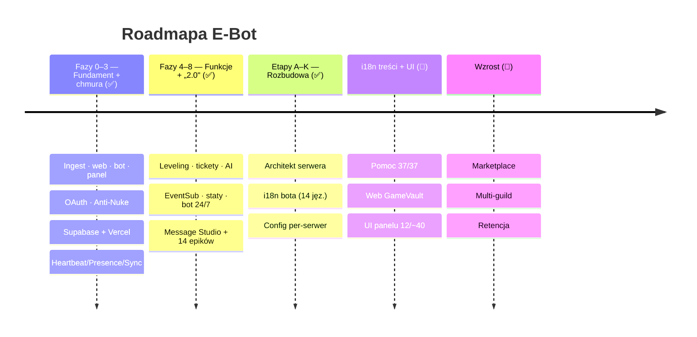
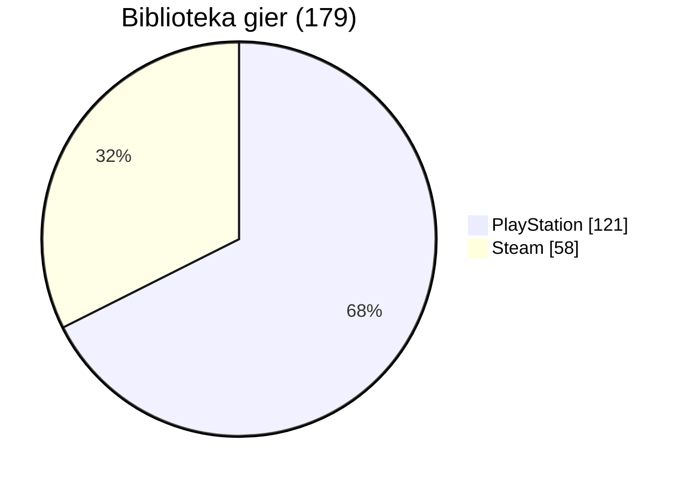

<!-- SYNC: v0.265.0 · #335 · 2026-06-19 — utrzymywane przez `pnpm docs:check` (badge wersji + blurb „Najnowsze") -->
<!-- ╔══════════════════════════════════════════════════════════════════╗ -->
<!-- ║                            E - B O T                              ║ -->
<!-- ╚══════════════════════════════════════════════════════════════════╝ -->

<div align="center">


# 🎬 E‑BOT &nbsp;·&nbsp; GH0ST EMPIRE

### ⟣ Discordowe ramię imperium · biblioteka gier „Netflix" · live · bezpieczeństwo ⟣

<br/>


<br/>

**[ 🖥️ Dashboard »](https://e-bot-dc.vercel.app)** &nbsp;·&nbsp;
**[ 📖 Wiki »](../../wiki)** &nbsp;·&nbsp;
**[ 🗺️ Roadmapa »](docs/ROADMAP.md)** &nbsp;·&nbsp;
**[ 📜 Changelog »](CHANGELOG.md)** &nbsp;·&nbsp;
**[ 🧠 Architektura »](docs/ARCHITECTURE.md)** &nbsp;·&nbsp;
**[ 🔐 Bezpieczeństwo »](.github/SECURITY.md)**

</div>

<br/>

```
━━━━━━━━━━━━━━━━━━━━━━━━━━━━━━━━━━━━━━━━━━━━━━━━━━━━━━━━━━━━━━━━━━━━━━━━━━
```

## ✨ O projekcie

**E‑Bot** to wielomodułowy ekosystem twórcy: bot Discord (discord.js v14), agregator
biblioteki gier w stylu **Netflix** (Steam · PlayStation · GOG → IGDB) oraz **panel
sterowania** (Next.js, hostowany na Vercel, dane w Supabase). E‑Bot jest **Discordowym
ramieniem GH0ST EMPIRE** — nalicza **Ghost Tokens (GT)** za aktywność i łączy konta z portalem.

> Right‑sized z planu SaaS (`docs/ANALIZA.md`) → wąski, działający produkt zamiast 75 modułów.

<br/>

## 🧩 Moduły

| Moduł | Opis | Status |
|:--|:--|:--:|
| 🎮 **Biblioteka gier** | Steam (58) + PlayStation (121) = **179**, okładki/metadane z IGDB → SQLite/Supabase |  |
| 🖥️ **Dashboard** | Panel GH0ST (Przegląd, Biblioteka, Live, Bezpieczeństwo, Integracje, Komendy, Ekonomia, Profil, Ustawienia) |  |
| 🤖 **Bot Discord** | ~95 slash‑komend (moderacja, ekonomia, leveling, tickety, AI, gry…), ~40 usług w tle, **i18n 14 języków** |  |
| 🛡️ **Anti‑Nuke** | Detekcja audit‑log, progi, kary, whitelist |  |
| 📡 **Powiadomienia live** | Twitch · Kick · YouTube · Rumble (polling) |  |
| 💰 **Ekonomia GH0ST** | GT za czat/voice, `/link`, stawki z portalu |  |

<br/>

## 🗺️ Architektura


<br/>

## 🧱 Stack technologiczny


<br/>


<br/>

## 🚀 Szybki start

```bash
# 1) Biblioteka gier → SQLite (Steam + PSN + GOG)
node ingest/sync.mts
npm run sync:cloud          # ingest + wysyłka do Supabase

# 2) Dashboard (panel GH0ST) — http://localhost:3001
cd dashboard && npm install && npm run dev

# 3) Bot Discord
cd bot && npm install && npm run deploy   # rejestracja slash-komend
cd bot && npm start                       # bot online + powiadomienia
```

> 🔑 Sekrety w `.env` / `dashboard/.env.local` (oba **gitignored**). Szablon: [`.env.example`](.env.example).

<br/>

## 🛰️ Funkcje

<details>
<summary><b>🎮 Biblioteka gier „Netflix"</b></summary>

- Kolektory: **Steam** (Web API), **PlayStation** (psn‑api / NPSSO), **GOG** (lokalna baza Galaxy)
- Normalizacja + okładki/gatunki/rok przez **IGDB** (OAuth Twitcha), dedup po `igdb_id`
- Dashboard: hero, filtry (platforma/gatunek/szukajka), gęste okładki, proxy obrazów `/api/img`
</details>

<details>
<summary><b>🛡️ Anti‑Nuke</b></summary>

- Detekcja przez `GuildAuditLogEntryCreate` + liczniki w pamięci (X akcji / Y s)
- 9 ochron: kanały/role create+delete, bany, kicki, webhooki, dodawanie botów
- Kary: ban · kick · timeout · strip ról · kwarantanna; whitelist (użytkownicy + role)
- Sterowanie: `/antinuke` oraz panel **Bezpieczeństwo**
</details>

<details>
<summary><b>📡 Powiadomienia live + 💰 Ekonomia GH0ST</b></summary>

- Live: Twitch · Kick · Rumble (polling 60 s), YouTube (opcjonalnie); embedy w kolorach platform
- Ekonomia: GT za wiadomości i voice (stawki z `/api/bot/config`), `/link` łączy konto z portalem
- Panel **Ekonomia** pokazuje stawki na żywo; **Live** auto‑odświeża się co 30 s
</details>

<details>
<summary><b>🖥️ Dashboard (GH0ST look)</b></summary>

- Logowanie **Discord OAuth** (tylko właściciel), responsywny (mobilne menu)
- **Personalizacja bota** (nazwa, avatar), **status/aktywność**, **motyw/kolor akcentu**
- **Zaproś bota** jednym kliknięciem, statystyki, wykresy, profil
</details>

<br/>

## 🗓️ Roadmapa



Pełna roadmapa i fazy → [`docs/ROADMAP.md`](docs/ROADMAP.md) · [`docs/PHASES.md`](docs/PHASES.md)

<br/>

## 📊 Biblioteka w liczbach



<br/>

## 📜 Changelog

Najnowsze: **v0.265.0** — 🧱 **Infra prod: audyt gotowości + przewodnik aktywacji** — Sentry (DSN-gated), Supabase Realtime (z fallbackiem poll), Redis (opcja na skalę) — wszystko kompletne i gated, [`docs/AKTYWACJA-INFRA.md`](docs/AKTYWACJA-INFRA.md). Wcześniej: Twitch sub→rola kod-ready + przewodnik (v0.264.0), `/stats` zakres + eksport CSV (v0.263.0); domknięte **i18n 14 jęz.** i **lustrzane RTL** (v0.254–260). Wcześniej: 14 stron tras (v0.258.0), strona główna (v0.257.0), chrom nawigacyjny (v0.255–256), fundament RTL `dir="rtl"` + audyt i18n 14 jęz. **1394×14** (v0.254.0). Wcześniej domknięta **i18n CAŁEJ powierzchni web**: panel 39/39 + współdzielone edytory + powierzchnia publiczna (login/`/p/leaderboard`/`/p/u/[id]`) + boilerplate (`error`/`404`/`loading`/metadane) + obraz OG profilu (fonty per-skrypt). Fundamenty: i18n treści „Jak to działa?" (37/37), web GameVault (+RTL), Architekt serwera, config per‑serwer (Etap K), 14 epików „2.0" (Faza 8).
Pełna, numerowana historia → [`CHANGELOG.md`](CHANGELOG.md).

<br/>

## 📁 Struktura repo

```
E-Bot/
├─ ingest/        📥 kolektory: steam · psn · gog · igdb → data/bot.db (+ Supabase)
├─ bot/           🤖 discord.js v14 — komendy, powiadomienia, anti-nuke, ekonomia
├─ dashboard/     🖥️ Next.js (panel GH0ST) → Vercel + Supabase
├─ web/           🎞️ pierwsza wersja UI „Netflix dla gier" (lokalnie)
├─ docs/          📚 ANALIZA · DESIGN · ARCHITECTURE · ROADMAP · PHASES · SECRETS
├─ .github/       ⚙️ CI · CodeQL · Dependabot · CODEOWNERS · SECURITY
├─ CHANGELOG.md   📜 numerowana historia
└─ README.md      🎬 ten plik
```

<br/>

## 🔐 Bezpieczeństwo

Repo **prywatne**, chronione: branch protection, CodeQL, Dependabot, secret‑scanning,
proprietarna licencja, CODEOWNERS. Sekrety wyłącznie w `.env*` (gitignored).
Szczegóły i zgłaszanie → [`.github/SECURITY.md`](.github/SECURITY.md).

<br/>

## 📚 Dokumentacja

| Dokument | Treść |
|:--|:--|
| [Wiki](../../wiki) | Pełna baza wiedzy projektu |
| [docs/ARCHITECTURE.md](docs/ARCHITECTURE.md) | Diagramy, przepływy, decyzje |
| [docs/ROADMAP.md](docs/ROADMAP.md) | Roadmapa + Gantt |
| [docs/PHASES.md](docs/PHASES.md) | Fazy i status (na bieżąco) |
| [docs/ANALIZA.md](docs/ANALIZA.md) | Analiza i right‑sizing |
| [docs/DESIGN.md](docs/DESIGN.md) | System wizualny (GH0ST/Netflix) |
| [docs/SECRETS.md](docs/SECRETS.md) | Triage kluczy + rotacja |

<br/>

<div align="center">

```
━━━━━━━━━━━━━━━━━━━━━━━━━━━━━━━━━━━━━━━━━━━━━━━━━━━━━━━━━━━━━━━━━━━━━━━━━━
```

**© 2026 GH0ST EMPIRE — wszelkie prawa zastrzeżone.**
Made with 🩸 & ☕ · `E-BOT`

</div>
