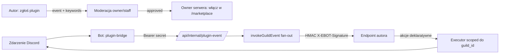

<div align="center">

# 🧩 Aktywacja pluginów community (Marketplace M6)


</div>

> Pluginy community (3rd-party) są **kompletne i wpięte**, ale **domyślnie wyłączone**. Bez flag panel działa jak dziś (zero przyjmowania zgłoszeń, zero wykonywania obcych pluginów). Ten przewodnik aktywuje cały tor: **zgłoszenie → moderacja → włączenie per-serwer → auto-trigger z bota → wykonanie w sandboxie**. Model bezpieczeństwa: [`PLAN-M6-SANDBOX.md`](PLAN-M6-SANDBOX.md), audyt: [`SECURITY-REVIEW-MARKETPLACE.md`](SECURITY-REVIEW-MARKETPLACE.md).

```
━━━━━━━━━━━━━━━━━━━━━━━━━━━━━━━━━━━━━━━━━━━━━━━━━━━━━━━━━━━━━━━━━━━━━━━━━━
```

## 🔑 Najpierw: DWA różne sekrety (nie myl ich)

| Sekret | Między kim | Po co | Gdzie ustawiasz |
|:--|:--|:--|:--|
| **`PLUGIN_BRIDGE_SECRET`** | bot ↔ panel | nagłówek `Authorization: Bearer` — bot uwierzytelnia się w `/api/internal/*` | **ten sam** w env panelu (Vercel) **i** bota (Railway), ≥16 znaków |
| **manifest `secret`** (pole pluginu) | panel ↔ endpoint autora | podpis `X-EBOT-Signature` (HMAC-SHA256) — autor weryfikuje, że wywołanie pochodzi od nas | autor podaje przy zgłoszeniu pluginu (per-plugin) |

- Oba to **sekrety** — po wycieku (czat/screenshot/log) natychmiast zrotuj. `PLUGIN_BRIDGE_SECRET` zmieniasz w env (panel + bot równocześnie); manifest `secret` — przez ponowne zgłoszenie/edycję pluginu.
- Endpoint mostu **bez** `PLUGIN_BRIDGE_SECRET` (lub przy community OFF) zwraca **404** — nie zdradza nawet swojego istnienia.

## 🔧 Kroki aktywacji

1. **Schemat** — upewnij się, że uruchomiony jest [`m1-marketplace-schema.sql`](../dashboard/scripts/m1-marketplace-schema.sql) (tabele `plugins`, `guild_plugins`, `plugin_config`).
2. **Panel (Vercel)** → Settings → Environment Variables:
   - `MARKETPLACE_COMMUNITY=1` — włącza przyjmowanie zgłoszeń **i** wykonywanie zatwierdzonych pluginów.
   - `PLUGIN_BRIDGE_SECRET=<losowe ≥16 znaków>` — np. `openssl rand -hex 24`.
   - Redeploy.
3. **Bot (Railway)** → Variables:
   - `PLUGIN_BRIDGE_URL=https://<twój-panel>` (TYLKO https, np. `https://e-bot-dc.vercel.app`).
   - `PLUGIN_BRIDGE_SECRET=<ta sama wartość co w panelu>`.
   - Restart bota — w logach pojawi się `plugin-bridge: aktywny (...)`.
4. **Intencje bota** — `messageCreate` wymaga przywileju **Message Content** (a member lifecycle — **Server Members**) w Discord Dev Portal. Oba są już używane przez bota (automod/powitania).

## 🔄 Jak to działa



**6 warstw strażników** (każde wywołanie przechodzi wszystkie):
1. `MARKETPLACE_COMMUNITY=1` (env),
2. plugin `source=community` **i** `review_status=approved`,
3. manifest ma `endpoint` (https) + `secret`,
4. `guild_plugins.enabled=true` dla TEGO serwera,
5. SSRF-guard runnera (https + blokada loopback/private/link-local/metadata, brak redirectów, timeout 3 s, limit 100 KB),
6. per-akcja authz executora: kanał ∈ gildia · rola ∈ gildia, nie-managed, **bez groźnych uprawnień** (anty-eskalacja).

> Bot jest autorytatywny tylko co do `guild_id` zdarzenia — o tym, **czy** i **co** się wykona, decyduje wyłącznie panel (zatwierdzenie + włączenie + authz). Obcego kodu nie uruchamiamy ani w bocie, ani w panelu.

```
━━━━━━━━━━━━━━━━━━━━━━━━━━━━━━━━━━━━━━━━━━━━━━━━━━━━━━━━━━━━━━━━━━━━━━━━━━
```

## 📡 Kontrakt webhooka (dla autorów pluginów)

Panel wysyła **POST** na `endpoint` z manifestu:

```
POST <endpoint>
Content-Type: application/json
X-EBOT-Signature: <hex HMAC-SHA256(rawBody, manifest.secret)>

{
  "event": "guildMemberAdd",
  "guild_id": "123…",
  "plugin_key": "moj-plugin",
  "config": { /* aktualny plugin_config dla tego serwera+pluginu */ },
  "input": { /* ładunek zależny od zdarzenia, patrz niżej */ }
}
```

Plugin **musi** odpowiedzieć (HTTP 200, JSON, ≤100 KB, w ≤3 s, bez redirectów):

```json
{
  "actions": [
    { "type": "sendMessage", "channelId": "…", "content": "…" },
    { "type": "addRole",     "userId": "…",   "roleId": "…" },
    { "type": "setConfig",   "key": "…",      "value": "…" }
  ]
}
```

**Akcje** (max 20 na odpowiedź; host wykona je scoped do `guild_id`):

| `type` | Pola | Limity | Wykonanie (host) |
|:--|:--|:--|:--|
| `sendMessage` | `channelId`, `content` | content ≤ 2000 | tylko gdy kanał ∈ gildia |
| `addRole` | `userId`, `roleId` | — | tylko gdy rola ∈ gildia, nie-managed, **bez** groźnych uprawnień |
| `setConfig` | `key`, `value` | key ≤ 64, value ≤ 4000 | zapis do `plugin_config` (zero efektu w Discordzie) |

**Ładunek `input` wg zdarzenia:**

| `event` | `input` | Uwagi |
|:--|:--|:--|
| `guildMemberAdd` | `{ userId, username }` | nowy członek |
| `guildMemberRemove` | `{ userId, username }` | odejście |
| `guildBoost` | `{ userId, username }` | start boostowania |
| `messageCreate` | `{ userId, channelId, content }` | tylko wiadomości zawierające słowo-klucz z manifestu (`keywords`); boty pominięte |
| `manual` | `null` lub dowolny | owner-run / dry-run z panelu |

## 🧪 Przykładowy plugin (Node.js)

Minimalny handler — **najpierw weryfikuj podpis na SUROWYM body**, dopiero potem parsuj JSON:

```js
import crypto from 'node:crypto';
import express from 'express';

const SECRET = process.env.EBOT_PLUGIN_SECRET; // to samo, co podałeś w manifeście (pole „secret")
const app = express();

// WAŻNE: surowe body do weryfikacji podpisu (podpis liczony jest z bajtów, nie z re-serializacji).
app.post('/ebot', express.raw({ type: 'application/json' }), (req, res) => {
  const raw = req.body; // Buffer
  const expected = crypto.createHmac('sha256', SECRET).update(raw).digest('hex');
  const got = String(req.get('X-EBOT-Signature') || '');
  if (got.length !== expected.length || !crypto.timingSafeEqual(Buffer.from(got), Buffer.from(expected))) {
    return res.status(401).end(); // zły podpis → odrzuć
  }

  const { event, input, config } = JSON.parse(raw.toString('utf8'));

  if (event === 'guildMemberAdd') {
    return res.json({
      actions: [
        { type: 'sendMessage', channelId: config.welcomeChannelId, content: `Witaj <@${input.userId}>! 👋` },
      ],
    });
  }
  return res.json({ actions: [] }); // brak akcji = nic się nie dzieje
});

app.listen(3000);
```

- Hostuj go publicznie po **https** (np. Render/Railway/Cloudflare/Vercel) — SSRF-guard odrzuci adresy lokalne/prywatne.
- `config.welcomeChannelId` ustawisz przez akcję `setConfig` albo z panelu (`plugin_config`). Wartość kanału/roli musi należeć do serwera — inaczej host odrzuci akcję.

## ✅ Test bez ryzyka

1. **Zgłoś** plugin w `/marketplace/submit` (klucz, tytuł, **endpoint https**, **secret**, **event**, dla `messageCreate` — `keywords`).
2. **Zatwierdź** w panelu moderacji (owner/staff).
3. **Dry-run** — `POST /api/community/dryrun` (owner-only): woła Twój endpoint przez runner i pokazuje zwrócone akcje **bez wykonania**. Idealny do debugowania kontraktu/podpisu.
4. **Włącz** plugin na serwerze w `/marketplace` i albo wywołaj **owner-run** (`/api/community/run`), albo wyzwól realne zdarzenie Discorda.

## 🟢 Stan bez aktywacji

- `MARKETPLACE_COMMUNITY` puste → panel nie przyjmuje zgłoszeń, `/api/community/*` i `/api/internal/*` zwracają 400/404, bot nie forwarduje zdarzeń. Zero zmian w działaniu first-party.
- Aktywacja jest w pełni odwracalna — usuń env i zrób redeploy/restart.

```
━━━━━━━━━━━━━━━━━━━━━━━━━━━━━━━━━━━━━━━━━━━━━━━━━━━━━━━━━━━━━━━━━━━━━━━━━━
```
<div align="center"><sub>Powiązane: <a href="PLAN-M6-SANDBOX.md">PLAN-M6-SANDBOX</a> · <a href="SECURITY-REVIEW-MARKETPLACE.md">SECURITY-REVIEW</a> · <a href="PLAN-MARKETPLACE.md">PLAN-MARKETPLACE</a> · <a href="PHASES.md">PHASES</a></sub></div>
