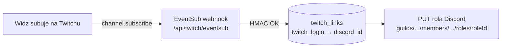

<div align="center">

# 🟣 Aktywacja: Twitch sub → rola Discord


</div>

> Kod jest **kompletny** (panel + EventSub + bot). Aktywacja wymaga jednorazowo Twojej aplikacji Twitch oraz autoryzacji broadcastera. Ten przewodnik to dokładna lista kroków.

```
━━━━━━━━━━━━━━━━━━━━━━━━━━━━━━━━━━━━━━━━━━━━━━━━━━━━━━━━━━━━━━━━━━━━━━━━━━
```

## 🔁 Jak to działa (gdy aktywne)



Plik runtime: [`dashboard/app/api/twitch/eventsub/route.ts`](../dashboard/app/api/twitch/eventsub/route.ts) → `assignSubRole`. Bez konfiguracji **degraduje się cicho** (early-return, zero błędów).

## ✅ Kroki aktywacji

1. **Aplikacja Twitch** — [dev.twitch.tv/console](https://dev.twitch.tv/console/apps) → utwórz aplikację. Zapisz `Client ID` i `Client Secret`. W „OAuth Redirect URLs" dodaj URL panelu.
2. **Zmienne środowiskowe** (panel — Vercel / `.env`):
   - `TWITCH_CLIENT_ID`, `TWITCH_CLIENT_SECRET`
   - `TWITCH_CHANNEL` — login kanału broadcastera (małe litery)
   - `TWITCH_EVENTSUB_SECRET` — dowolny losowy sekret (HMAC podpisu webhooka)
   - `EVENTSUB_CALLBACK` — `https://<twój-panel>/api/twitch/eventsub` (domyślnie `e-bot-dc.vercel.app`)
   - `DISCORD_BOT_TOKEN` — token bota (nadawanie roli)
3. **Autoryzacja broadcastera** (jednorazowo, klucz całości) — broadcaster otwiera URL OAuth ze scope `channel:read:subscriptions` i akceptuje:
   ```
   https://id.twitch.tv/oauth2/authorize?client_id=<CLIENT_ID>&redirect_uri=<REDIRECT>&response_type=code&scope=channel:read:subscriptions
   ```
   Bez tego Twitch odrzuci rejestrację `channel.subscribe`.
4. **Schemat DB** — zastosuj [`dashboard/scripts/expansion-n-twitchsub-schema.sql`](../dashboard/scripts/expansion-n-twitchsub-schema.sql) (tabele `twitch_sub_config`, `twitch_links`) w Supabase.
5. **Rejestracja EventSub** — po wdrożeniu panelu uruchom:
   ```
   node dashboard/scripts/eventsub-setup.mts
   ```
   Skrypt rejestruje teraz **oba** typy: `stream.online` (powiadomienia live) **oraz** `channel.subscribe` (sub → rola). Jeśli `channel.subscribe` zwróci błąd — broadcaster nie autoryzował scope z kroku 3.
6. **Panel** — `/notifications` → `TwitchSubForm`: włącz „subskrypcja → rola" i wybierz rolę Discord (zapisuje `twitch_sub_config` = `{ enabled, roleId }`).
7. **Linkowanie kont** — widzowie wiążą Twitch ↔ Discord komendą `/linktwitch` na Discordzie (zapisuje `twitch_links`). Tylko zlinkowani dostają rolę.

## 🧪 Weryfikacja

- `eventsub-setup.mts` wypisuje `✅ channel.subscribe: <id> · status: enabled`.
- Testowy sub (lub `Test Event` w Twitch CLI) → w logach panelu `[eventsub:sub]` brak błędu, rola nadana zlinkowanemu użytkownikowi.

```
━━━━━━━━━━━━━━━━━━━━━━━━━━━━━━━━━━━━━━━━━━━━━━━━━━━━━━━━━━━━━━━━━━━━━━━━━━
```
<div align="center"><sub>Powiązane: <a href="ROADMAP.md">ROADMAP</a> · <a href="PHASES.md">PHASES</a> · runtime: <code>dashboard/app/api/twitch/eventsub/route.ts</code></sub></div>
