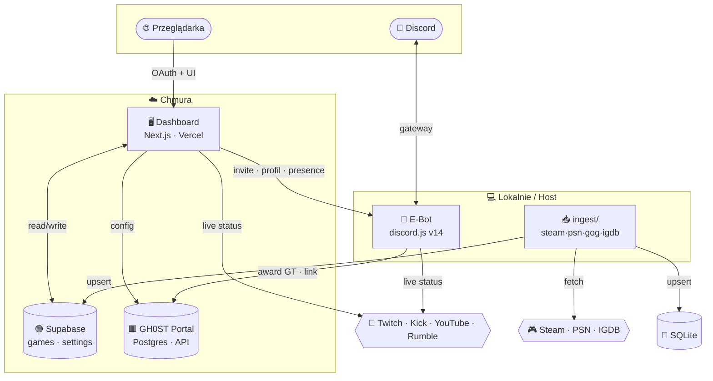
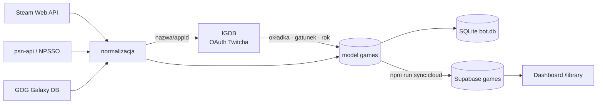
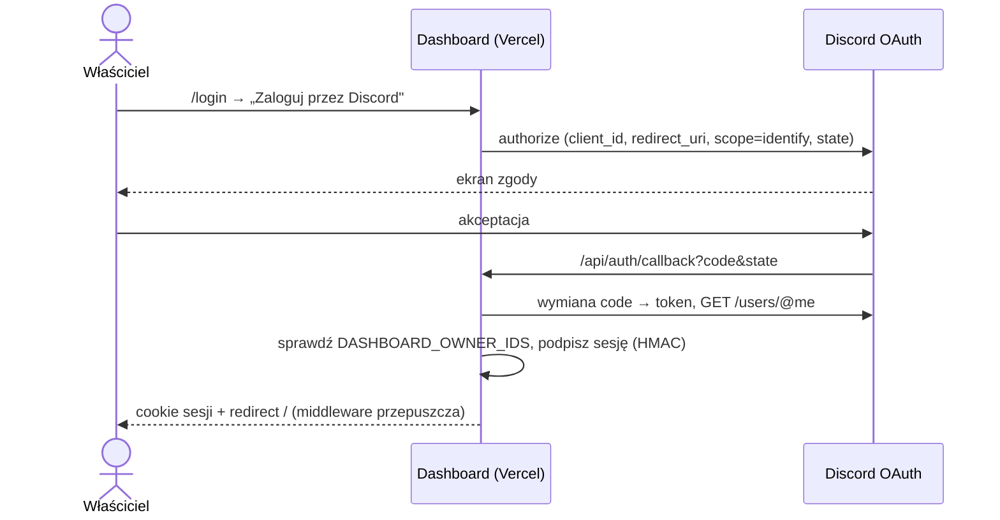
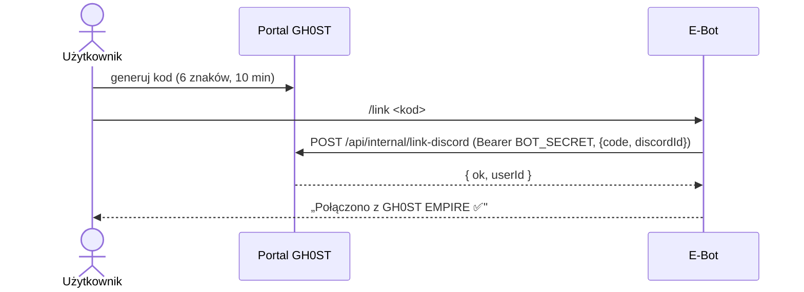
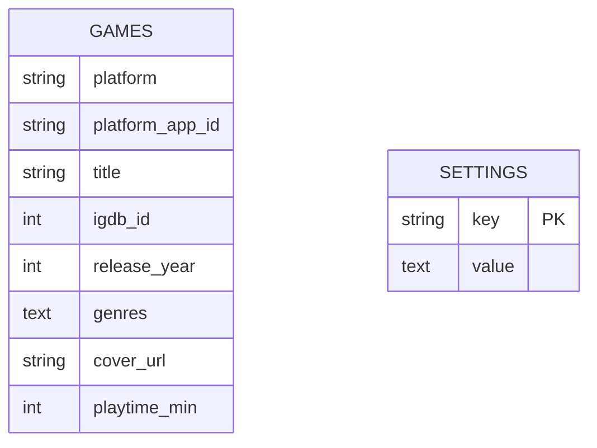

<!-- Uwaga: diagramy nie obejmują jeszcze warstwy Marketplace pluginów (M1–M6: plugin-bridge,
     sandbox, auto-trigger). Architektura pluginów: docs/PLAN-MARKETPLACE.md · docs/PLAN-M6-SANDBOX.md ·
     docs/SECURITY-REVIEW-MARKETPLACE.md. -->

<div align="center">

# 🧠 ARCHITEKTURA &nbsp;·&nbsp; E‑BOT


</div>

```
━━━━━━━━━━━━━━━━━━━━━━━━━━━━━━━━━━━━━━━━━━━━━━━━━━━━━━━━━━━━━━━━━━━━━━━━━━
```

## 🛰️ Widok systemu



## 🔻 Przepływ danych — biblioteka gier



## 🔐 Sekwencja — logowanie do panelu (Discord OAuth)



## 🔗 Sekwencja — łączenie konta GH0ST (`/link`)



## 🧩 Mapa modułów

| Ścieżka | Rola |
|:--|:--|
| `ingest/` | Kolektory gier → `data/bot.db` (+ Supabase przez `sync:cloud`) |
| `bot/src/` | discord.js: komendy, `live/` powiadomienia, `security/` anti‑nuke, `empire/` ekonomia |
| `dashboard/app/` | Strony panelu (App Router) + `api/` (auth, img, settings, antinuke, bot/*, live) |
| `dashboard/lib/` | `data` (adapter Supabase↔SQLite), `live`, `economy`, `session`, `auth`, `themes`, `invite`… |
| `dashboard/components/` | UI: Sidebar, Topbar, karty, formularze, ThemeSwitcher… |
| `web/` | Pierwsza wersja UI „Netflix dla gier" (lokalna) |

## 🗃️ Model danych (kluczowe tabele)



`settings` przechowuje m.in.: `antinuke` (JSON), powiadomienia (`notify_*`), `bot_status` (heartbeat),
`bot_presence` (status/aktywność).

## 🧠 Kluczowe decyzje (ADR skrót)

| # | Decyzja | Dlaczego |
|:--:|:--|:--|
| 1 | **Node LTS**, nie Bun | Stabilność discord.js + audio |
| 2 | **node:sqlite** lokalnie → **Supabase** w chmurze | Zero‑ops dev, jeden adapter z fallbackiem |
| 3 | **Adapter Supabase↔SQLite** (fallback na błędzie) | Panel działa lokalnie i w chmurze tym samym kodem |
| 4 | **IGDB przez OAuth Twitcha** | Darmowe metadane, te same klucze |
| 5 | **Proxy `/api/img`** | CORS/cache okładek, whitelist hostów (anty‑SSRF) |
| 6 | **OAuth HMAC cookie + middleware** | Lekka autoryzacja właściciela bez ciężkich zależności |

```
━━━━━━━━━━━━━━━━━━━━━━━━━━━━━━━━━━━━━━━━━━━━━━━━━━━━━━━━━━━━━━━━━━━━━━━━━━
```
<div align="center"><sub>Powiązane: <a href="ROADMAP.md">ROADMAP</a> · <a href="DESIGN.md">DESIGN</a> · <a href="SECRETS.md">SECRETS</a></sub></div>
