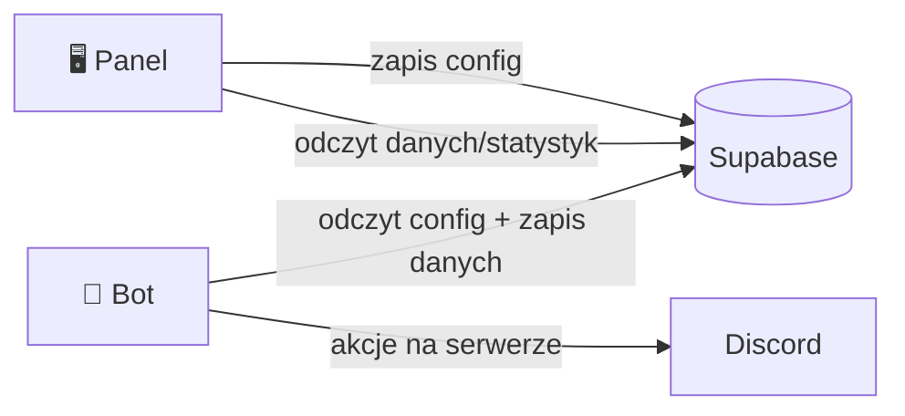
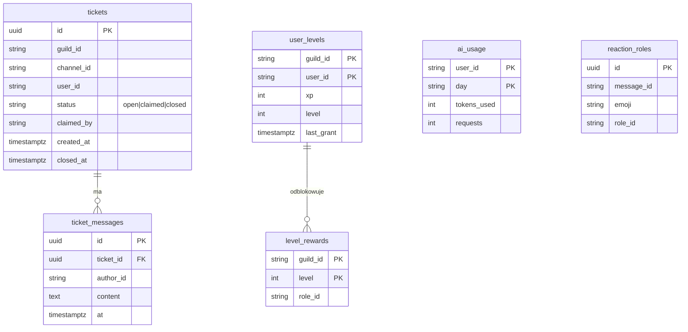
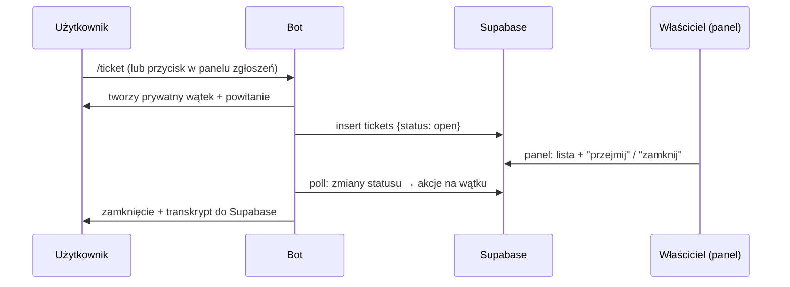
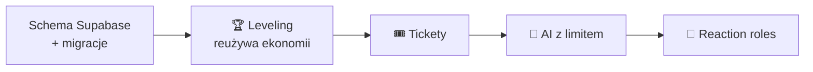

<div align="center">

# 🧭 PLAN FAZY 4 &nbsp;·&nbsp; E‑BOT — Wzrost


</div>

> Plan przed kodem — architektura, model danych i podział **bot ↔ panel** dla funkcji Fazy 4.
> Funkcje są **bot‑side** (katalog `bot/` = sesja 2) → wymagają koordynacji. Panel‑side robię samodzielnie.

```
━━━━━━━━━━━━━━━━━━━━━━━━━━━━━━━━━━━━━━━━━━━━━━━━━━━━━━━━━━━━━━━━━━━━━━━━━━
```

## 🧱 Zasada architektury (z Fazy 3)

Trzymamy wzorzec, który już działa: **panel pisze do Supabase → `settings-sync` pobiera do bota**. Nowe funkcje dostają własne tabele w Supabase; bot je czyta/zapisuje przez ten sam klient REST (`bot/src/lib/cloud.mts`).



## 🗃️ Nowy model danych (Supabase)



```
━━━━━━━━━━━━━━━━━━━━━━━━━━━━━━━━━━━━━━━━━━━━━━━━━━━━━━━━━━━━━━━━━━━━━━━━━━
```

## 🎟️ 1. Tickety

System zgłoszeń: użytkownik otwiera ticket → bot tworzy **prywatny wątek/kanał** → obsługa z panelu i z Discorda.



| Element | Strona | Opis |
|:--|:--:|:--|
| `/ticket` + przycisk panelu | 🤖 bot | otwiera wątek, zapis do `tickets` |
| Lista/zarządzanie ticketów | 🖥️ panel | nowa strona `/tickets` (open/claimed/closed, transkrypt) |
| Przejmij/zamknij | 🖥️→🤖 | panel pisze status → bot wykonuje (settings/poll) |
| Transkrypt | 🤖 bot | zapis `ticket_messages` przy zamknięciu |

## 🏆 2. Leveling / XP

XP za aktywność (czat + voice) — **reużywamy hooków ekonomii** (`bot/src/empire/{messages,voice}.mts`) z anty‑spamem (cooldown 60 s/wiadomość).

- Formuła: `xpDoNastępnego = 5 * level² + 50 * level + 100` (klasyczna, łagodna progresja).
- **Role‑nagrody**: `level_rewards` (poziom → rola); bot nadaje rolę przy awansie + ogłasza.
- **Panel**: konfiguracja progów/ról + **ranking** (`/levels` strona z top 100, czyta `user_levels`).

| Element | Strona |
|:--|:--:|
| Naliczanie XP (czat/voice) + awanse | 🤖 bot |
| Nadawanie ról‑nagród | 🤖 bot |
| Konfiguracja progów + ranking | 🖥️ panel |

## 🤖 3. Komendy AI (z twardym limitem kosztów)

`/ai <prompt>` przez **DeepSeek** (tani) z fallbackiem OpenAI — z **budżetem**:
- Limit dzienny per‑user (np. 20 zapytań / 50k tokenów) w `ai_usage` — bot sprawdza **przed** wywołaniem.
- Globalny bezpiecznik kosztów (miesięczny cap) — po przekroczeniu komenda grzecznie odmawia.
- Streaming odpowiedzi w ephemeral; moderacja wejścia (bez sekretów/PII).
- **Panel**: ustawienia limitów + podgląd zużycia (wykres z `ai_usage`).

| Element | Strona |
|:--|:--:|
| `/ai` + licznik tokenów + cap | 🤖 bot |
| Limity + statystyki zużycia | 🖥️ panel |

## 🧩 4. Dodatki (backlog Fazy 4)

- **Reaction roles** — edytor w panelu (`reaction_roles`) → bot nadaje role po reakcji.
- **EventSub (Twitch)** — webhooki zamiast pollingu (przez Cloudflare Tunnel / endpoint Vercel).
- **Statystyki/retencja** — wykresy aktywności w panelu (z istniejących zdarzeń).

```
━━━━━━━━━━━━━━━━━━━━━━━━━━━━━━━━━━━━━━━━━━━━━━━━━━━━━━━━━━━━━━━━━━━━━━━━━━
```

## 🗂️ Proponowana kolejność



1. **Schema** (tabele wyżej) — fundament, panel‑side, zero ryzyka.
2. **Leveling** — najwięcej wartości, reużywa istniejących hooków ekonomii.
3. **Tickety** — samodzielny moduł.
4. **AI** — wymaga ostrożności wokół kosztów.
5. **Reaction roles / EventSub** — dodatki.

## ⚖️ Podział pracy (bot ↔ panel)

| Robię samodzielnie (panel/infra) | Wymaga `bot/` (koordynacja z sesją 2) |
|:--|:--|
| Schema Supabase + migracje | Naliczanie XP, awanse, role‑nagrody |
| Strony `/tickets`, `/levels`, AI‑limity | `/ticket`, akcje na wątkach |
| Konfiguracja → Supabase (wzorzec settings) | `/ai` + egzekwowanie limitów |
| Wykresy/rankingi (odczyt) | Reaction‑role listener |

> 💡 Mogę zacząć **bezkonfliktowo** od schematu Supabase + stron panelu (config/rankingi), a logikę bota dołożyć, gdy potwierdzisz wejście w `bot/` (lub zrobi to sesja 2).

<div align="center"><sub>🧭 Plan Fazy 4 · E‑BOT — powiązane: <a href="ROADMAP.md">ROADMAP</a> · <a href="PHASES.md">PHASES</a> · <a href="../CHANGELOG.md">CHANGELOG</a></sub></div>
