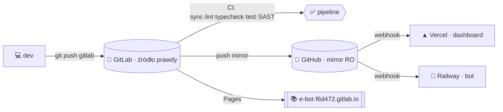

<div align="center">

# 🛠️ Utrzymanie repozytorium E‑BOT


**Przewodnik operacyjny** — jak na co dzień utrzymywać repo po migracji na model GitLab‑first. Stan na 2026‑07‑13.

</div>

```
━━━━━━━━━━━━━━━━━━━━━━━━━━━━━━━━━━━━━━━━━━━━━━━━━━━━━━━━━━━━━━━━━━━━━━━━━━
```

## 0. Mapa w jednym akapicie

**GitLab** (`gitlab.com/Gh0s777tt/e-bot`) to źródło prawdy: tu pushujesz, tu działa CI/CD. **Push mirror** kopiuje `main` i tagi na **GitHub** (`Gh0s777tt/E-Bot`, tylko odczyt), z którego **Vercel** (panel) i **Railway** (bot) auto‑wdrażają. Dokumentacja buduje się z `docs/` na **GitLab Pages**. Jakość pilnują: **pre‑commit**, **GitLab CI** i **hook Claude Code (Stop)**.



```
━━━━━━━━━━━━━━━━━━━━━━━━━━━━━━━━━━━━━━━━━━━━━━━━━━━━━━━━━━━━━━━━━━━━━━━━━━
```

## 1. Codzienny workflow

```bash
git switch -c feat/moja-zmiana          # gałąź tematyczna
# … praca …
pnpm sync:check && pnpm check && pnpm typecheck && pnpm test   # bramki lokalnie
git commit -m "feat(bot): opis"         # pre-commit: sync + biome --staged
git push gitlab feat/moja-zmiana        # → otwórz Merge Request do main
```

- **Commity**: Conventional Commits (`feat` · `fix` · `docs` · `chore` · `ci` · `refactor` · `test` · `perf` · `build`), małe i tematyczne, po polsku.
- **Merge do `main`**: przez MR (main chroniony — bez force‑push i kasowania). Bezpośredni push maintainera dozwolony, ale MR daje przebieg CI przed scaleniem.
- Aktywacja hooków raz na klon: `git config core.hooksPath scripts/hooks`.

## 2. Bramki jakości

| Komenda | Pilnuje | Gdzie egzekwowane |
|:--|:--|:--|
| `pnpm check` | Biome — lint + format (2 sp., lineWidth 100) | pre‑commit (`--staged`) · CI `lint` |
| `pnpm typecheck` | `tsc --noEmit` ×4 pakiety | CI `typecheck` |
| `pnpm docs:check` | markery `SYNC` w README/PHASES/ROADMAP = wersja CHANGELOG | pre‑commit · CI `sync:check` · hook Stop |
| `pnpm schema:check` | `_ALL.sql` ↔ schematy per‑feature | pre‑commit · CI |
| `pnpm env:check` | `.env.example` ↔ `process.env` | pre‑commit · CI |
| `pnpm test` / `test:coverage` | Vitest + próg pokrycia (ratchet) | CI `unit` |

Zbiorczo: **`pnpm sync:check`**. Awaryjne pominięcie hooka: `git commit --no-verify`.

> **Próg pokrycia** (`vitest.config.ts`): stmts 34 / br 31 / **fn 31** / ln 35 — podłoga tuż pod baseline. **Podnoś przy dokładaniu testów**; nie obniżaj, chyba że nowy, świadomie nietestowany kod obniża realny baseline (jak billing #694–#696 → fn 32→31).

## 3. Pipeline CI/CD (`.gitlab-ci.yml`)

```
sync ──▶ quality ──▶ test ──▶ release ──▶ deploy
 │         │           │         │           │
sync:check lint       unit      release     pages
           typecheck  build     (manual)    (GitLab Pages)
           audit:deps e2e*      
                      SAST · Secret Detection
```

- Joby Node dziedziczą obraz+instalację przez `extends: .node` (NIE globalny `default` — inaczej obrazy SAST dostają `corepack` i padają).
- `audit:deps`, `e2e` = `allow_failure` (informacyjne / do stabilizacji). **e2e** wymaga serwera panelu + env — do promocji na wymagany po skonfigurowaniu.
- Coverage raportowany jako **cobertura** (widoczny w MR).

## 4. Wydania (semantic-release)

Skonfigurowany (`.releaserc.json`), **uśpiony** — job `release` jest `when: manual` i pojawia się **tylko** gdy ustawiono zmienną `GL_RELEASE_TOKEN`.

**Uzbrojenie (jednorazowo):**
1. Settings → Access Tokens → **Project Access Token**, rola **Maintainer**, scope **`api` + `write_repository`**.
2. Settings → CI/CD → Variables → **`GL_RELEASE_TOKEN`** = token (masked + protected).
3. W pipeline `main` pojawi się job **`release`** → ▶ ręcznie.

**Co robi run:** Conventional Commits → wersja → wpis w `CHANGELOG.md` → `scripts/bump-sync-markers.mjs` podbija markery SYNC + badge (docs:check zielony) → commit `[skip ci]` → tag `vX.Y.Z` → GitLab Release.

> ⚠️ Pierwszy run **zmienia styl CHANGELOG** na auto‑generowany z commitów (koniec ręcznie kurowanych, polskich blurbów dla NOWYCH wersji; stara historia zostaje). Jeśli wolisz „auto‑tag + zachowany kurowany CHANGELOG" — zmień plugin chain w `.releaserc.json` (usuń `@semantic-release/changelog`, zostaw tag+release).

**Alternatywa manualna** (dopóki nie uzbroisz): dopisz wpis `## [x.y.z]` na górze CHANGELOG i podbij markery SYNC (`node scripts/bump-sync-markers.mjs x.y.z`), zgodnie z ZASADĄ #1 z `CLAUDE.md`.

## 5. Zależności (Renovate)

`renovate.json`: grupuje minor+patch, automerge łatek `devDependencies` po zielonym CI, major i alerty podatności osobno (etykiety). **Wymaga aktywnej aplikacji Mend Renovate** na projekcie GitLab (lub self‑hosted runnera) — bez niej config leży bezczynnie. Dependabot usunięty (GitHub‑only).

## 6. Mirror GitLab → GitHub

- Konfiguracja: GitLab → **Settings → Repository → Mirroring repositories** (kierunek **Push**).
- Auth: **GitHub PAT** (scope `repo`) wbity w URL mirrora.
- **Pułapka**: rotacja tego PAT‑u **zatrzymuje mirror** → GitHub przestaje się aktualizować → Vercel/Railway wdrażają stary kod. Po rotacji: podmień token we wpisie mirrora i „Update now".
- Diagnoza: status „finished/failed" widać przy wpisie mirrora.

## 7. Dokumentacja (docs-as-code)

- Źródło: `docs/*.md` + `mkdocs.yml`. Portal: **MkDocs Material** → job `pages` → **https://e-bot-f6d472.gitlab.io** (prywatny — wymaga logowania GitLab).
- Lokalny podgląd: `python3 -m venv .venv && .venv/bin/pip install -r requirements.txt && .venv/bin/mkdocs serve`.
- Nowy dokument: dodaj plik do `docs/` i wpis do `nav:` w `mkdocs.yml`. Build musi przejść `--strict`.

```
━━━━━━━━━━━━━━━━━━━━━━━━━━━━━━━━━━━━━━━━━━━━━━━━━━━━━━━━━━━━━━━━━━━━━━━━━━
```

## 8. 🔐 Bezpieczeństwo — ROTACJA KLUCZY (pilne po tej sesji)

W trakcie prac konfiguracyjnych używano **żywych poświadczeń**. **Zrotuj je** i trzymaj wyłącznie w panelach (Vercel/Railway/GitLab CI Variables), nigdy w repo/czacie:

- [ ] **Stripe** `sk_live_…` → Dashboard → Developers → API keys → **Roll**.
- [ ] **Vercel** tokeny → Account → Tokens → revoke + nowy.
- [ ] **Railway** API key → Account → Tokens → regenerate.
- [ ] **GitHub PAT** (w tym token mirrora `ghp_…`) → Settings → Developer settings → revoke + nowy → **zaktualizuj wpis mirrora w GitLab**.
- [ ] **GitLab** token(y) → Settings → Access Tokens → revoke; dla release utwórz świeży `GL_RELEASE_TOKEN`.

> Skan potwierdził **0 sekretów w historii gita** — dobrze. Utrzymuj to: sekrety tylko w `.env*` (gitignored) i zmiennych CI. SAST + Secret Detection w CI wychwycą przypadkowe wycieki.

## 9. Stan po audycie (ETAP 1)

Pełny raport: [`audit/AUDIT-2026-07-13.md`](audit/AUDIT-2026-07-13.md). Rdzeń `bot`+`dashboard`: **0 krytycznych**. Otwarte priorytety do napraw (osobny tor, poza tymi 5 etapami):

1. **`web/`** czyta lokalny SQLite → na Vercel pusto (2× krytyczny) — przełącz na źródło sieciowe.
2. **`reaction-roles`** globalny stan (cross‑tenant overwrite) — per‑guild.
3. **`ingest`** izolacja źródeł (`try/catch` Steam/GOG) + koniec nadpisywania okładek.
4. **i18n 1.69 MB** w bundlu klienta — podział per‑język.
5. **A‑1**: zakres Biome na `docs/**/*.svg` (lokalne `pnpm check` czerwone).

## 10. Checklist operacyjny

| Rytm | Zadanie |
|:--|:--|
| każdy commit | bramki lokalne (`pnpm sync:check` + `check`/`typecheck`/`test`) — pilnuje pre‑commit |
| każdy MR | zielony pipeline GitLab przed merge |
| tygodniowo | przejrzyj MR‑y Renovate (po aktywacji aplikacji) |
| przy wydaniu | `release` (po uzbrojeniu) lub ręczny wpis CHANGELOG + `bump-sync-markers.mjs` |
| po rotacji GH PAT | zaktualizuj token mirrora w GitLab |
| kwartalnie | przejrzyj otwarte pozycje audytu (sekcja 9) |

```
━━━━━━━━━━━━━━━━━━━━━━━━━━━━━━━━━━━━━━━━━━━━━━━━━━━━━━━━━━━━━━━━━━━━━━━━━━
```

<div align="center"><sub>ETAP 5 · raport końcowy · 2026‑07‑13 · źródło prawdy: GitLab <code>Gh0s777tt/e-bot</code></sub></div>
