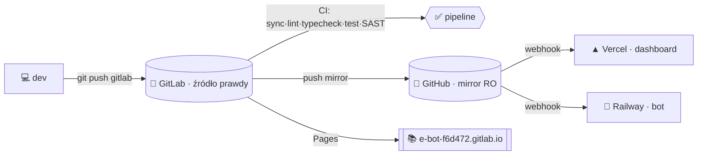

<div align="center">

# 🛠️ Utrzymanie repozytorium E‑BOT


**Przewodnik operacyjny** — jak na co dzień utrzymywać repo po migracji na model GitLab‑first. Stan na 2026‑07‑13.

</div>

```
━━━━━━━━━━━━━━━━━━━━━━━━━━━━━━━━━━━━━━━━━━━━━━━━━━━━━━━━━━━━━━━━━━━━━━━━━━
```

## 0. Mapa w jednym akapicie

**GitLab** (`gitlab.com/Gh0s777tt/e-bot`) to źródło prawdy: tu pushujesz, tu działa CI/CD. **Push mirror** kopiuje `main` i tagi na **GitHub** (`Gh0s777tt/E-Bot`, tylko odczyt), z którego **Vercel** (panel) i **Railway** (bot) auto‑wdrażają. Dokumentacja buduje się z `docs/` na **GitLab Pages**. Jakość pilnują: **pre‑commit**, **GitLab CI** i **hook Claude Code (Stop)**.


```mermaid
flowchart LR
  DEV[💻 dev] -->|git push gitlab| GL[("🦊 GitLab · źródło prawdy")]
  GL -->|CI: sync·lint·typecheck·test·SAST| CI{{✅ pipeline}}
  GL -->|push mirror| GH[("🐙 GitHub · mirror RO")]
  GL -->|Pages| DOCS[["📚 e-bot-f6d472.gitlab.io"]]
  GH -->|webhook| VER[▲ Vercel · dashboard]
  GH -->|webhook| RW[🚂 Railway · bot]
```

```
━━━━━━━━━━━━━━━━━━━━━━━━━━━━━━━━━━━━━━━━━━━━━━━━━━━━━━━━━━━━━━━━━━━━━━━━━━
```

## 1. Codzienny workflow

```bash
git switch -c feat/moja-zmiana          # gałąź tematyczna
# … praca …
pnpm sync:check && pnpm lint && pnpm typecheck && pnpm test    # bramki lokalnie
git commit -m "feat(bot): opis"         # pre-commit: sync + biome --staged
git push gitlab feat/moja-zmiana        # → otwórz Merge Request do main
```

- **Commity**: Conventional Commits (`feat` · `fix` · `docs` · `chore` · `ci` · `refactor` · `test` · `perf` · `build`), małe i tematyczne, po polsku.
- **Merge do `main`**: przez MR (main chroniony — bez force‑push i kasowania). Bezpośredni push maintainera dozwolony, ale MR daje przebieg CI przed scaleniem.
- Aktywacja hooków raz na klon: `git config core.hooksPath scripts/hooks`.

## 2. Bramki jakości

| Komenda | Pilnuje | Gdzie egzekwowane |
|:--|:--|:--|
| `pnpm lint` | Biome — lint + format (2 sp., lineWidth 100), **bez zapisu** | pre‑commit (`--staged`) · CI `lint` |
| `pnpm typecheck` | `tsc --noEmit` ×4 pakiety | CI `typecheck` |
| `pnpm docs:check` | marker `SYNC` **+ badge wersji** w README/PHASES/ROADMAP **+ blurb „📜 Najnowsze"** w README = wersja CHANGELOG | pre‑commit · CI `sync:check` · hook Stop |
| `pnpm schema:check` | `_ALL.sql` ↔ schematy per‑feature | pre‑commit · CI |
| `pnpm env:check` | `.env.example` ↔ `process.env` | pre‑commit · CI |
| `pnpm test` / `test:coverage` | Vitest + próg pokrycia (ratchet) | CI `unit` |

Zbiorczo: **`pnpm sync:check`**. Awaryjne pominięcie hooka: `git commit --no-verify`.

> ⚠️ **Bramką jest `pnpm lint`, NIE `pnpm check`** (audyt 2026‑08, low). `pnpm check` = `biome check --write` — **auto‑naprawia i przepisuje pliki**, więc jego „zielono" oznacza „zielono PO cichych edycjach drzewa roboczego", a CI (`biome ci`) niczego nie zapisuje. Używaj `check` świadomie jako narzędzia naprawczego, a stan bramki odczytuj z `lint`.

> **Próg pokrycia** (`vitest.config.ts`): stmts 35.32 / br 32.69 / **fn 32.97** / ln 37.07 — podłoga tuż pod baseline (stan po domknięciu `recordAudit` w audycie A‑2). **Podnoś przy dokładaniu testów**; nie obniżaj, chyba że nowy, świadomie nietestowany kod obniża realny baseline (jak billing #694–#696 → fn 32→31). Aktualne wartości czytaj zawsze z `vitest.config.ts` — ta tabela bywa o wydanie do tyłu.

## 3. Pipeline CI/CD (`.gitlab-ci.yml`)

```
sync ──▶ quality ──▶ test ──▶ release ──▶ deploy
 │         │           │         │           │
sync:check lint       unit      release     pages
           typecheck  build     (manual)    (GitLab Pages)
           audit:deps e2e       
                      SAST · Secret Detection
```

- Joby Node dziedziczą obraz+instalację przez `extends: .node` (NIE globalny `default` — inaczej obrazy SAST dostają `corepack` i padają).
- `audit:deps` = `allow_failure` (informacyjny — świeży CVE nie wstrzymuje niezwiązanych MR‑ów; podatności domyka Renovate). Od v0.627.1 jest **zielony**, więc jego czerwień znów coś znaczy — przeglądaj raport w MR.
- **`e2e` jest WYMAGANY** (od 2026‑08‑15). Wisiał na `allow_failure` „do stabilizacji", a przez ~7 tygodni czerwień brała się z jednej zestarzałej asercji (marka `/login` szukana wśród nagłówków po przeprojektowaniu ekranu), nie z flaka. `playwright.config.ts` ma `retries: 1` pod CI. Gdyby okazał się niestabilny — powrót to `allow_failure: true` w `.gitlab-ci.yml`.
- Coverage raportowany jako **cobertura** (widoczny w MR).

## 4. Wydania (semantic-release)

Skonfigurowany (`.releaserc.json`) i **uzbrojony** — pierwsze automatyczne wydanie to **v0.627.0** (commit `chore(release): v0.627.0 [skip ci]` autorstwa `semantic-release-bot`). Job `release` pozostaje `when: manual` i pojawia się **tylko** gdy ustawiono zmienną `GL_RELEASE_TOKEN` — to świadoma bramka, nie niedoróbka: push na chronioną `main` wymaga tokena o roli Maintainer, więc wydanie ma być decyzją człowieka, a nie skutkiem ubocznym merge'a.

**Uzbrojenie (jednorazowo — zrobione, opis dla odtworzenia/rotacji):**
1. Settings → Access Tokens → **Project Access Token**, rola **Maintainer**, scope **`api` + `write_repository`**.
2. Settings → CI/CD → Variables → **`GL_RELEASE_TOKEN`** = token (masked + protected).
3. W pipeline `main` pojawi się job **`release`** → ▶ ręcznie.

**Co robi run:** Conventional Commits → wersja → wpis w `CHANGELOG.md` → `scripts/bump-sync-markers.mjs` podbija markery SYNC + badge wersji we wszystkich trzech plikach docs → commit `[skip ci]` → tag `vX.Y.Z` → GitLab Release.

> ⚠️ **Po release'ie `pnpm docs:check` jest CZERWONY — i tak ma być.** Automat podbija tylko stringi wersji (marker, badge). Blurbu **„📜 Najnowsze"** w README nie tknie, bo to zdanie pisane przez człowieka. Dopisz je (jedno zdanie o tym, co realnie wyszło) w pierwszym commicie po wydaniu — dopiero wtedy bramka jest zielona. Gdyby automat pisał też blurb, `docs:check` byłby pieczątką zieloną z definicji (znalezisko audytowe „docs:check to rubber stamp").

> ⚠️ Od pierwszego runu **styl CHANGELOG jest auto‑generowany z commitów** (koniec ręcznie kurowanych, polskich blurbów dla NOWYCH wersji; stara historia < v0.627.0 zostaje bez zmian). Jeśli wolisz „auto‑tag + zachowany kurowany CHANGELOG" — zmień plugin chain w `.releaserc.json` (usuń `@semantic-release/changelog`, zostaw tag+release).

**Alternatywa manualna** (gdy nie chcesz odpalać joba `release`): dopisz wpis `## [x.y.z]` na górze CHANGELOG i podbij markery SYNC (`node scripts/bump-sync-markers.mjs x.y.z`), zgodnie z ZASADĄ #1 z `CLAUDE.md`.

> ℹ️ **Pola `version` w `package.json` celowo zostają `0.1.0`** (root · bot · dashboard · web · ingest — audyt 2026‑08, low). Łańcuch pluginów `.releaserc.json` nie zawiera `@semantic-release/npm`, więc release nigdy nie podbija manifestów; źródłem prawdy wersji jest **tag gita + nagłówek CHANGELOG** (badge/markery podbija `bump-sync-markers.mjs`). Pakiety są prywatne i niepublikowane, a jednorazowa ręczna synchronizacja bez automatu rozjechałaby się przy pierwszym kolejnym wydaniu — dlatego NIE synchronizujemy ich ręcznie. Chcesz wersji w manifestach? Dodaj `@semantic-release/npm` (`npmPublish: false`) do `.releaserc.json` — wtedy podbija je release, nie człowiek.

## 5. Zależności (Renovate)

`renovate.json`: grupuje minor+patch, automerge łatek `devDependencies` po zielonym CI, major i alerty podatności osobno (etykiety). **Wymaga aktywnej aplikacji Mend Renovate** na projekcie GitLab (lub self‑hosted runnera) — bez niej config leży bezczynnie. Dependabot usunięty (GitHub‑only).

## 6. Mirror GitLab → GitHub

- Konfiguracja: GitLab → **Settings → Repository → Mirroring repositories** (kierunek **Push**).
- Auth: **GitHub PAT** (scope `repo`) wbity w URL mirrora.
- **Pułapka**: rotacja tego PAT‑u **zatrzymuje mirror** → GitHub przestaje się aktualizować → Vercel/Railway wdrażają stary kod. Po rotacji: podmień token we wpisie mirrora i „Update now".
- Diagnoza: status „finished/failed" widać przy wpisie mirrora.

## 7. Dokumentacja (docs-as-code)

- Źródło: `docs/*.md` + `mkdocs.yml`. Portal: **MkDocs Material** → job `pages` → **https://e-bot-f6d472.gitlab.io** (prywatny — wymaga logowania GitLab).
- Lokalny podgląd: `python3 -m venv .venv && .venv/bin/pip install -r requirements.txt && .venv/bin/mkdocs serve`.
- Nowy dokument: dodaj plik do `docs/` i wpis do `nav:` w `mkdocs.yml`. Build musi przejść `--strict`.

```
━━━━━━━━━━━━━━━━━━━━━━━━━━━━━━━━━━━━━━━━━━━━━━━━━━━━━━━━━━━━━━━━━━━━━━━━━━
```

## 8. 🔐 Bezpieczeństwo — ROTACJA KLUCZY (pilne po tej sesji)

W trakcie prac konfiguracyjnych używano **żywych poświadczeń**. **Zrotuj je** i trzymaj wyłącznie w panelach (Vercel/Railway/GitLab CI Variables), nigdy w repo/czacie:

- [ ] **Stripe** `sk_live_…` → Dashboard → Developers → API keys → **Roll**.
- [ ] **Vercel** tokeny → Account → Tokens → revoke + nowy.
- [ ] **Railway** API key → Account → Tokens → regenerate.
- [ ] **GitHub PAT** (w tym token mirrora `ghp_…`) → Settings → Developer settings → revoke + nowy → **zaktualizuj wpis mirrora w GitLab**.
- [ ] **GitLab** token(y) → Settings → Access Tokens → revoke; dla release utwórz świeży `GL_RELEASE_TOKEN`.

> Skan potwierdził **0 sekretów w historii gita** — dobrze. Utrzymuj to: sekrety tylko w `.env*` (gitignored) i zmiennych CI. SAST + Secret Detection w CI **zaraportują** przypadkowe wycieki (joby z szablonów GitLaba są `allow_failure` — alarmują w pipeline, ale go nie blokują; audyt 2026‑08), więc raporty security w MR trzeba realnie przeglądać.

## 9. Stan po audycie (ETAP 1)

Pełny raport: [`audit/AUDIT-2026-07-13.md`](audit/AUDIT-2026-07-13.md). Rdzeń `bot`+`dashboard`: **0 krytycznych**.

**Naprawione w v0.627.0** (ta sekcja wcześniej wciąż wymieniała je jako otwarte — audyt 2026‑08): `web/` → Supabase (B‑2/B‑3), reaction‑roles + statystyki automod per‑serwer (C‑1/C‑2), izolacja źródeł `ingest` + `manual_lock` (B‑4/B‑5), leniwy i18n panelu (B‑1), zakres Biome bez `.svg` (A‑1) — szczegóły w CHANGELOG i sekcji 0a raportu.

**Naprawione w v0.627.1:** `/backup` i `/undo` per‑serwer, `GHOST_API_URL` bez wycieku sekretu, anty‑SSRF domknięty w `dashboard/`, `/library` z Supabase, **C‑4** (`ingest`: sekrety z query stringu do nagłówków + escape IGDB) oraz **17 podatności produkcyjnych → 0** (Next.js middleware/proxy bypass, `sharp`, `nanoid`, `postcss`).

**Naprawione po v0.627.1:** **A‑4 + D‑3** — root wyczyszczony: raporty jednorazowe → [`archive/`](archive/), makiety i szkice → `design/`.

**Otwarte priorytety** (osobny tor, poza tymi 5 etapami):

1. **A‑2** — testy kontraktowe tras mutujących — iteracyjnie, falami. **Fala 1:** billing (`checkout` +15, `webhook` +19). **Fala 2:** trasy globalne za instance‑admin (`ai-config` +13, `integrations` +15). **Fala 3:** configi bezpieczeństwa per‑serwer (`antinuke` +14, `automod` +14). **Fala 4:** ekonomia (`economy` +19, `eco-season` +15). **Fala 5:** trasy z bramką limitu planu (`counters` +16, `custom-commands` +21). **Fala 6:** `antiraid` +19, `leveling` +25. **Fala 7:** trasy o najwyższej stawce uprawnieniowej (`panel-staff` +17, `config/import` +15). Zostaje ~97 tras — wzorzec `parseBody` → zapis → `recordAudit` powtarza się w większości, więc kolejne fale idą szybciej.
   **Domknięte po drodze (2026‑08‑16):** `recordAudit` brakowało nie tylko w `economy`/`eco-season` — wołało go 10 tras na 116, a 62 zapisywały config bez śladu w `settings_audit` (teraz audytuje 72). Wpis dołożony wszystkim trasom utrwalającym konfigurację, zawsze po UDANYM zapisie (400/403 dziennika nie ruszają). Świadomie pominięte: webhooki i `internal/*` (brak sesji), zgłoszenia użytkowników, podglądy/testy, dane GameVault, akcje moderacyjne. Do decyzji właściciela: `dev/reset`, `automod-native`, `bot/profile`. Szczegóły: [`audit/AUDIT-2026-07-13.md`](audit/AUDIT-2026-07-13.md) § A‑2.

## 10. Checklist operacyjny

| Rytm | Zadanie |
|:--|:--|
| każdy commit | bramki lokalne (`pnpm sync:check` + `check`/`typecheck`/`test`) — pilnuje pre‑commit |
| każdy MR | zielony pipeline GitLab przed merge |
| tygodniowo | przejrzyj MR‑y Renovate (po aktywacji aplikacji) |
| przy wydaniu | `release` (po uzbrojeniu) lub ręczny wpis CHANGELOG + `bump-sync-markers.mjs` |
| po rotacji GH PAT | zaktualizuj token mirrora w GitLab |
| kwartalnie | przejrzyj otwarte pozycje audytu (sekcja 9) |

```
━━━━━━━━━━━━━━━━━━━━━━━━━━━━━━━━━━━━━━━━━━━━━━━━━━━━━━━━━━━━━━━━━━━━━━━━━━
```

<div align="center"><sub>ETAP 5 · raport końcowy · 2026‑07‑13 · źródło prawdy: GitLab <code>Gh0s777tt/e-bot</code></sub></div>
