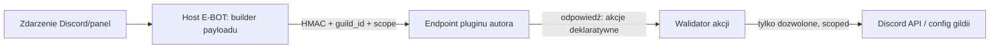

<div align="center">

# 🧪 Plan: M6 — sandbox pluginów community (wykonanie obcego kodu)


</div>

> Dokument **projektowy** (nie implementacja). Domyka ostatni, świadomie odłożony element toru
> marketplace: bezpieczne **uruchamianie kodu pluginów 3rd-party**. Dziś community to wyłącznie
> metadane (manifest + config + moderacja). Tu projektujemy, jak plugin może coś **robić**, nie
> wystawiając instancji ani innych serwerów na ryzyko.

```
━━━━━━━━━━━━━━━━━━━━━━━━━━━━━━━━━━━━━━━━━━━━━━━━━━━━━━━━━━━━━━━━━━━━━━━━━━
```

## 🎯 Cel i nie-cele

**Cel:** pozwolić autorom community na logikę (reakcje na zdarzenia Discorda, własne komendy,
transformacje), wykonywaną w izolacji — **bez** dostępu do sekretów bota, danych innych gildii,
hosta czy nieograniczonej sieci, i bez możliwości DoS-a instancji.

**Nie-cele:** dowolny natywny kod, długie zadania w tle bez limitów, dostęp do tokenu bota,
współdzielenie stanu między gildiami.

## 🧱 Model zagrożeń (untrusted code)

| Zagrożenie | Wektor | Wymóg projektu |
|---|---|---|
| Kradzież sekretów | `process.env`, token bota, klucze Stripe/Supabase | Brak ambient-authority; zero dostępu do env/sekretów |
| Wyciek cross-tenant | odczyt configu/danych innej gildii | Każde wywołanie scoped do JEDNEJ `guild_id` (jak chokepoint) |
| Eskalacja w hoście | fs, child_process, natywne moduły | Izolat bez `require`/fs/net; tylko wąski host-API |
| DoS (CPU/RAM/pętle) | nieskończona pętla, alokacje | Twardy timeout + limit pamięci + rate-limit per plugin/gildia |
| Nadużycie sieci | SSRF, spam | Brak `fetch` lub allowlista + limity; egress przez proxy |
| Trwały XSS/treści | wstrzyknięcie do paneli/Discorda | Walidacja+escaping wyjścia (jak F4 — http(s), brak `javascript:`) |

## 🧰 Opcje izolacji (trade-offy)

| Opcja | Izolacja | Koszt wdrożenia | Ograniczenia |
|---|:--:|:--:|---|
| **A. Declarative-only** (dziś) | 🟢 pełna (brak kodu) | 🟢 zerowy | mała ekspresywność (tylko config/manifest) |
| **B. Webhook author-hosted** | 🟢 pełna (kod u autora) | 🟡 średni | autor musi hostować; latencja sieciowa |
| **C. Managed isolate** (QuickJS/WASM, `isolated-vm`) | 🟡 dobra (przy poprawnej konfiguracji) | 🔴 wysoki | trudny hardening; powierzchnia ataku runtime'u |
| **D. microVM** (Firecracker/gVisor) | 🟢 b. wysoka | 🔴 b. wysoki | ciężkie operacyjnie; nadmiarowe dla wtyczek |
| **E. Serverless isolate** (Cloudflare Workers / Deno Deploy) | 🟢 wysoka (platforma) | 🟡 średni | zależność od dostawcy; provisioning per plugin |

> ⚠️ `vm2` — **odrzucone** (historia sandbox-escape’ów). Goły `node:vm` **nie jest** granicą bezpieczeństwa.

## ✅ Rekomendacja: **webhook-first (B), potem opcjonalnie isolate (C/E)**

Najbezpieczniejszy pierwszy krok **nie uruchamia obcego kodu u nas wcale**: plugin = **endpoint
autora**, który wołamy podpisanym, scoped payloadem (model jak nasz webhook Stripe — tylko odwrotnie).
Izolację „kodu" oddajemy platformie autora; my pilnujemy **granicy danych i kontraktu**.



- **Payload:** `{ event, guild_id, plugin_key, config (tej gildii), input }` + nagłówek `X-EBOT-Signature` (HMAC z sekretu pluginu).
- **Odpowiedź:** lista **akcji deklaratywnych** (np. `sendMessage`, `addRole`, `setConfig`) — host je **waliduje i wykonuje** w granicach gildii. Plugin nigdy nie dotyka tokenu bota.
- **Limity:** timeout (np. 3 s), rozmiar odpowiedzi, rate-limit per `plugin_key`+`guild_id`, retry z backoffem.
- **Zaufanie:** `review_status` (już w schemacie) + podpis + wersjonowanie (`manifest.version`); rejestr endpointu w `plugins.manifest`.

Dopiero gdy pojawi się potrzeba „inline" (bez hostingu autora), dokładamy **C/E** (QuickJS/WASM lub Worker) jako drugi backend wykonania, za tym samym kontraktem akcji.

## 🔑 Model uprawnień (capability-based)

- Plugin deklaruje w manifeście **scopes** (np. `messages:send`, `roles:add`, `config:read`).
- Host wykonuje **wyłącznie** akcje z zadeklarowanych scope’ów, **tylko** dla `guild_id` z payloadu.
- Zero ambient-authority: brak env, brak globalnego `fetch`, brak innych gildii, brak tokenu bota.
- Konfiguracja pluginu czytana/zapisywana przez [`lib/pluginConfig.ts`](../dashboard/lib/pluginConfig.ts) (M3, `plugin_config`).

## 🚦 Fazowanie

1. **M6a — kontrakt akcji + webhook runner** (model B) — ✅ **runner gotowy** ([`lib/pluginRunner.ts`](../dashboard/lib/pluginRunner.ts), v0.285.0): builder payloadu, podpis HMAC, walidator akcji (Zod), SSRF-guard, timeout/limit. **Bez wykonywania akcji** (to M6b). Pluginy „server-side hosted".
2. **M6b — SDK autora + przykładowy plugin**: typy akcji/zdarzeń, helper podpisu, szablon endpointu (Worker/Express), dokumentacja.
3. **M6c — publikacja/review UX**: rozszerzenie `/marketplace/submit` o pola endpointu/scope’ów; panel review pokazuje scope’y; sandbox testowy (dry-run) przed approve.
4. **M6d (opcjonalnie) — inline isolate** (C/E) za tym samym kontraktem, gdy potrzebny hosting po naszej stronie.

## ⚠️ Ryzyka i decyzje

- **Decyzja 1:** webhook author-hosted (B) jako pierwszy backend? (rekomendacja: **tak** — eliminuje wykonanie obcego kodu u nas).
- **Decyzja 2:** czy w ogóle dopuszczać inline isolate (C/E), czy zostać przy B na zawsze? (rekomendacja: B na start; C/E tylko przy realnym popycie).
- **Decyzja 3:** egress sieci pluginów — zabroniony czy przez proxy z allowlistą?
- **Ryzyka:** każdy nowy backend wykonania = nowa powierzchnia ataku; bezwzględnie wymaga testów bezpieczeństwa i ścieżki „kill switch" (env-gate + `review_status=rejected` globalnie).

```
━━━━━━━━━━━━━━━━━━━━━━━━━━━━━━━━━━━━━━━━━━━━━━━━━━━━━━━━━━━━━━━━━━━━━━━━━━
```
<div align="center"><sub>Design do akceptacji · powiązane: <a href="PLAN-MARKETPLACE.md">PLAN-MARKETPLACE</a> · <a href="SECURITY-REVIEW-MARKETPLACE.md">SECURITY-REVIEW</a> · <a href="ROADMAP.md">ROADMAP</a></sub></div>
