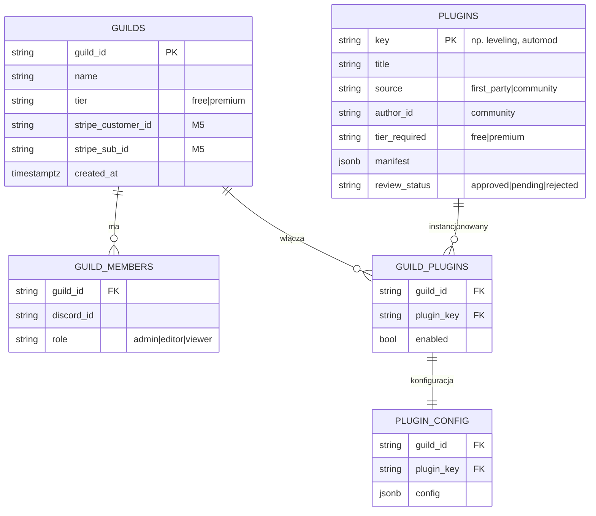

<div align="center">

# 🛒 Plan: Marketplace pluginów + multi-guild jako usługa


-E50914?style=for-the-badge&labelColor=0a0a0a)

</div>

> Cel: przekształcić panel z trybu „jeden właściciel / jeden serwer" w **usługę multi-guild** z **marketplace pluginów**.
>
> ✅ **Decyzje podjęte (v0.267.0):** model **PŁATNY** (tiery free/premium → billing M5) + pluginy **COMMUNITY** (3rd-party: SDK/sandbox/review → M6). Pełny zakres **M1–M6**. **M1 wystartował** — schemat danych [`m1-marketplace-schema.sql`](../dashboard/scripts/m1-marketplace-schema.sql).

```
━━━━━━━━━━━━━━━━━━━━━━━━━━━━━━━━━━━━━━━━━━━━━━━━━━━━━━━━━━━━━━━━━━━━━━━━━━
```

## 📍 Stan obecny (co już mamy)

- ✅ **Config per-serwer** (Etap K, C-1…C-27): każdy moduł konfigurowalny per-`guild_id` — to **fundament pluginów**.
- ✅ **GuildSwitcher** + `panel_guild` cookie + `getPrimaryGuildId()` — przełączanie kontekstu serwera (dziś dla serwerów bota).
- ✅ **Auth**: Discord OAuth + `DASHBOARD_OWNER_IDS` (model **jednowłaścicielski**).
- ✅ **Supabase** (`settings` key-value) + Realtime push + i18n 14 jęz. + RTL.
- ✅ **~95 komend / ~40 usług** = gotowy katalog funkcji do „opluginowania".

## 🧩 Luki do „SaaS multi-guild"

| Obszar | Dziś | Docelowo |
|---|---|---|
| **Tożsamość** | 1 właściciel (env) | dowolny admin **swojego** serwera (per-guild role) |
| **Izolacja** | `settings` globalne + per-guild miks | twarda izolacja per-`guild_id` (RLS) |
| **Włączanie modułów** | flagi w configu | **marketplace**: katalog pluginów, enable/disable per guild |
| **Rozliczenia** | brak | (opcjonalnie) tiery free/premium + limity |
| **Onboarding** | ręczny | self-serve: „dodaj bota → wybierz pluginy" |

## 🗃️ Proponowany model danych



Migracja: istniejące `settings` (per-guild) → `plugin_config` (mapowanie moduł→plugin_key). Klucze globalne zostają jako konfiguracja instancji.

> 🧱 **Zrealizowane (M1):** powyższy model istnieje jako migracja [`dashboard/scripts/m1-marketplace-schema.sql`](../dashboard/scripts/m1-marketplace-schema.sql) — **additive** (nie rusza `settings` ani działającego panelu; nowe tabele zaczynają puste).

## 🔐 Auth & izolacja (kluczowe)

1. Discord OAuth → pobierz listę gildii użytkownika z uprawnieniem `MANAGE_GUILD`.
2. `GuildSwitcher` pokazuje **tylko** gildie, w których user jest adminem **i** bot jest obecny.
3. Każde zapytanie panelu scope'owane do wybranego `guild_id`; **Supabase RLS** wymusza izolację (policy: `guild_id` ∈ gildie usera).
4. Role per-guild (`admin|editor|viewer`) — reużycie istniejącego modelu `panelAccess`/`tier*` (już w i18n).

## 🛍️ Marketplace pluginów

- **Faza 1 — first-party**: każdy istniejący moduł = pozycja katalogu **pochodna z `lib/modules.ts`** (źródło prawdy w kodzie, bez seedu do DB — zero driftu; reader: [`lib/pluginCatalog.ts`](../dashboard/lib/pluginCatalog.ts)). UI: katalog z kartami (ikona, opis, tier), toggle enable per guild → odsłania istniejący formularz konfiguracji.
- **Faza 2 — tiery**: `tier_required` na pluginie + `tier` na gildii; gating w UI + na backendzie.
- **Faza 3 — community** ✅ *(w zakresie, M6)*: SDK/manifest dla pluginów 3rd-party (`source='community'`, `author_id`, `manifest`, `review_status` już w schemacie). Sandbox wykonania + proces review przed publikacją. Najwyższe ryzyko → wdrażane **na końcu**, po dojrzałym M1–M5.

## 💳 Rozliczenia (✅ płatne — M5)

- ✅ **Decyzja: płatne** (tiery free/premium). Stripe Checkout + webhook → `guilds.tier` (kolumny `stripe_customer_id`/`stripe_sub_id` **już w schemacie M1**). Limity (liczba aktywnych pluginów, retencja statystyk, pluginy `tier_required='premium'`) egzekwowane per tier w UI i backendzie.

## 🚀 Fazowanie (przyrostowo, każda faza = działający przyrost)

1. **M1 — Multi-tenant auth**: OAuth gildii usera + RLS + scope per-guild. *(Bez marketplace — sam fundament izolacji.)*
2. **M2 — Rejestr pluginów**: tabela `PLUGINS` + `GUILD_PLUGINS`; katalog UI (enable/disable) mapowany na istniejące moduły.
3. **M3 — Config pluginów** *(reframe — v0.282.0)*: first-party trzyma config w `settings` per-serwer (`g:<guildId>:<key>` + chokepoint — **już izolowany, bez ryzykownej migracji**); `plugin_config` to dom konfiguracji **community** ([`lib/pluginConfig.ts`](../dashboard/lib/pluginConfig.ts): `getPluginConfig`/`setPluginConfig`).
4. **M4 — Onboarding self-serve** *(gotowe — v0.273+279)*: admin serwera (MANAGE_GUILD) loguje się → auto-enrollment do `guild_members` ([`lib/enroll.ts`](../dashboard/lib/enroll.ts)) → zarządza swoim serwerem (izolacja przez chokepoint). Ekran [`/onboarding`](../dashboard/app/onboarding/page.tsx): „dodaj bota" + lista Twoich serwerów (klik = wybór kontekstu). Aktywacja self-serve: env `MARKETPLACE_SELF_SERVE=1`.
5. **M5 — Tiery + billing** (Stripe; ✅ w zakresie): gating `tier_required`, Checkout, webhook → `guilds.tier`.
6. **M6 — Community plugins** *(warstwa danych + UI gotowe — v0.276–278)*: zgłoszenia + moderacja ([`lib/communityPlugins.ts`](../dashboard/lib/communityPlugins.ts): manifest Zod, submit→`pending`, review→`approved`/`rejected`; zatwierdzone wpadają do katalogu z M2). Gated env `MARKETPLACE_COMMUNITY`. **Sandbox wykonania obcego kodu — design gotowy** ([`PLAN-M6-SANDBOX.md`](PLAN-M6-SANDBOX.md): model webhook-first + capability-based + fazy M6a–M6d); implementacja po akceptacji (najwyższe ryzyko).

## ⚠️ Ryzyka

- **Izolacja danych** (RLS) — błąd = wyciek między serwerami. Wymaga testów bezpieczeństwa.
- **Skala bota**: jeden proces bota na N gildii — limity Discorda (sharding gdy >2500 gildii).
- **Migracja** istniejących `settings` bez przestoju.
- **Zakres**: M1–M4 to solidny SaaS bez community/billing. Pełne community-marketplace to osobny, duży projekt.

## ✅ Decyzje podjęte (v0.267.0)

1. **Płatne?** → ✅ **TAK** — tiery free/premium (billing Stripe = M5).
2. **Community plugins?** → ✅ **TAK** — 3rd-party SDK/sandbox/review (M6, ostatnie ze względu na ryzyko).
3. **Sharding?** → później (jeden proces do <2500 gildii; sharding po przekroczeniu progu).
4. **Start od M1?** → ✅ **TAK — wystartował**: schemat danych [`m1-marketplace-schema.sql`](../dashboard/scripts/m1-marketplace-schema.sql) (additive). Następny przyrost M1: multi-tenant auth (OAuth listy gildii usera + scope per-guild).

```
━━━━━━━━━━━━━━━━━━━━━━━━━━━━━━━━━━━━━━━━━━━━━━━━━━━━━━━━━━━━━━━━━━━━━━━━━━
```
<div align="center"><sub>Decyzje podjęte · M1 w toku (v0.267.0) · powiązane: <a href="ROADMAP.md">ROADMAP</a> · <a href="PHASES.md">PHASES</a></sub></div>
