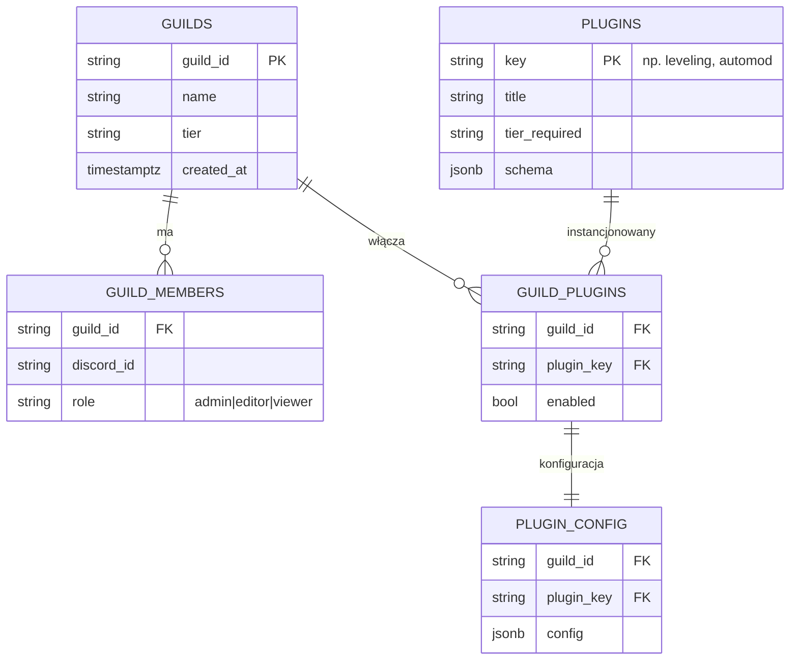

<div align="center">

# 🛒 Plan: Marketplace pluginów + multi-guild jako usługa


-E50914?style=for-the-badge&labelColor=0a0a0a)

</div>

> Dokument **planistyczny** (nie implementacja). Cel: przekształcić panel z trybu „jeden właściciel / jeden serwer" w **usługę multi-guild** z **marketplace pluginów**. Decyzje oznaczone ❓ wymagają Twojego wyboru przed startem.

```
━━━━━━━━━━━━━━━━━━━━━━━━━━━━━━━━━━━━━━━━━━━━━━━━━━━━━━━━━━━━━━━━━━━━━━━━━━
```

## 📍 Stan obecny (co już mamy)

- ✅ **Config per-serwer** (Etap K, C-1…C-27): każdy moduł konfigurowalny per-`guild_id` — to **fundament pluginów**.
- ✅ **GuildSwitcher** + `panel_guild` cookie + `getPrimaryGuildId()` — przełączanie kontekstu serwera (dziś dla serwerów bota).
- ✅ **Auth**: Discord OAuth + `DASHBOARD_OWNER_IDS` (model **jednowłaścicielski**).
- ✅ **Supabase** (`settings` key-value) + Realtime push + i18n 14 jęz. + RTL.
- ✅ **~95 komend / ~40 usług** = gotowy katalog funkcji do „opluginowania".

## 🧩 Luki do „SaaS multi-guild"

| Obszar | Dziś | Docelowo |
|---|---|---|
| **Tożsamość** | 1 właściciel (env) | dowolny admin **swojego** serwera (per-guild role) |
| **Izolacja** | `settings` globalne + per-guild miks | twarda izolacja per-`guild_id` (RLS) |
| **Włączanie modułów** | flagi w configu | **marketplace**: katalog pluginów, enable/disable per guild |
| **Rozliczenia** | brak | (opcjonalnie) tiery free/premium + limity |
| **Onboarding** | ręczny | self-serve: „dodaj bota → wybierz pluginy" |

## 🗃️ Proponowany model danych



Migracja: istniejące `settings` (per-guild) → `plugin_config` (mapowanie moduł→plugin_key). Klucze globalne zostają jako konfiguracja instancji.

## 🔐 Auth & izolacja (kluczowe)

1. Discord OAuth → pobierz listę gildii użytkownika z uprawnieniem `MANAGE_GUILD`.
2. `GuildSwitcher` pokazuje **tylko** gildie, w których user jest adminem **i** bot jest obecny.
3. Każde zapytanie panelu scope'owane do wybranego `guild_id`; **Supabase RLS** wymusza izolację (policy: `guild_id` ∈ gildie usera).
4. Role per-guild (`admin|editor|viewer`) — reużycie istniejącego modelu `panelAccess`/`tier*` (już w i18n).

## 🛍️ Marketplace pluginów

- **Faza 1 — first-party**: każdy istniejący moduł (C-1…C-27) = wpis w `PLUGINS`. UI: katalog z kartami (ikona, opis, tier), toggle enable per guild → odsłania istniejący formularz konfiguracji.
- **Faza 2 — tiery**: `tier_required` na pluginie + `tier` na gildii; gating w UI + na backendzie.
- **Faza 3 (opcjonalnie) — community**: SDK/manifest dla pluginów 3rd-party (sandbox, review). **Duże ryzyko** — rekomendacja: odłożyć.

## 💳 Rozliczenia (❓ decyzja)

- ❓ **Czy w ogóle płatne?** Jeśli tak: Stripe Checkout + webhook → `guilds.tier`. Limity (np. liczba aktywnych pluginów, retencja statystyk) egzekwowane per tier.
- Jeśli nie: pomiń całą warstwę billing (prościej, szybciej).

## 🚀 Fazowanie (przyrostowo, każda faza = działający przyrost)

1. **M1 — Multi-tenant auth**: OAuth gildii usera + RLS + scope per-guild. *(Bez marketplace — sam fundament izolacji.)*
2. **M2 — Rejestr pluginów**: tabela `PLUGINS` + `GUILD_PLUGINS`; katalog UI (enable/disable) mapowany na istniejące moduły.
3. **M3 — Migracja configu**: `settings`→`plugin_config` per guild; kompatybilność wsteczna.
4. **M4 — Onboarding self-serve**: „dodaj bota" → wybór pluginów → gotowe.
5. **M5 (opc.) — Tiery + billing** / **M6 (opc.) — community plugins**.

## ⚠️ Ryzyka

- **Izolacja danych** (RLS) — błąd = wyciek między serwerami. Wymaga testów bezpieczeństwa.
- **Skala bota**: jeden proces bota na N gildii — limity Discorda (sharding gdy >2500 gildii).
- **Migracja** istniejących `settings` bez przestoju.
- **Zakres**: M1–M4 to solidny SaaS bez community/billing. Pełne community-marketplace to osobny, duży projekt.

## ❓ Decyzje do podjęcia (zanim zacznę M1)

1. **Płatne czy darmowe?** (przesądza o M5/billing)
2. **Community plugins teraz czy nigdy?** (rekomendacja: nie teraz)
3. **Sharding od razu czy później?** (zależy od docelowej skali)
4. **Start od M1 (auth/izolacja)** — potwierdź, to pierwszy konkretny przyrost.

```
━━━━━━━━━━━━━━━━━━━━━━━━━━━━━━━━━━━━━━━━━━━━━━━━━━━━━━━━━━━━━━━━━━━━━━━━━━
```
<div align="center"><sub>Plan do akceptacji · powiązane: <a href="ROADMAP.md">ROADMAP</a> · <a href="PHASES.md">PHASES</a></sub></div>
