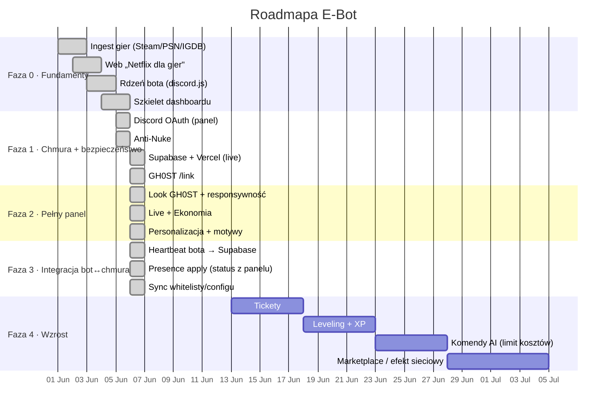
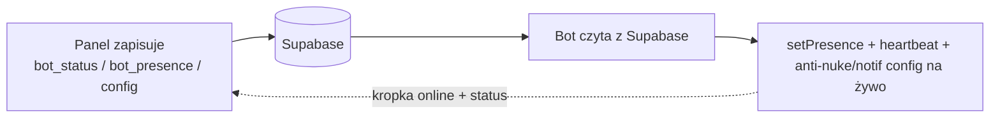

<div align="center">

# 🗺️ ROADMAPA &nbsp;·&nbsp; E‑BOT


</div>

> Roadmapa żywa — aktualizowana przy każdym istotnym update. Status faz: `docs/PHASES.md`.

```
━━━━━━━━━━━━━━━━━━━━━━━━━━━━━━━━━━━━━━━━━━━━━━━━━━━━━━━━━━━━━━━━━━━━━━━━━━
```

## ⏳ Oś czasu



## 🧭 Fazy

| Faza | Cel | Status |
|:--:|:--|:--:|
| **0** | Fundamenty: ingest, web, rdzeń bota, szkielet panelu | ✅ done |
| **1** | OAuth, Anti‑Nuke, chmura (Supabase + Vercel), `/link` | ✅ done |
| **2** | Pełny panel GH0ST: live, ekonomia, personalizacja, motywy | ✅ done |
| **3** | Integracja bot↔chmura: heartbeat, presence apply, sync configu | 🟢 core ✓ |
| **4** | Wzrost: tickety, leveling, komendy AI, marketplace | 🧭 plan |

## 🎯 Najbliższe kroki (Faza 3)



1. ✅ **Heartbeat** — bot pisze `settings['bot_status']` `{online,guilds,tag,ts}` co 60 s (panel czyta status na żywo; offline przy zamknięciu).
2. ✅ **Presence apply** — bot czyta `settings['bot_presence']` i woła `client.user.setPresence` (sync co 60 s).
3. ✅ **Sync configu** — `settings-sync` pobiera Supabase → lokalny SQLite; anti‑nuke/notify widzą zmiany z panelu, a zmiany z bota (`/antinuke`) wracają do panelu (mirror‑up).
4. ⏳ **GH0ST link‑status** — endpoint po stronie GH0ST EMPIRE → realny status powiązania w Profilu *(do zrobienia w repo ghost-empire)*.

## 🧪 Pomysły / backlog (Faza 4+)

- 🎟️ Tickety (panel + komendy) · 🏆 Leveling/XP + role nagrody · 🤖 Komendy AI (DeepSeek/OpenAI z limitem)
- 🧩 Reaction roles z edytora · 🔔 Webhooki EventSub (zamiast pollingu) przez Cloudflare Tunnel
- 📈 Statystyki/retencja w panelu · 🛒 Marketplace pluginów

```
━━━━━━━━━━━━━━━━━━━━━━━━━━━━━━━━━━━━━━━━━━━━━━━━━━━━━━━━━━━━━━━━━━━━━━━━━━
```
<div align="center"><sub>Aktualizuj przy każdym kamieniu milowym · powiązane: <a href="PHASES.md">PHASES</a> · <a href="../CHANGELOG.md">CHANGELOG</a></sub></div>
