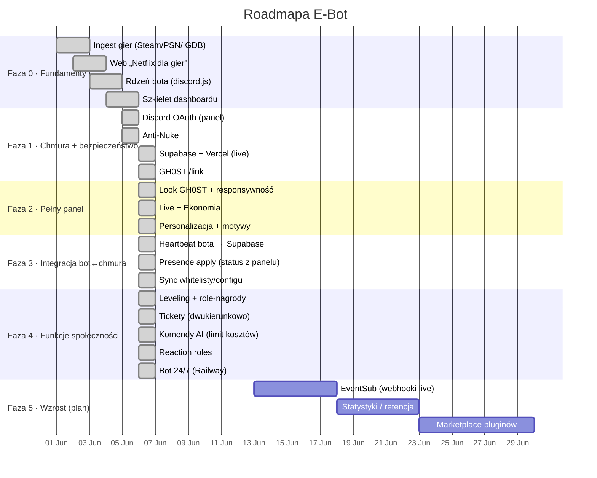
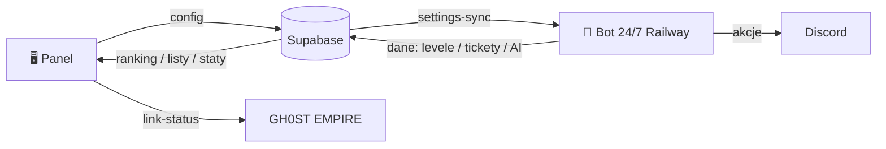

<div align="center">

# 🗺️ ROADMAPA &nbsp;·&nbsp; E‑BOT


</div>

> Roadmapa żywa — aktualizowana przy każdym istotnym update. Status faz: `docs/PHASES.md`.

```
━━━━━━━━━━━━━━━━━━━━━━━━━━━━━━━━━━━━━━━━━━━━━━━━━━━━━━━━━━━━━━━━━━━━━━━━━━
```

## ⏳ Oś czasu



## 🧭 Fazy

| Faza | Cel | Status |
|:--:|:--|:--:|
| **0** | Fundamenty: ingest, web, rdzeń bota, szkielet panelu | ✅ done |
| **1** | OAuth, Anti‑Nuke, chmura (Supabase + Vercel), `/link` | ✅ done |
| **2** | Pełny panel GH0ST: live, ekonomia, personalizacja, motywy | ✅ done |
| **3** | Integracja bot↔chmura: heartbeat, presence, sync configu | ✅ done |
| **4** | Funkcje: leveling, tickety, AI, reaction roles, link‑status, bot 24/7 | ✅ done |
| **5** | Wzrost: EventSub, statystyki/retencja, marketplace | 🧭 plan |

## ✅ Zrealizowane (Fazy 0–4) — wszystko LIVE

Stack zmodernizowany (Next 16 · React 19 · Tailwind 4 · TS 6 · React Compiler · pnpm · Biome · Zod), branding GH0ST (logo/baner/favicon/avatar bota), panel na Vercel (**e-bot-dc.vercel.app**), **bot 24/7 na Railway**, tabele Supabase, integracja GH0ST (`/link`, `link-status`). Funkcje: leveling + role‑nagrody, tickety (dwukierunkowo), komendy AI (z twardym limitem kosztów), reaction roles, anti‑nuke, powiadomienia live.



## 🧭 Faza 5 — Wzrost (plan / opcjonalne)

- 🔔 **EventSub** — webhooki Twitch zamiast pollingu (natychmiastowe powiadomienia live; wymaga publicznego endpointu + subskrypcji Twitch EventSub). *Polling już działa → niski priorytet.*
- 📈 **Statystyki / retencja** — wykresy aktywności, XP w czasie, użycie AI (dane już w Supabase).
- 🛒 **Marketplace / efekt sieciowy** — pluginy, multi‑guild.

```
━━━━━━━━━━━━━━━━━━━━━━━━━━━━━━━━━━━━━━━━━━━━━━━━━━━━━━━━━━━━━━━━━━━━━━━━━━
```
<div align="center"><sub>Aktualizuj przy każdym kamieniu milowym · powiązane: <a href="PHASES.md">PHASES</a> · <a href="../CHANGELOG.md">CHANGELOG</a></sub></div>
