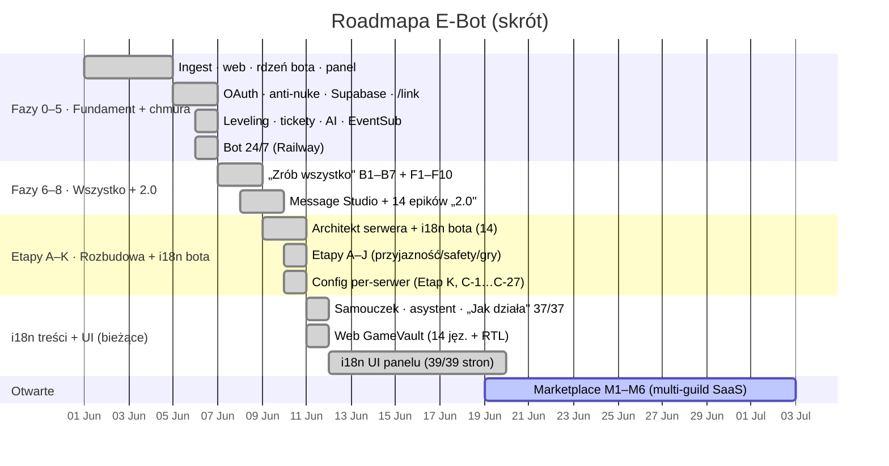
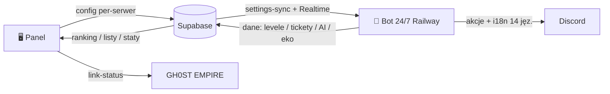

<!-- SYNC: v0.429.0 · #499 · 2026-06-22 — utrzymywane przez `pnpm docs:check` (NIE edytuj ręcznie wersji bez aktualizacji statusu) -->
<div align="center">

# 🗺️ ROADMAPA &nbsp;·&nbsp; E‑BOT


</div>

> Roadmapa żywa — aktualizowana przy każdym istotnym update. Szczegółowy status zadań: [`PHASES.md`](PHASES.md). Numeracja/wersje: [`CHANGELOG.md`](../CHANGELOG.md).
> 🔄 **Synchronizacja z CHANGELOG pilnowana przez `pnpm docs:check`** (zasada: [`CLAUDE.md`](../CLAUDE.md)).

```
━━━━━━━━━━━━━━━━━━━━━━━━━━━━━━━━━━━━━━━━━━━━━━━━━━━━━━━━━━━━━━━━━━━━━━━━━━
```

## ⏳ Oś czasu



## 🧭 Fazy / etapy

| Etap | Cel | Status |
|:--:|:--|:--:|
| **0–3** | Fundamenty: ingest, web, rdzeń bota, panel; OAuth, anti‑nuke, chmura, heartbeat/presence/sync | ✅ done |
| **4–5** | Leveling, tickety, AI, reaction roles, EventSub, statystyki, **bot 24/7** | ✅ done |
| **6–7** | „Zrób wszystko" (B1–B7) + pełna personalizacja (F1–F10) | ✅ done |
| **8** | Fundament customizacji: Message Studio + 14 epików „2.0" | ✅ done |
| **A–J** | Architekt serwera, fun/safety/gaming, customization 2.0, **i18n bota (14 jęz.)** | ✅ done |
| **K** | Przyjazność 2.0 + **config per‑serwer** (C‑1…C‑27 — fundament multi‑guild) | ✅ done |
| **i18n** | Treść panelu/web w 14 językach: pomoc 37/37 ✓, web ✓, **UI panelu 39/39 ✓** | ✅ done |
| **Wzrost** | Marketplace pluginów / multi‑guild (**M1–M6 ✓ + auto-trigger**), retencja, infra prod | 🚧 w toku |

## ✅ Zrealizowane — stan na v0.222

Stack zmodernizowany (Next 16 · React 19 · Tailwind 4 · TS 6 · React Compiler · pnpm · Biome · Zod), branding GH0ST, panel na Vercel (**e‑bot‑dc.vercel.app**), **bot 24/7 na Railway**, ~95 slash‑komend, 59 usług w tle, tabele Supabase, integracja GH0ST (`/link`, `link-status`). Pełen zestaw: moderacja + bezpieczeństwo (anti‑nuke/anti‑raid/heat/automod/weryfikacja/modmail/logi), leveling+ekonomia (eco/sklep/giełda/pety/karty), tickety, AI (czat/vision/moderacja/`/imagine`), powiadomienia live + EventSub, biblioteka gier 2.0, narzędzia twórcy, Architekt serwera, **config per‑serwer** oraz **i18n bota w 14 językach** (komendy + runtime).



## 🏁 Ukończone — i18n UI panelu

Etykiety/formularze **wszystkich** stron panelu przetłumaczone na 14 języków (Pulpit `/` + powłoka + pomoc 37/37 + web GameVault + strony ustawień). **Komplet: 39/39 stron** — ostatnia, odkryta przy przeglądzie strona główna (Pulpit `/`) z widgetami pulpitu (health-check, szybkie akcje, wzrost serwera, alarm anti-raid, live-kafelki, checklista) + relTime zależny od języka (v0.250.0). Domknięta też opcjonalna fala — etykiety współdzielonego `CardStyleEditor` + `GradientField` (v0.249.0). Zlokalizowana również **powierzchnia publiczna / pre-auth** (osobno od 39/39): logowanie, publiczny ranking `/p/leaderboard`, publiczny profil `/p/u/[id]` (17 kluczy `ui.pub.*` × 14 jęz., v0.251.0) oraz **boilerplate frameworka** — `error`/`404`/`loading`/metadane (8 kluczy `ui.sys.*` × 14 jęz., v0.252.0). Naprawiony też **obraz OG profilu** — dynamiczne fonty Google per-skrypt (fail-safe) + etykiety (5 kluczy `ui.og.*` × 14 jęz., v0.253.0), więc dowolny username/skrypt renderuje się bez „tofu". **KONIEC i18n CAŁEJ powierzchni web** — nie zostaje żaden niezlokalizowany element UI. **Audyt 14 jęz. (v0.254.0)**: parzystość 1394×14, 0 duplikatów, tokeny `{…}` spójne; naprawiony **RTL** dla arabskiego (`dir="rtl"` na `<html>` — SSR z cookie + klient na zmianę języka; pełne lustrzane odbicie układu jako follow-up). Szczegóły: [`PHASES.md`](PHASES.md#-bieżący-tor-v02540).

## 🧭 Wzrost (plan / opcjonalne)

- 🛒 **Marketplace / efekt sieciowy** — pluginy, multi‑guild jako usługa. *Config* per‑serwer już jest (Etap K). **Decyzje: płatne (tiery) + community (3rd-party)** → pełny zakres M1–M6. **M1–M6 ✓ (bez sandboxa):** schemat + multi-tenant + chokepoint (v0.267–269) + katalog + strona + toggle (v0.270–272) + self-serve login + **onboarding** `/onboarding` (v0.273+279) + billing Stripe (v0.274–275) + community UI pipeline `/marketplace/submit`+`/review` (v0.276–278) + **i18n wszystkich powierzchni ×14** (onboarding/review/submit, v0.280–281) + **M3 config** (`plugin_config`=community; first-party bez migracji, v0.282.0) + **self-review bezpieczeństwa** (4 luki cross-tenant naprawione, v0.283.0; [`SECURITY-REVIEW-MARKETPLACE.md`](SECURITY-REVIEW-MARKETPLACE.md)) + **design sandboxa M6** ([`PLAN-M6-SANDBOX.md`](PLAN-M6-SANDBOX.md): webhook-first + capability, v0.284.0) + **M6a runner webhook** ([`lib/pluginRunner.ts`](../dashboard/lib/pluginRunner.ts): kontrakt + HMAC + SSRF-guard, v0.285.0) + **M6b wykonanie akcji** ([`lib/pluginExecutor.ts`](../dashboard/lib/pluginExecutor.ts) + [`lib/discordActions.ts`](../dashboard/lib/discordActions.ts): `setConfig`+`sendMessage`+`addRole` z per-akcja authz/anty-eskalacja, v0.286–287) + **M6c dry-run + trigger produkcyjny** ([`lib/pluginInvoke.ts`](../dashboard/lib/pluginInvoke.ts) + `/api/community/run`: orchestrator 6 warstw + owner-triggered realne wykonanie, v0.288–289) + formularz endpoint/secret + **toggle community per-serwer** (`guild_plugins` — pełna pętla UI ✓, v0.290–291) + **auto-trigger z bota** (most [`plugin-bridge.mts`](../bot/src/cloud/plugin-bridge.mts) → [`/api/internal/plugin-event`](../dashboard/app/api/internal/plugin-event/route.ts) → fan-out [`invokeGuildEvent`](../dashboard/lib/pluginInvoke.ts); `guildMemberAdd`/`Remove`/`Boost` + `messageCreate` (filtr słów-kluczy) → włączone+zatwierdzone pluginy przez audytowany sandbox (reakcje/voice pominięte — ochrona przed zalaniem); autor deklaruje `event`+`keywords` w formularzu (i18n ×14), **„żywa" pętla ✓**, v0.292–295) + **przewodnik aktywacji** ([`AKTYWACJA-COMMUNITY.md`](AKTYWACJA-COMMUNITY.md): env + kontrakt webhooka + przykład, v0.296.0). Plan: [`PLAN-MARKETPLACE.md`](PLAN-MARKETPLACE.md).
- 📈 **Retencja + więcej wykresów w czasie** (`/stats`) — przyrosty 1–3 gotowe (v0.261–263): wzrost członków + komplet trendów + konfigurowalny zakres 7/14/30/90d + eksport CSV; **kohortowa retencja ✓** — fundament danych (`member_cohorts` + tracking join/leave w bocie, v0.297.0) + **wykres D1/D7/D30 na `/stats`** ([`lib/retention.ts`](../dashboard/lib/retention.ts) eligible-based + i18n ×14, v0.298.0) + **Audyt #2** — naprawa F5 (scoping analityki `/stats` przez `getPrimaryGuildId`, anty-przeciek cross-tenant; [`SECURITY-REVIEW-MARKETPLACE.md`](SECURITY-REVIEW-MARKETPLACE.md), v0.299.0) + **rezydua F5 domknięte** (`server_history` + `ai_usage` per-serwer (cała analityka `/stats` scoped chokepointem; v0.300–301).
- 🧱 **Produkcyjna infra** — szkielety **kompletne + gated** (audyt v0.265.0, [`AKTYWACJA-INFRA.md`](AKTYWACJA-INFRA.md)): Sentry (env `SENTRY_DSN`), Realtime (`ALTER PUBLICATION … ADD TABLE settings`, fallback poll), Redis niewpięty (opcja na skalę). **Wdrożenie + monitoring** (Railway/Vercel env, cron-job.org → `/api/health/check`, Uptime.com → `/api/health`): [`AKTYWACJA-DEPLOY.md`](AKTYWACJA-DEPLOY.md) (v0.305.0).
- 🧩 **Sharding (skala >2500 serwerów)** — bot **shard-ready** (v0.302.0): audyt shard-safety + uodpornione `heartbeat`/`moderation`/`tempRoles` (single-process-safe), opcjonalny [`shard.mts`](../bot/src/shard.mts) `ShardingManager` (skrypt `shard`, `SHARD_COUNT=auto`); przewodnik [`SHARDING.md`](SHARDING.md). Włączasz przy zbliżaniu się do progu Discorda.
- 🔗 **Twitch sub → rola** — kod **kompletny + gotowy do aktywacji** (v0.264.0, `eventsub-setup.mts` rejestruje `channel.subscribe`, przewodnik `AKTYWACJA-TWITCH-SUB.md`); aktywacja wymaga aplikacji Twitch + OAuth broadcastera (`channel:read:subscriptions`).
- ↔️ **Lustrzane RTL — ✅ KOMPLETNE (v0.260.0)** — cała powierzchnia (chrom + strony + komponenty + przełączniki) na klasach logicznych Tailwind v4; zostaje tylko weryfikacja wizualna arabskiego na preview‑deployu.

```
━━━━━━━━━━━━━━━━━━━━━━━━━━━━━━━━━━━━━━━━━━━━━━━━━━━━━━━━━━━━━━━━━━━━━━━━━━
```
<div align="center"><sub>Ostatnia aktualizacja: 2026‑06‑22 · v0.429.0 (#499) · powiązane: <a href="PHASES.md">PHASES</a> · <a href="../CHANGELOG.md">CHANGELOG</a> · weryfikacja sync: <code>pnpm docs:check</code></sub></div>
