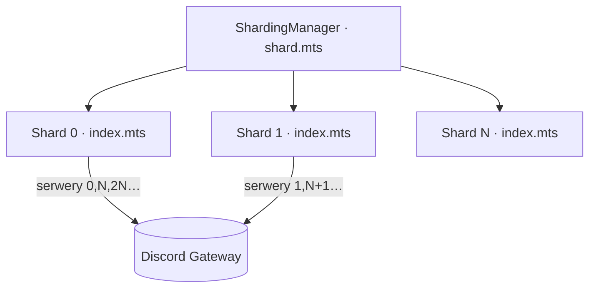

<div align="center">

# 🧩 Sharding bota (skala >2500 serwerów)


</div>

> Discord **wymusza sharding** gdy bot przekracza ~2500 serwerów (jedno połączenie z bramą obsługuje max 2500). Poniżej progu single-process jest prostszy i pozostaje domyślny. Kod jest **shard-ready**: krytyczne miejsca zostały uodpornione (v0.302.0), a włączenie shardingu to uruchomienie innego skryptu — `index.mts` nie wymaga zmian.

```
━━━━━━━━━━━━━━━━━━━━━━━━━━━━━━━━━━━━━━━━━━━━━━━━━━━━━━━━━━━━━━━━━━━━━━━━━━
```

## 🔧 Jak włączyć

- **Single-process (domyślnie):** `pnpm --filter bot start` (`node src/index.mts`).
- **Sharded:** `pnpm --filter bot shard` (`node src/shard.mts`) — [`ShardingManager`](../bot/src/shard.mts) spawnuje N procesów `index.mts`.
  - `SHARD_COUNT=auto` (domyślnie) — liczbę shardów dobiera Discord. Albo liczba na sztywno (np. `SHARD_COUNT=4`).
  - Każdy shard to osobny proces; discord.js wstrzykuje mu info o shardzie, a `Client` czyta je sam — **zero zmian w `index.mts`**.
- Na Railway: zmień komendę startu z `start` na `shard`, gdy zbliżasz się do progu.

## 🧭 Model



**Każdy serwer trafia na dokładnie jeden shard.** Dlatego praca **per-serwer** (iteracja `client.guilds.cache.values()` w ~40 usługach: powitania, automod, leveling, analytics, liczniki…) działa pod shardingiem bez zmian — każdy shard obsługuje swój podzbiór.

## 🛡️ Co zostało uodpornione (v0.302.0)

Audyt shard-safety wykrył 3 miejsca zakładające „jeden proces widzi wszystko". Naprawione **single-process-safe** (`client.shard` jest `null` bez shardingu → zero zmian w obecnym trybie):

| Miejsce | Problem pod shardingiem | Naprawa |
|:--|:--|:--|
| [`cloud/heartbeat.mts`](../bot/src/cloud/heartbeat.mts) | Każdy shard nadpisywał globalny `bot_status` swoim **cząstkowym** countem → panel pokazywałby undercount | Sumowanie liczników ze wszystkich shardów (`broadcastEval`); globalny `bot_status` pisze **tylko shard 0**. Panel czyta jak dotąd (jeden klucz, globalne sumy). |
| [`security/moderation.mts`](../bot/src/security/moderation.mts) | Poller tempbanów czyta z bazy bany **wszystkich** serwerów → każdy shard przetwarzałby każdy wpis (N× REST + N× delete) | `if (client.shard && !client.guilds.cache.has(guild_id)) continue` — wpis obsługuje tylko shard-właściciel. |
| [`economy/tempRoles.mts`](../bot/src/economy/tempRoles.mts) | Jak wyżej (role czasowe ze sklepu) | Jak wyżej. |

**Bez zmian (shard-agnostyczne):** panel Next.js — `getBotGuilds` czyta `/users/@me/guilds` przez REST (zwraca wszystkie serwery niezależnie od shardów); `deploy-commands.mts` to osobny skrypt (rejestracja komend raz, globalnie).

## 🟡 Akceptowalna degradacja (przy shardingu)

- **Cooldown XP (`leveling.mts`) i deltas aktywności (`activity.mts`)** — trzymane w pamięci procesu, keyed per-user. Użytkownik aktywny na serwerach z różnych shardów ma osobny stan na każdym → metryki per-user nieznacznie rozjechane, cooldown liczony per-shard. Pełne ujednolicenie wymagałoby Redis (opcja na dużą skalę).
- **Osierocone wpisy `temp_bans`/`temp_roles`** — jeśli bot opuści serwer z oczekującym wpisem, pod shardingiem żaden shard go nie „posiada" → wpis może zostać (nieszkodliwy). Single-process sprząta jak dotąd.

```
━━━━━━━━━━━━━━━━━━━━━━━━━━━━━━━━━━━━━━━━━━━━━━━━━━━━━━━━━━━━━━━━━━━━━━━━━━
```
<div align="center"><sub>Shard-ready od v0.302.0 · powiązane: <a href="ROADMAP.md">ROADMAP</a> · <a href="PHASES.md">PHASES</a></sub></div>
