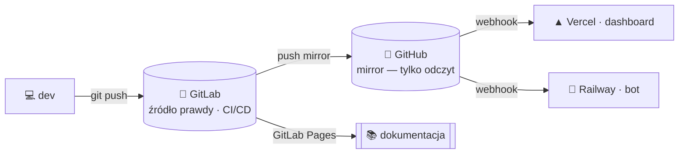

---
hide:
  - navigation
---

# 🎬 E‑BOT · dokumentacja

Portal dokumentacji ekosystemu **E-Forge** — bot Discord, panel sterowania, biblioteka gier „Netflix" i kolektory danych. Budowany z katalogu [`docs/`](https://gitlab.com/Gh0s777tt/e-bot/-/tree/main/docs) jako **docs‑as‑code** (MkDocs Material → GitLab Pages).

!!! tip "Szybkie wejścia"
    **[🧠 Architektura](ARCHITECTURE.md)** · **[🗺️ Roadmapa](ROADMAP.md)** · **[📊 Fazy i status](PHASES.md)** · **[📖 Wiki: start](wiki/Getting-Started.md)** · **[🔍 Audyt](audit/AUDIT-2026-07-13.md)**

---

## 🧩 Czym jest E‑Bot

Monorepo **pnpm** złożone z 4 pakietów, i18n w **14 językach** (PL bazowo, fallback `PL → EN → PL`):

| Pakiet | Rola |
|:--|:--|
| 🤖 **`bot/`** | discord.js v14 — ~100 slash‑komend, ~59 usług w tle |
| 🖥️ **`dashboard/`** | panel E-Forge (Next.js 16) → Vercel + Supabase |
| 🎞️ **`web/`** | „GameVault" — UI „Netflix dla gier" (WIP) |
| 📥 **`ingest/`** | kolektory Steam · PSN · GOG · IGDB → SQLite/Supabase |

---

## 🗂️ Mapa dokumentacji

- :material-sitemap: **Architektura i plan**

    ---

    [Architektura](ARCHITECTURE.md) · [Roadmapa](ROADMAP.md) · [Fazy](PHASES.md) · [Analiza / right‑sizing](ANALIZA.md)

- :material-book-open-variant: **Wiki użytkownika**

    ---

    [Start](wiki/Getting-Started.md) · [Komendy](wiki/Commands.md) · [Moduły](wiki/Modules.md) · [Dashboard](wiki/Dashboard.md) · [FAQ](wiki/FAQ.md)

- :material-rocket-launch: **Wdrożenia i infrastruktura**

    ---

    [Hosting](HOSTING.md) · [Deploy](AKTYWACJA-DEPLOY.md) · [Infra](AKTYWACJA-INFRA.md) · [Hardening prod](HARDENING-PROD.md) · [Sharding](SHARDING.md)

- :material-cash-multiple: **Marketplace i Premium**

    ---

    [Plan Marketplace](PLAN-MARKETPLACE.md) · [Aktywacja Stripe](AKTYWACJA-STRIPE.md) · [Sandbox M6](PLAN-M6-SANDBOX.md) · [Review bezpieczeństwa](SECURITY-REVIEW-MARKETPLACE.md)

- :material-shield-lock: **Bezpieczeństwo**

    ---

    [Sekrety i rotacja](SECRETS.md) · [Review Marketplace](SECURITY-REVIEW-MARKETPLACE.md) · [Hardening](HARDENING-PROD.md)

- :material-magnify-scan: **Audyt inżynierski**

    ---

    [AUDYT 2026‑07‑13](audit/AUDIT-2026-07-13.md) — 4 wymiary, priorytetyzowana lista

---

<small>© 2026 E-Forge — wszelkie prawa zastrzeżone. Źródło prawdy: GitLab <code>Gh0s777tt/e-bot</code>.</small>
